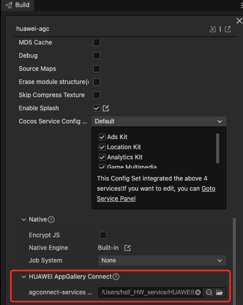

# Cloud Functions（AppGallery Connect）Quick Start

[Cloud Functions](https://developer.huawei.com/consumer/en/doc/development/AppGallery-connect-Guides/agc-cloudfunction-introduction-0000001059279544) enables serverless computing. It provides the Function as a Service (FaaS) capabilities to simplify app development and O&M so your functions can be implemented more easily and your service capabilities can be built more quickly.

### Main Functions

- Cloud Functions provides an efficient and reliable framework for developing and running functions. It frees you from complex traditional development and O&M of apps. Server configuration and management, code deployment, load balancing, autoscaling, and high reliability assurance are now streamlined. You only need to focus on service logic and function code to build reliable and scalable serverless apps.

- As the core of serverless computing, Cloud Functions works with other cloud services like building blocks to implement your service logic.

### Concepts

With Cloud Functions, you can develop functions using programming languages supported by AppGallery Connect and run them in a serverless environment. Each function instance receives and responds to events in an isolated environment. Cloud Functions guarantees reliable function instances and scales their number as needed.

- Function: A script or program running in Cloud Functions to respond to events.

- Event source: Other services (such as Cloud DB) in AppGallery Connect, or your custom services. An event source can release multiple types of events to trigger functions.

- Trigger: Configured to listen on a specified type of event from the event source. Triggers vary by event source, event type, and function-event mapping, and submit data of the specified type of event to a function for handling.

- Alias: A pointer to a specific function. You can create one or more aliases for a function. The function caller (including the trigger) can access a function through its alias.

### Use Cases

Cloud Functions lets you run function code to respond to specific events, such as:

- Sending event notifications to users.

- Executing database cleaning and maintenance tasks.

- Executing intensive tasks on the cloud.

- Integrating third-party services and APIs.

### Version Update Description

- Latest Version:[3.X]2.3.3_1.9.1.301

     - Improve internal implementation
     - SDK upgrade to 1.9.1.301

- [3.X]2.1.3_1.9.1.300

    - Upgrade the sdk version.

-  0.5.0_1.4.1.300

    - Integrated Huawei AGC Cloud Functions service.

## Enable Cloud Functions Service

- Ensure that the Cloud Functions service test qualification application has been passed.

- Use Cocos Creator to open the project that needs to be connected to Cloud Functions service.

- Click on **Panel -> Service** in the menu bar to open the Service panel, select **Cloud Functions** service to go to the service detail page, and then click on the **Enable** button in the top right to enable the service. 

    

### Configs HUAWEI Config File

Most of HUAWEI Services need the `agconnect-services.json` configuration file. If there are operations such as newly opened services, please update the file in time.

- Sign in to [AppGallery Connect](https://developer.huawei.com/consumer/en/service/josp/agc/index.html) find your project from the project list and select the app on the project card.

    

- For Creator v2.4.3 and above, if you want to publish to the HUAWEI AppGallery Connect, you can select the downloaded or updated configuration file directly in the **Build** panel, no need to copy it manually.

    

## Sample Project

Developer can get a quick taste of the Cloud Functions service with the sample project.

- Click on the **Sample** button in the Cloud Functions service panel, clone or download, and open the project in Cocos Creator.

- Please refer to[ Creating a Function ](https://developer.huawei.com/consumer/en/doc/development/AppGallery-connect-Guides/create-and-configure-0000001563715033)document, create a function in the AGC console. 

- After enabling the Cloud Function service and configuring the HUAWEI configuration file as described above, you can open the **Build** panel to compile the project by clicking **Project -> Build** in the Creator editor menu bar. Cocos Creator v2.4.1 and above, you could publish to HUAWEI AppGallery Connect. Below Creator v2.4.1 could publish to the Android platform.

- Once the Sample project is running on the phone, click the **Functions** button on the homepage for testing.

    

- The corresponding cloud function code of Sample project can be configured to [Huawei agc background](https://developer.huawei.com/consumer/cn/service/josp/agc/index.html#/myProject/388421841221566752/9249519184595931747?appId=108702107)

```JavaScript
let myHandler = function (event, context, callback, logger) {
    var res = new context.HTTPResponse(context.env, {
        "res-type": "context.env",
        "faas-content-type": "json",
    }, "application/json", "200");

    
    if (event.body != null && event.body !="" && event.body !="{}" ) {
        let _body = {
            code:"200",
            msg: "云函数调用成功",
            hasParam: "携带参数",
            paramType: "参数类型: "+typeof (event.body),
            param: JSON.parse(event.body),
        }
        res.body = _body;
        context.callback(res);
    } else {
        let _body = {
            code:"200",
            msg: "云函数调用成功",
            hasParam: "未携带参数",
            paramType: "无",
            param: null,
        }
        res.body = _body;
        context.callback(res);
    }
}
module.exports.func = myHandler;
```

## Developer Guide

This document refers to AppGallery Connect documentation - [Calling a Function](https://developer.huawei.com/consumer/en/doc/development/AppGallery-connect-Guides/agc-cloudfunction-appcall#h1-1578361210933).

Call `wrap` and transfer the trigger identifier to it.

`wrap(trigger: string): AGCFunctionCallable`

**Example**:

```JavaScript
var function = huawei.agc.func.AGCFunctionService.wrap("test-$latest");
```

Then call the `call` method to call the function.

`call(cb: FunctionCallback, param = {}): void`

**Example**:

```JavaScript
// without params
function.call((err, data) => {
    if (err !== null) {
        console.log("Cloud Function", `error: ${JSON.stringify(err)}`);
    }
    console.log("Cloud Function", `result: ${JSON.stringify(data)}`);
});

// with params
function.call((err, data) => {
    if (err !== null) {
        console.log("Cloud Function", `error: ${JSON.stringify(err)}`);
    }
    console.log("Cloud Function", `result: ${JSON.stringify(data)}`);
}, {
    param1: "value1",
    param2: {
        param3: "value3",
        param4: 123
    }
});
```

## Other

Please refer to the[ Cloud Functions - API Reference.](https://developer.huawei.com/consumer/en/doc/development/AppGallery-connect-Guides/agc-cloudfunction-introduction-0000001059279544)


