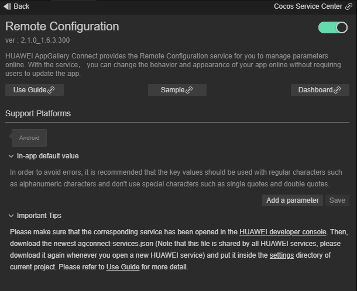
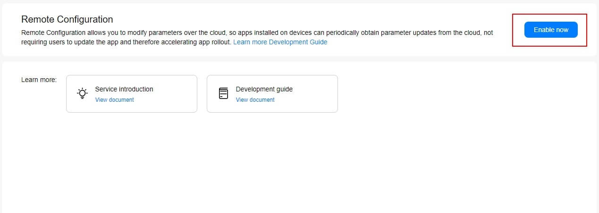
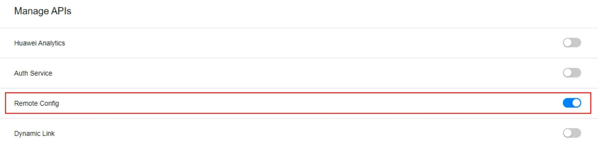
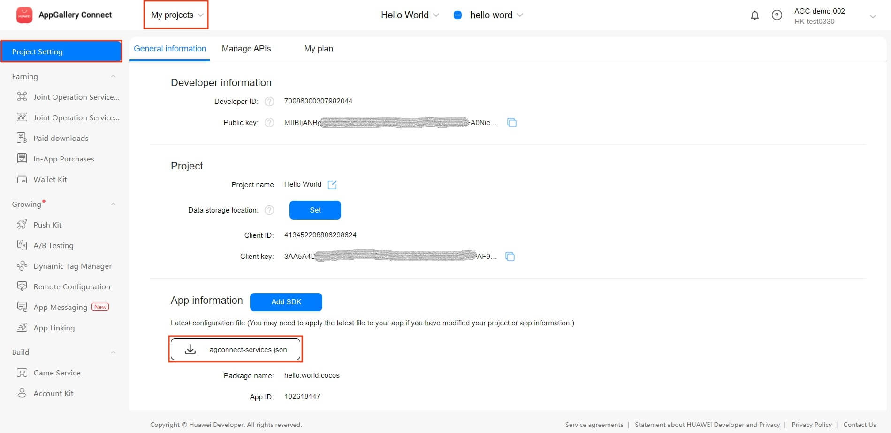
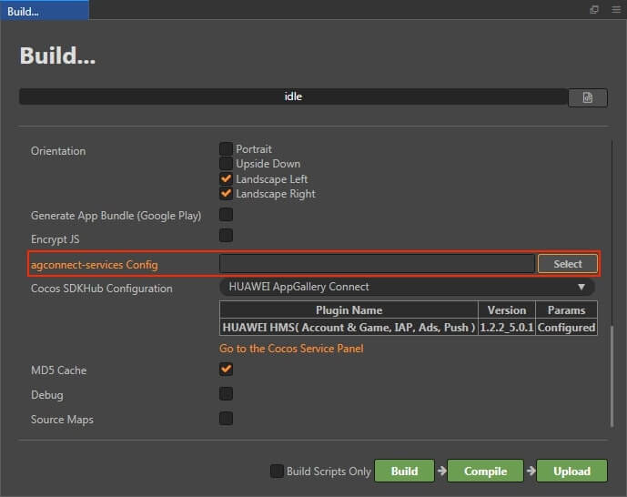
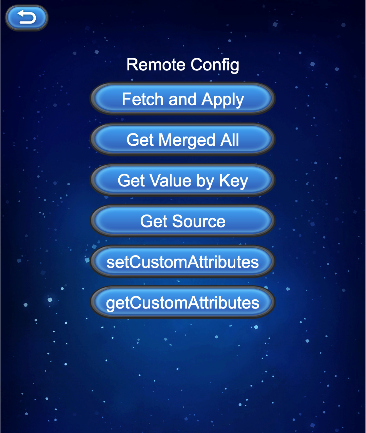
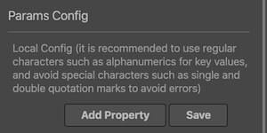

# Remote Configuration (AppGallery Connect) Quick Start

HUAWEI AppGallery Connect provides the [Remote Configuration](https://developer.huawei.com/consumer/en/doc/development/AppGallery-connect-Guides/agc-remoteconfig-introduction) service for you to manage parameters online. With the service, you can change the behavior and appearance of your app online without requiring users to update the app.

By integrating the client SDK, your app can periodically obtain parameter values delivered on the console to modify the app's behavior and appearance.

### Functions

- **Parameter management**: Includes adding, deleting, and modifying parameters, copying and modifying existing parameters as new ones, and setting conditional values.

- **Condition management**: Includes adding, deleting, and modifying conditions, and copying and modifying existing conditions as new ones. Currently, you can set the following conditions: version, language, country/region, audience, user attribute, user percentage, and time. More conditions will be available in the future.

- **Version management**: Supports management and rollback of up to 90 days of 300 historical versions for parameters and conditions.

- **Permission management**: Allows the account holder, administrator, app administrator, R&D personnel, and operations personnel to access Remote Configuration by default.

### Use Cases

#### Displaying the Language by Country/Region

You can schedule a promotion by setting a trigger in Remote Configuration. More importantly, the promotion content can vary depending on the country or region as long as you set the locale information in Remote Configuration.

#### Displaying Different Content to Different Users

Remote Configuration can work with HUAWEI Analytics to personalize content displayed to different user groups. For example, office workers and students will see different products and UI layouts in an app.

#### Adapting the App Theme by Time

You can set the time condition, different app colors, and various picture materials in Remote Configuration to change the app theme for a special time. For example, during the graduation season, you can adapt your app to the graduation theme to attract more users.

#### Releasing New Functions

Releasing new functions to all users at the same time may be risky. Remote Configuration enables new function release by user percentage for you to slowly increase the target user scope, effectively helping you improve your app based on the feedback from users already exposed to the new functions.

### Version Update Description

- Latest Version：[3.x] 2.3.1_1.9.1.302
    - Improve internal implementation

    - SDK upgrade to 1.9.1.302  

- Version: [3.x] 2.2.0_1.9.1300

    - Update the SDK.

    - Add setCustomAttributes and getCustomAttributes methods.

- v0.5.1_1.4.1.300

    - Update the SDK and add local configuration entry.

- v0.5.0_1.4.0

    - Integrated Huawei AGC Remote Configuration service.

## Enable Remote Configuration Service

- Use Cocos Creator to open the project that needs to be connected to Remote Configuration service.

- Click on **Panel -> Service** in the menu bar to open the Service panel, select Remote Configuration service to go to the service detail page, and then click on the **Enable** button in the top right to enable the service. For details, please refer to the Cocos Service Operation Guide documentation.

    - The **Params Config** item in Service panel, please refer to [Setting Default In-app Parameter Values](https://developer.huawei.com/consumer/en/doc/development/AppGallery-connect-Guides/agc-remoteconfig-android-setvalue-0000001334137009).

        

- Find your project from the project list and click the app for which you need to enable Remote Configuration service on the project card. Go to **Growing -> Remote Configuration**, if it is the first time that you use Remote Configuration service, click **Enable now** in the upper right corner.

    

- By default, the Remote Configuration API is automatically enabled when you enable the Remote Configuration service. If you need to manually control whether the Remote Configuration API is enabled or not.

    

### Configs HUAWEI Config File

Most of HUAWEI Services need the `agconnect-services.json` configuration file. If there are operations such as newly opened services, please update the file in time.

- Sign in to [AppGallery Connect](https://developer.huawei.com/consumer/en/service/josp/agc/index.html) find your project from the project list and select the app on the project card.

- On the **Project Setting** page, click the configuration file **agconnect-services.json** to download it. The `agconnect-services.json` file **must be copied manually** to the `settings` directory of the project directory after downloading or updating.

    

- For Creator v2.4.3 and above, if you want to publish to the [HUAWEI AppGallery Connect](https://docs.cocos.com/creator/manual/en/publish/publish-huawei-agc.html), you can select the downloaded or updated configuration file directly in the **Build** panel, no need to copy it manually.

    

### Verify whether the service is integrated successfully

- Once the Remote Configuration service is integrated, we can verify the success of the Remote Configuration service integration by adding simple code to the script.

    ```JavaScript
    let value = huawei.agc.rc.rcService.getValueAsString('test');
    console.log('Get config by key : test, value :' + value);
    ```

## Sample Project

Developer can get a quick taste of the Remote Configuration with the sample project.

- Click on the **Sample** button in the Remote Configuration Service panel, clone or download, and open the project in Cocos Creator.

- After enabling the Remote Configuration service and configuring the HUAWEI configuration file as described above, you can open the **Build** panel to compile the project by clicking **Project -> Build** in the Creator editor menu bar. Cocos Creator v2.4.1 and above, you could publish to HUAWEI AppGallery Connect. Below Creator v2.4.1 could publish to the Android platform.

- Need to test on Huawei or Honor brand phones with HMS Core service installed.

- Once the Sample project is running on the phone, click the **Remote** button on the homepage for testing.

    

## Developer Guide

This document refers to the AppGallery Connect documentation - [Integrating Remote Configuration](https://developer.huawei.com/consumer/en/doc/development/AppGallery-connect-Guides/agc-remoteconfig-dev-guide). When calling in JavaScript, please use this document and the [API documentation](https://service.cocos.com/document/api/modules/huawei.agc.rc.html) as a guide.

Since the `apply` method of the Java SDK returns a parameter object, it cannot be passed in the JavaScript layer. So the Remote Configuration service plug-in that Creator integrates into the Service panel uses the `applyLastFetched` and `fetchAndApply` methods instead of the `applyDefault` and `apply` methods of the Java SDK in its wrapper.

### Setting Default In-app Parameter Values

You can set [in-app default parameter values](https://developer.huawei.com/consumer/en/doc/development/AppGallery-connect-Guides/agc-remoteconfig-dev-guide#h1-1592307026459) in the Remote Configuration object so that your app can run properly before being connected to Remote Configuration, and in-app default values are used if parameter values are not set on the console, the default values is set in **Params Config** item in the Service panel.



### Fetching Parameter Values from Remote Configuration

#### fetchAndApply

`fetchAndApply(intervalSeconds?: number): void`

The Remote Configuration plug-in add the `fetchAndApply` method, corresponding to `fetch` + `apply` methods of the Java SDK.

It is recommended to use this method to fetch and apply parameter values from the cloud. 

**Parameter Description**:

|Parameter|Description|
|-|-|
|intervalSeconds|The setting interval cannot be less than 1800 seconds. If the interval is less than 1800 seconds, the system will process it in 1800 seconds.|

**Example**:

```JavaScript
huawei.agc.rc.rcService.once(huawei.agc.rc.API_EVENT_LIST.fetchAndApplyCallback, (result: huawei.agc.rc.ApiCbResult) => {
    console.log(result);
});
const interval = 30;
huawei.agc.rc.rcService.fetchAndApply(interval);
```

#### fetch

`fetch(intervalSeconds: number): void`

Developers can also call the `fetch` method to get the `setRemoteConfigListener` callback, and then call the `applyLastFetched` method to apply parameter values from the cloud. But it is recommended to use the `fetchAndApply` method.

**Parameter Description**:

|Parameter|Description|
|-|-|
|intervalSeconds|The setting interval cannot be less than 1800 seconds. If the interval is less than 1800 seconds, the system will process it in 1800 seconds|

**Example**:

```JavaScript
huawei.agc.rc.rcService.once(huawei.agc.rc.API_EVENT_LIST.fetchCallback, (result: huawei.agc.rc.ApiCbResult) => {
    console.log(result);
});
huawei.agc.rc.rcService.fetch();
```

### Obtaining Parameter Values by Data Type

```JavaScript
getValueAsBoolean(key: String): Boolean {return false;}

getValueAsDouble(key: String): Number {return 0;}

getValueAsLong(key: String): Number {return 0;}

getValueAsString(key: String): String {return "";}
```

After default parameter values are set and parameter values are fetched from Remote Configuration, you can call any of these APIs provided by the SDK based on the data type to obtain the parameter values to use in your app.

**Note**: Due to JavaScript layer limitation, the Remote Configuration plug-in does not support `getValueAsBytArray` method of the Java SDK.

**Parameter Description**:

|Parameter|Description|
|-|-|
|key|Key of a parameter specified in Remote Configuration.|

**Example**:

```JavaScript
let value = huawei.agc.rc.rcService.getValueAsString('test');
console.log('Get config by key : test, value :' + value);
```

You can call the `getSource` API to obtain the source of a value. The data sources are as follows:

- `huawei.agc.rc.rcService.RemoteConfigSource.STATIC = 0`: default value of the data type.

- `huawei.agc.rc.rcService.RemoteConfigSource.DEFAULT = 1`: in-app default value.

- `huawei.agc.rc.rcService.RemoteConfigSource.REMOTE = 2`: value obtained from Remote Configuration.

### Obtaining All Parameter Values

`getMergedAll(): any`

Returns all values obtained after the combination of the default values and values in Remote Configuration. If they have a same Key, the values in Remote Configuration is preferred.

**Example**:

```JavaScript
huawei.agc.rc.rcService.once(huawei.agc.rc.API_EVENT_LIST.getMergedAllCallback, (result: huawei.agc.rc.ApiCbResult) => {
    console.log(result);
});
huawei.agc.rc.rcService.getMergedAll();
```

### Resetting Parameter Values

`clearAll(): void`

Clears all cached data, including the data fetched from Remote Configuration and the default values passed in.

**Example**:

```JavaScript
huawei.agc.rc.rcService.once(huawei.agc.rc.API_EVENT_LIST.clearAllCallback, (result: huawei.agc.rc.ApiCbResult) => {
    console.log(result);
});
huawei.agc.rc.rcService.clearAll();
```

### Loading Process

You can apply obtained parameter values in either of the following ways, refer to [Loading Process](https://developer.huawei.com/consumer/en/doc/development/AppGallery-connect-Guides/agc-remoteconfig-dev-guide#h1-1592307089186) documentation for details.

#### Applying parameter values immediately

Please refer to fetchAndApply function.

#### Applying parameter values upon the next startup

You can `fetch` parameter values at any time. However, the fetched values are not applied immediately but take effect when the app is started next time by calling the `apply` API. In this way, latest parameter values can be applied without asynchronous waiting.

Corresponding to the fetch method, when setRemoteConfigListener is successfully callback, call the `applyLastFetched` method to update the cloud parameter value.

`applyLastFetched(): void`

Corresponding to `loadLastFetched` + `apply` methods of the Java SDK. Obtains the cached data that is successfully fetched last time, and applies parameter values.

**Example**:

```JavaScript
huawei.agc.rc.rcService.once(huawei.agc.rc.API_EVENT_LIST.applyLastFetchedCallback, (result: huawei.agc.rc.ApiCbResult) => {
    console.log(result);
});
huawei.agc.rc.rcService.applyLastFetched();
```

### Set Developer Mode

`setDeveloperMode(isDeveloperMode: Boolean): void`

Enables the developer mode, in which the number of times that the client obtains data from Remote Configuration is not limited, and traffic control is still performed over the cloud.

**Parameter Description**:

|Parameter|Description|
|-|-|
|isDeveloperMode|Indicates whether to enable the developer mode.|

**Example**:

```JavaScript
huawei.agc.rc.rcService.once(huawei.agc.rc.API_EVENT_LIST.setDeveloperModeCallback, (result: huawei.agc.rc.ApiCbResult) => {
    console.log(result);
});
huawei.agc.rc.rcService.setDeveloperMode(true);
```

### setCustomAttributes

`setCustomAttributes(map: any | null): void`

Sets custom parameters. If an empty map or **null** is passed, all custom parameters will be cleared.

**Parameter Description**:

|参数|说明|
|-|-|
|map|Parameters passed as a map.|

**Example:**

```JavaScript
huawei.agc.rc.rcService.once(huawei.agc.rc.API_EVENT_LIST.setCustomAttributesCallback, (result: huawei.agc.rc.ApiCbResult) => {
    console.log(result);
});
let map = {
    "testKey1": "testValue1",
    "testKey2": "testValue2",
    "testKey3": "testValue3",
};
huawei.agc.rc.rcService.setCustomAttributes(map);
```

### getCustomAttributes

`getCustomAttributes(): string`

Obtains custom parameters.

**Example:**

```JavaScript
let value: string = huawei.agc.rc.rcService.getCustomAttributes();
console.log("getCustomAttributes succeed: ", value);
```

### Set whether to allow the collection of user privacy information

`setEnableCollectUserPrivacy(enable: boolean): void`

Set whether to allow the collection of user privacy information, including chip type and HA user attribute information. The default value is true.

**Example**：

```JavaScript
huawei.agc.rc.rcService.setEnableCollectUserPrivacy(true);
```

## API Reference

Please refer to the [Remote Configuration - API Reference](https://service.cocos.com/document/api/modules/huawei.agc.rc.html).

