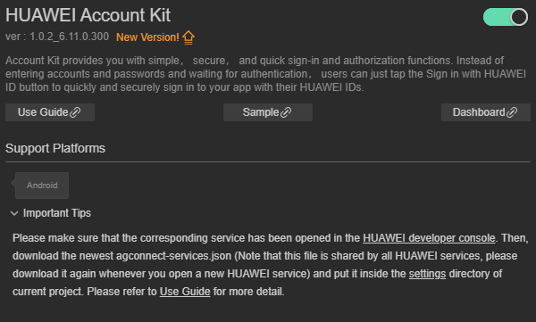
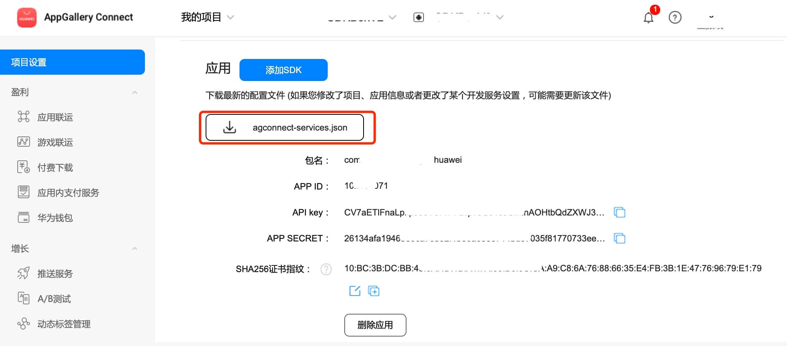
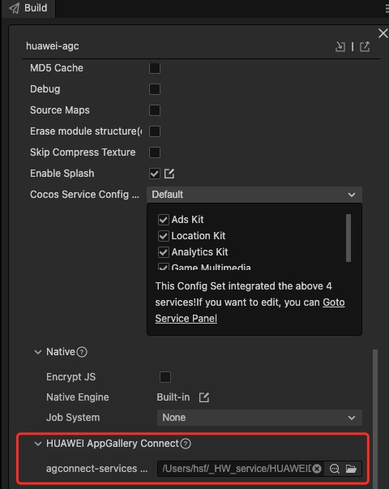
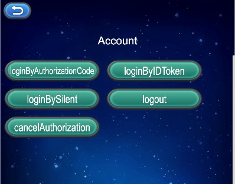

# HUAWEI Account Kit (HMS Core) Quick Start

[Account Kit](https://developer.huawei.com/consumer/en/hms/huawei-accountkit) provides you with simple, secure, and quick sign-in and authorization functions. Instead of entering accounts and passwords and waiting for authentication, users can just tap the **Sign in with HUAWEI ID** button to quickly and securely sign in to your app with their HUAWEI IDs.

## Supported Devices

|Platform|Device Type|OS Version|HMS Core (APK) Version|
|-|-|-|-|
|Android|Phone, tablet, HUAWEI Vision, and telematics device|EMUI 3.0 or later and Android 4.4 or later|4.0.0.300 or later|
|HarmonyOS (Java)|Phone and tablet|HarmonyOS 2.0 or later|5.0.0.300 or later|
||Telematics device|HarmonyOS 2.0 or later|6.2.0.300 or later|
||HUAWEI Vision and smart watch|HarmonyOS 2.0 or later|6.5.0.300 or later|
|HarmonyOS (JavaScript)|Phone and tablet|HarmonyOS 2.0 or later|5.0.0.300 or later|
||Telematics device|HarmonyOS 2.0 or later|6.2.0.300 or later|
||HUAWEI Vision and smart watch|HarmonyOS 2.0 or later|6.5.0.300 or later|

### Version Update Description

- Latest Version：[3.x] 1.1.1_6.12.0.300
    - Improve internal implementation
    - Account information does not provide accessToken and account content

    - SDK upgrade to 6.12.0.300

- [3.X] 1.0.3_6.11.0.300

    - Update the SDK

## Enable Account Kit Service

- Use Cocos Creator to open the project that needs to be connected to Account Kit.

- Click on **Panel -> Service** in the menu bar to open the Service panel, select Account Kit service to go to the service detail page, and then click on the **Enable** button in the top right to enable the service. 

    

- Refer to the [Configuring App Information in AppGallery Connect](https://developer.huawei.com/consumer/en/doc/development/HMSCore-Guides/android-config-agc-0000001050163815) documentation to complete developer registration, app creation, enable Huawei Analysis Service parameter configuration, and enable the API.

- Fill in **App installation source** in "Params Config" of Analytics Kit service panel. For example, if the installation source of the application is Huawei AppGallery, you can fill in  **AppGallery**. The installation source name can contain up to 128 characters, including letters, digits, underscores (_), hyphens (-), and spaces. The name cannot start or end with a space if it contains only digits.

### Configs HUAWEI Config File

Most of HUAWEI Services need the `agconnect-services.json` configuration file. If there are operations such as newly opened services, please update the file in time.

- Sign in to [AppGallery Connect](https://developer.huawei.com/consumer/en/service/josp/agc/index.html) find your project from the project list and select the app on the project card.

- On the **Project Setting** page, click the configuration file **agconnect-services.json** to download it. The `agconnect-services.json` file **must be copied manually** to the `settings` directory of the project directory after downloading or updating.

    

**Note**:

1. Please make sure that you have completed the [generating/configuring the signing certificate Fingerprint](https://developer.huawei.com/consumer/en/doc/development/HMSCore-Guides/config-agc-0000001050166285#EN-US_TOPIC_0000001054452903__section10260203515546) to config the SHA-256 certificate fingerprint.

2. If the **Debug Mode** is checked in the **Build** panel, the developer needs to configure the Keystore signature file in the `app/build.gradle` file of Android Studio.

    

1. For Creator v2.4.3 and above, if you want to publish to the [HUAWEI AppGallery Connect](https://docs.cocos.com/creator/manual/en/publish/publish-huawei-agc.html), you can select the downloaded or updated configuration file directly in the **Build** panel, no need to copy it manually.

    

## Sample

Developer can get a quick taste of the Location Kit with the sample project.

- Click on the **Sample** button in the Analytics Kit service panel, clone or download, and open the project in Cocos Creator.

- After enabling the Analytics Kit service and configuring the HUAWEI configuration file as described above, you can open the **Build** panel to compile the project by clicking **Project -> Build** in the Creator editor menu bar. Cocos Creator v2.4.1 and above, you could [publish to HUAWEI AppGallery Connect](https://docs.cocos.com/creator/manual/en/publish/publish-huawei-agc.html). Below Creator v2.4.1 could [publish to the Android platform](https://docs.cocos.com/creator/manual/en/publish/publish-native.html).

- Need to test on Huawei or Honor brand phones with HMS Core service installed.

- Once the Sample project is running on the phone, click the **Account** button on the homepage for testing.

    

## Developer Guide

All of the Ads service apis are asynchronous callbacks. Can use`huawei.hms.ads.adsService.once` get single callback, or use `huawei.hms.ads.adsService.on`to monitor the callback.

#### Login

`login(type: string): void;`

**Parameter Description**

|Parameter|Description|
|-|-|
|type|AuthorizationCode ｜ IDToken ｜ Silent （[Details](https://developer.huawei.com/consumer/en/doc/development/HMSCore-Guides/dev-guide-account-0000001050048888)）|

**Example**

```JavaScript
this.account.once(huawei.hms.account.API_EVENT_LIST.loginCallback, (result: huawei.hms.account.ApiCbResult) => {
   console.log(result);
}, this)
this.account.login("AuthorizationCode");
```

#### Logout

`logout(): void;`

**Example**

```JavaScript
this.account.once(huawei.hms.account.API_EVENT_LIST.logoutCallback, (result: huawei.hms.account.ApiCbResult) => {
    console.log(result);
}, this)
this.account.logout();
```

#### Cancel Authorization

`cancelAuthorization(): void;`

**Example**

```JavaScript
this.account.once(huawei.hms.account.API_EVENT_LIST.cancelAuthorizationCallback, (result: huawei.hms.account.ApiCbResult) => {
    console.log(result);
}, this)
this.account.cancelAuthorization();
```

## Else

Detailed functional specifications, please refer to the service [directory](https://developer.huawei.com/consumer/en/doc/development/HMSCore-Guides/dev-guide-account-0000001050048888).

