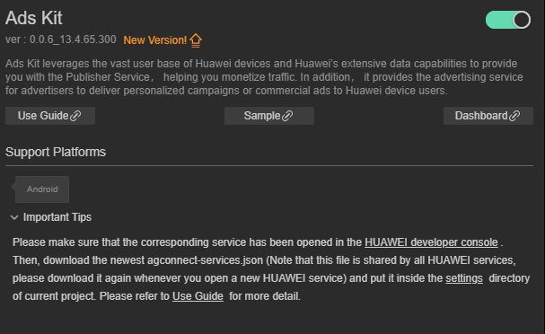
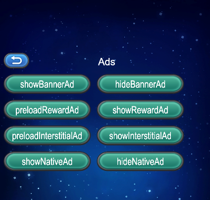

# Ads Kit (HMS Core) Quick Start

[Ads Kit](https://developer.huawei.com/consumer/en/hms/huawei-adskit) leverages the vast user base of Huawei devices and Huawei's extensive data capabilities to provide you with the Publisher Service, helping you monetize traffic. In addition, it provides the advertising service for advertisers to deliver personalized campaigns or commercial ads to Huawei device users.

## Features

### Petal Ads Publisher Service

Petal Ads Publisher Service is a monetization service that leverages Huawei's extensive data capabilities to display high-quality ad content in your apps to the vast user base of Huawei devices. To integrate Petal Ads Publisher Service, refer to [this document](https://developer.huawei.com/consumer/en/doc/distribution/monetize/advantage-0000001051201913).

### Identifier Service

Ads Kit provides the Open Advertising Identifier (OAID) and install referrer capabilities for advertisers to deliver personalized ads and attribute conversions.

- An OAID is a non-permanent device identifier. You can use OAIDs to provide personalized ads for users while protecting their privacy. In addition, third-party tracking platforms can provide conversion attributions for advertisers based on OAIDs.

- You and advertisers can obtain app install referrers through APIs provided by Huawei. Advertisers can use install referrers to attribute conversions to different promotion channels.

### Version Update Description

- Latest Version：[3.x] 1.1.0_13.4.74.300
    - SDK upgrade to 13.4.74.300

- Version：[3.x] 1.0.2_13.4.68.300
    - Improve internal implementation

    - SDK upgrade to 13.4.68.300

- Version:[3.x]0.0.5_6.11.0.301

    - Update the SDK and add some functions.

## Enable Ads Kit Service

- Use Cocos Creator to open the project that needs to be connected to Ads Kit.

- Click on **Panel -> Service** in the menu bar to open the Service panel, select Ads Kit service to go to the service detail page, and then click on the **Enable** button in the top right to enable the service. 

    

- Refer to the [Configuring App Information in AppGallery Connect](https://developer.huawei.com/consumer/en/doc/development/HMSCore-Guides/android-config-agc-0000001050163815) documentation to complete developer registration, app creation, enable Huawei Analysis Service parameter configuration, and enable the API.

- Fill in **App installation source** in "Params Config" of Analytics Kit service panel. For example, if the installation source of the application is Huawei AppGallery, you can fill in  **AppGallery**. The installation source name can contain up to 128 characters, including letters, digits, underscores (_), hyphens (-), and spaces. The name cannot start or end with a space if it contains only digits.

## Sample

Developer can get a quick taste of the Location Kit with the sample project.

- Click on the **Sample** button in the Analytics Kit service panel, clone or download, and open the project in Cocos Creator.

- After enabling the Analytics Kit service and configuring the HUAWEI configuration file as described above, you can open the **Build** panel to compile the project by clicking **Project -> Build** in the Creator editor menu bar. Cocos Creator v2.4.1 and above, you could publish to HUAWEI AppGallery Connect. Below Creator v2.4.1 could publish to the Android platform.

- Need to test on Huawei or Honor brand phones with HMS Core service installed.

- Once the Sample project is running on the phone, click the **Ads** button on the homepage for testing.

    

## Developer Guide

All of the Ads service apis are asynchronous callbacks. Can use`huawei.hms.ads.adsService.once` get single callback, or use `huawei.hms.ads.adsService.on`to monitor the callback.

**Ad Type**

|AD Type|Description|
|-|-|
|[Banner Ads](https://developer.huawei.com/consumer/en/doc/development/HMSCore-Guides/publisher-service-js-banner-0000001177692164)|Banner ads are rectangular images that occupy a spot at the top, middle, or bottom within an app's layout. Display a banner ad by coding or using a component.|
|[Rewarded Ads](https://developer.huawei.com/consumer/en/doc/development/HMSCore-Guides/publisher-service-js-rewarded-0000001177852100)|Rewarded ads are full-screen video ads that allow users to view in exchange for in-app rewards.|
|[Interstitial Ads](https://developer.huawei.com/consumer/en/doc/development/HMSCore-Guides/publisher-service-js-interstitial-0000001178013618)|Interstitial ads are displayed in full-screen mode when an app is launched, paused, or exited.|
|[ Native Ads](https://developer.huawei.com/consumer/en/doc/development/HMSCore-Guides/publisher-service-js-native-0000001223053343)|Native ads can be images, text, or videos, which fit seamlessly into the surrounding content to match your app design. You can customize native ads as needed. Display a native ad by using a component or coding.|

#### Listen for ad events.

- Ads are displayed, clicked, closed, the video starts, etc. The following methods can be used to listen for these events. The returned data will contain `adType` and `adId` fields to distinguish between ads.

```JavaScript
huawei.hms.ads.adsService.on(huawei.hms.ads.API_EVENT_LIST.showAdsCallback, (res: huawei.hms.ads.ApiCbResult) => { this.consolePanel && this.consolePanel.log("showAdsCallback\n" + res.toString()); }, this, false);
huawei.hms.ads.adsService.on(huawei.hms.ads.API_EVENT_LIST.preloadAdsCallback, (res: huawei.hms.ads.ApiCbResult) => { this.consolePanel && this.consolePanel.log("preloadAdsCallback\n" + res.toString()); }, this, false);
huawei.hms.ads.adsService.on(huawei.hms.ads.API_EVENT_LIST.onAdLoadedCallback, (res: huawei.hms.ads.ApiCbResult) => { this.consolePanel && this.consolePanel.log("onAdLoadedCallback\n" + res.toString()); }, this, false);
huawei.hms.ads.adsService.on(huawei.hms.ads.API_EVENT_LIST.onAdFailedCallback, (res: huawei.hms.ads.ApiCbResult) => { this.consolePanel && this.consolePanel.log("onAdFailedCallback\n" + res.toString()); }, this, false);
huawei.hms.ads.adsService.on(huawei.hms.ads.API_EVENT_LIST.onAdOpenedCallback, (res: huawei.hms.ads.ApiCbResult) => { this.consolePanel && this.consolePanel.log("onAdOpenedCallback\n" + res.toString()); }, this, false);
huawei.hms.ads.adsService.on(huawei.hms.ads.API_EVENT_LIST.onAdClickedCallback, (res: huawei.hms.ads.ApiCbResult) => { this.consolePanel && this.consolePanel.log("onAdClickedCallback\n" + res.toString()); }, this, false);
huawei.hms.ads.adsService.on(huawei.hms.ads.API_EVENT_LIST.onAdLeaveCallback, (res: huawei.hms.ads.ApiCbResult) => { this.consolePanel && this.consolePanel.log("onAdLeaveCallback\n" + res.toString()); }, this, false);
huawei.hms.ads.adsService.on(huawei.hms.ads.API_EVENT_LIST.onAdClosedCallback, (res: huawei.hms.ads.ApiCbResult) => { this.consolePanel && this.consolePanel.log("onAdClosedCallback\n" + res.toString()); }, this, false);
huawei.hms.ads.adsService.on(huawei.hms.ads.API_EVENT_LIST.onVideoStartCallback, (res: huawei.hms.ads.ApiCbResult) => { this.consolePanel && this.consolePanel.log("onVideoStartCallback\n" + res.toString()); }, this, false);
huawei.hms.ads.adsService.on(huawei.hms.ads.API_EVENT_LIST.onVideoPlayCallback, (res: huawei.hms.ads.ApiCbResult) => { this.consolePanel && this.consolePanel.log("onVideoPlayCallback\n" + res.toString()); }, this, false);
huawei.hms.ads.adsService.on(huawei.hms.ads.API_EVENT_LIST.onVideoEndCallback, (res: huawei.hms.ads.ApiCbResult) => { this.consolePanel && this.consolePanel.log("onVideoEndCallback\n" + res.toString()); }, this, false);
huawei.hms.ads.adsService.on(huawei.hms.ads.API_EVENT_LIST.onRewardAdOpenedCallback, (res: huawei.hms.ads.ApiCbResult) => { this.consolePanel && this.consolePanel.log("onRewardAdOpenedCallback\n" + res.toString()); }, this, false);
huawei.hms.ads.adsService.on(huawei.hms.ads.API_EVENT_LIST.onRewardAdClosedCallback, (res: huawei.hms.ads.ApiCbResult) => { this.consolePanel && this.consolePanel.log("onRewardAdClosedCallback\n" + res.toString()); }, this, false);
huawei.hms.ads.adsService.on(huawei.hms.ads.API_EVENT_LIST.onRewardAdFailedToShowCallback, (res: huawei.hms.ads.ApiCbResult) => { this.consolePanel && this.consolePanel.log("onRewardAdFailedToShowCallback\n" + res.toString()); }, this, false);
huawei.hms.ads.adsService.on(huawei.hms.ads.API_EVENT_LIST.onRewardedCallback, (res: huawei.hms.ads.ApiCbResult) => { this.consolePanel && this.consolePanel.log("onRewardedCallback\n" + res.toString()); }, this, false);
```

#### Display an ad

`showAds(adType: string, jsonInfo: string): void;`

**Descriptions**

- Call the **isLoaded()** method to check whether an ad has been loaded. If the ad has been loaded, call the **show(Activity activity)** method of the [InterstitialAd](https://developer.huawei.com/consumer/en/doc/development/HMSCore-References/interstitialad-0000001050066835) object to display the ad.

**Parameter Description**

|Parameter|Format|Description|
|-|-|-|
|adType|"Interstitial" "Native" "Reward" "Banner"|AD Type|
|adId|"testx9dtjwj8hp"|AD ID, Native Native advertising, advertising show ID corresponding to different forms of Native|
|pos|"0"|AD placement, optional in the case of Banner, defaults to "0". The center of the "0" : "1" just below: "2" : upper part|
|adSize|"BANNER_SIZE_360_144"|AD size, optional in the case of Banner, defaults to "BANNER_SIZE_360_57", refer to the [AD size documentation](https://developer.huawei.com/consumer/en/doc/development/HMSCore-Guides/publisher-service-banner-0000001050066915#ZH-CN_TOPIC_0000001057202899__section1395312137311).|
|nativeLayout|"native_small" "native_full"|Native: Optional, it corresponds to the two [native AD template files](https://developer.huawei.com/consumer/en/doc/development/HMSCore-Guides/publisher-service-native-0000001050064968#ZH-CN_TOPIC_0000001057043311__section424619410104) that come with the plugin, or users can modify the layout directly in the corresponding`.xml` file. The default is "native_full".|
|requestCustomDislikeThisAd|"1"|Users can hide or close the ads they are not interested in by themselves. The default value is "0". This function is not available in mainland China, and you need to check the output information in Log if you need to debug.|
|choicesPosition|"TOP_LEFT" "TOP_RIGHT" "BOTTOM_RIGHT" "BOTTOM_LEFT" "INVISIBLE"|Native advertising and optional `requestCustomDislikeThisAd`= "1" case,[ set the placement advertising options](https://developer.huawei.com/consumer/en/doc/HMSCore-References/nativeadconfiguration-builder-0000001050064912-V5#ZH-CN_TOPIC_0000001055645257__section8995193618112), the default value is "TOP_RIGHT"|
|videoConfiguration|"1"|Native case optional, [video advertising parameters set](https://developer.huawei.com/consumer/en/doc/development/HMSCore-References/videoconfiguration-builder-0000001050064890). The default value is "0". If it is set to "1", the following parameters can be set|
|audioFocusType|"GAIN_AUDIO_FOCUS_ALL" "NOT_GAIN_AUDIO_FOCUS_WHEN_MUTE" "NOT_GAIN_AUDIO_FOCUS_ALL"|Optional if `videoConfiguration` = "1", [set the audio focus type of the video](https://developer.huawei.com/consumer/en/doc/development/HMSCore-References/videoconfiguration-builder-0000001050064890), default is "GAIN_AUDIO_FOCUS_ALL".|
|startMuted|"0"|Native ads and `videoConfiguration` = "1" Optional, [set the initial silence state of the video](https://developer.huawei.com/consumer/cn/doc/development/HMSCore-References/videoconfiguration-builder-0000001050064890), default is "1"|

**Example**

```JavaScript
let params = {
      adId: "testw6vs28auh3",
      pos: "0",
      adSize: "BANNER_SIZE_320_50"
};
huawei.hms.ads.adsService.showAds("Banner", JSON.stringify(params));
```

#### Hide ads

`hideAds(adType: string, jsonInfo: string): void;`

**Parameter Description**

|Parameter|Format|Description|
|-|-|-|
|adType|"Banner" "Native"|AD Type|
|jsonInfo|{ adId: "testw6vs28auh3",  }|AD ID|

**Example**

```JavaScript
let params = {
    adId: "testw6vs28auh3",
};
huawei.hms.ads.adsService.hideAds("Banner", JSON.stringify(params));
```

#### Preload Ads

`preloadAds(adType: string, jsonInfo: string): void;`

**Parameter Description**

|Parameter|Format|Description|
|-|-|-|
|adType|"Reward" "Interstitial"|AD Type|
|jsonInfo|{ adId: "testb4znbuh3n2",  }|AD ID|

**Example**

```JavaScript
let params = {
    adId: "testb4znbuh3n2",
};
huawei.hms.ads.adsService.preloadAds("Interstitial", JSON.stringify(params));
```

## Else

Detailed functional specifications, please refer to the service [directory](https://developer.huawei.com/consumer/en/doc/development/HMSCore-Guides/publisher-service-introduction-0000001070671805).

