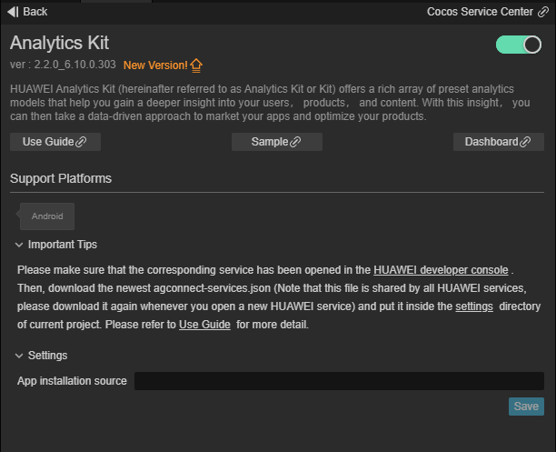
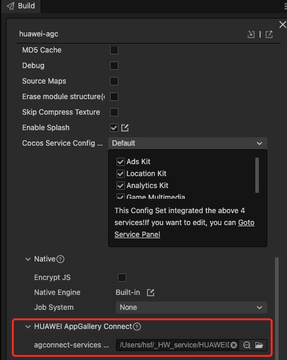
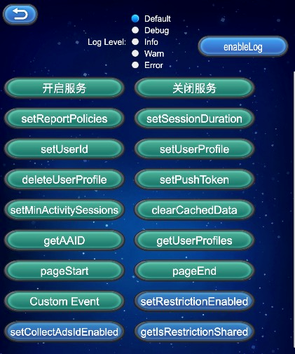

# Analytics Kit (HMS Core) Quick Start

[Analytics Kit](https://developer.huawei.com/consumer/en/hms/huawei-analyticskit) is a one-stop user behavior analysis platform for products such as mobile apps, web apps, quick apps, quick games, and mini-programs. It offers scenario-specific data collection, management, analysis, and usage, helping enterprises achieve effective user acquisition, product optimization, precise operations, and business growth.

**It is a one-stop digital, intelligent data analysis platform tailored to meet the needs of enterprises' cross-departmental and cross-role personnel.**

- Based on the user events and user attributes automatically collected by the Analytics SDK, as well as the reported user behavior data, Analytics Kit can automatically generate data dashboards and analysis reports on user retention, users, user behavior, user lifecycle, app versions, and crashes. In addition, it supports multi-dimensional drill-down analysis and comparison, satisfying data analysis requirements of different roles, such as the marketing personnel, product managers, activity operations personnel, user experience management personnel, and technical developers, as well as driving intelligent business analysis and decision-making.

### Use Cases

- Analyze user behavior using both predefined and custom events.

- Use audience building to tailor your marketing activity to your users' behaviors and preferences.

- Use dashboards and analytics to measure your marketing activity and identify areas to improve.

### Version Update Description

- Latest Version：[3.x] 2.3.5_6.12.0.300
    - Improve internal implementation

    - SDK upgrade to 6.12.0.300

- [3.x] 2.2.1_6.10.0.303

    - Upgrade the SDK version.

-  0.5.7_5.0.5.301

    - Add new predefined events and parameters.

- v0.5.5_5.0.5.301

    - Update the Analytics SDK to version 5.0.5.301.

    - Add support for the setting of the installation source.

    - Add `setReportPolicies` to set the report policies.

    - Add predefined events and parameters specific to the gaming and e-commerce industries.

    - Pass `null` or `undefined` in the `setUserProfile` method, can delete the corresponding user profile.

- v0.5.3_5.0.1

    - Integrated Huawei HMS Analytics Kit.

## Enable Analytics Kit Service

- Use Cocos Creator to open the project that needs to be connected to Analytics Kit.

- Click on **Panel -> Service** in the menu bar to open the Service panel, select Analytics Kit service to go to the service detail page, and then click on the **Enable** button in the top right to enable the service. 

    

- Refer to the [Configuring App Information in AppGallery Connect](https://developer.huawei.com/consumer/en/doc/development/HMSCore-Guides/android-config-agc-0000001050163815) documentation to complete developer registration, app creation, enable Huawei Analysis Service parameter configuration, and enable the API.

- Fill in **App installation source** in "Params Config" of Analytics Kit service panel. For example, if the installation source of the application is Huawei AppGallery, you can fill in  **AppGallery**. The installation source name can contain up to 128 characters, including letters, digits, underscores (_), hyphens (-), and spaces. The name cannot start or end with a space if it contains only digits.

### Configs HUAWEI Config File

Most of HUAWEI Services need the `agconnect-services.json` configuration file. If there are operations such as newly opened services, please update the file in time.

- Sign in to [AppGallery Connect](https://developer.huawei.com/consumer/en/service/josp/agc/index.html) find your project from the project list and select the app on the project card.

- On the **Project Setting** page, click the configuration file **agconnect-services.json** to download it. The `agconnect-services.json` file **must be copied manually** to the `settings` directory of the project directory after downloading or updating.

    

- For Creator v2.4.3 and above, if you want to publish to the [HUAWEI AppGallery Connect](https://docs.cocos.com/creator/manual/en/publish/publish-huawei-agc.html), you can select the downloaded or updated configuration file directly in the **Build** panel, no need to copy it manually.

    

### Verify whether the service is integrated successfully

- Once the Analytics Kit service is integrated, you can publish to the Android platform without changing your code. Please make sure that the **Package Name** on the **Build** panel is consistent with the **Package Name** set in the AppGallery Connect console.

- Login the [AppGallery Connect](https://developer.huawei.com/consumer/en/service/josp/agc/index.html) console, open the project, go to **HUAWEI Analytics -> User Analysis -> New Users**. If you can see new user information (usually displayed within 10 minutes), which means the integrate is successful.

## Sample Project

Developer can get a quick taste of the Analytics Kit with the sample project.

- Click on the **Sample** button in the Analytics Kit service panel, clone or download, and open the project in Cocos Creator.

- After enabling the Analytics Kit service and configuring the HUAWEI configuration file as described above, you can open the **Build** panel to compile the project by clicking **Project -> Build** in the Creator editor menu bar. Cocos Creator v2.4.1 and above, you could [publish to HUAWEI AppGallery Connect](https://docs.cocos.com/creator/manual/en/publish/publish-huawei-agc.html). Below Creator v2.4.1 could [publish to the Android platform](https://docs.cocos.com/creator/manual/en/publish/publish-native.html).

- Need to test on Huawei or Honor brand phones with HMS Core service installed.

- Once the Sample project is running on the phone, click the **Analytics** button on the homepage for testing.

    

## Developer Guide

Analytics kit provide some [Automatically Collected Events](https://developer.huawei.com/consumer/en/doc/development/HMSCore-Guides-V5/android-automatic-event-collection-0000001051757143-V5). Such events can be automatically collected without extra coding, and the only requirement is that the function of collecting system events is enabled. (The function is automatically enabled during initiation.)

When the analysis service plug-in is started, the initialization of the SDK has been called, and the developer does not need to call it again.

### Custom Events

`onEvent(eventId: any, params: any): void`

Such events can be used to meet personalized analysis requirements that cannot be met by automatically collected events and predefined events.

You may need personalized events for logging and analytics. Analytics Kit allows you to customize events and extend event parameters, or add personalized parameters for predefined events.

For example, you can add custom event `begin_examination` to indicate the event of entering a new exam and add the `exam_difficulty` parameter to define the exam difficulty.

**Parameter Description**:

|Name|Description|
|-|-|
|eventId|Event ID. It is consisting of numbers, letters and underscores, cannot start with a number, cannot contain spaces, cannot exceed 256 characters in length, cannot use [Automatically Collected Events](https://developer.huawei.com/consumer/en/doc/development/HMSCore-Guides-V5/android-automatic-event-collection-0000001051757143-V5). It is recommended to use [Predefined Events](https://developer.huawei.com/consumer/en/doc/development/HMSCore-Guides-V5/android-predefined-events-0000001051997159-V5) first.|
|params|Information carried in the event. The number of built-in key-value pairs in the Bundle cannot exceed 2048 and the size cannot exceed 200 KB. The key value in the Bundle can consist of digits, letters, and underscores (_) but cannot start with a digit.|

**Example**:

```JavaScript
let eventName = 'myEvent';
let params = {
    name: 'userName',
    age: 18,
    others: {
        stature: 199,
        level: 100
    }
};

huawei.hms.analytics.analyticsService.onEvent(eventName, params);
```

### Selectable functions

#### Specifies whether to enable event collection

`setAnalyticsEnabled(enable: boolean): void`

Specifies whether to enable event collection. If the function is disabled, no data is recorded.

**Parameter Description**:

|Name|Description|
|-|-|
|enabled|Indicates whether to enable automatic event collection. The options are as follows. The default value is **true**.<br>**true**: Enable the function<br>**false**: Close the function|

**Example**:

```JavaScript
huawei.hms.analytics.analyticsService.setAnalyticsEnabled(true);
```

#### Sets a user ID

`setUserId(userId: string): void`

When the API is called, a new session is generated if the old value of **userId* is not empty and is different from the new value. If you do not want to use **userId** to identify a user (for example, when a user signs out), you must set id to `null`.

The **userId** is used by Analytics Kit to associate user data. The use of **userId** must comply with related privacy regulations. You need to declare the use of such information in the privacy statement of your app.

**Parameter Description**:

|Name|Description|
|-|-|
|userId|User ID, a string containing a maximum of 256 characters. The value cannot be empty.|

**Example**:

```JavaScript
huawei.hms.analytics.analyticsService.setUserId("a123456");
```

#### Sets user attributes

`setUserProfile(name: string, value: string): void`

Sets user attributes. The values of user attributes remain unchanged throughout the app lifecycle and during each session. A maximum of 25 user attributes are supported. If the name of an attribute set later is the same as that of an existing attribute, the value of the existing attribute is updated.

Analytics Kit automatically collects some user attributes. You can use these attributes without extra coding.

**Parameter Description**:

|Name|Description|
|-|-|
|name|Name of the user attribute, a string containing a maximum of 256 characters excluding spaces and invisible characters. The value cannot be empty.|
|value|Value of the user attribute, a string containing a maximum of 256 characters, pass `null` or `undefined` to delete the corresponding user attribute.|

**Example**:

```JavaScript
let name = 'profile1';
let value = 'value1';
huawei.hms.analytics.analyticsService.setUserProfile(name, value);
console.log('setUserProfile...', name, value);
```

#### Sets the push token

`setPushToken(token: string): void`

Sets the push token. After obtaining a push token through Push Kit, call this method to save the push token so that you can use the audience defined by HUAWEI Analytics to create HCM notification tasks.

If the HMS Core Push Kit is integrated through SDKHub, the callback returned by calling the `startPush` function is the **Push Token**.

**Parameter Description**:

|Name|Description|
|-|-|
|token|Push token, a string containing a maximum of 256 characters. The value cannot be empty.|

**Example**:

```JavaScript
huawei.hms.analytics.analyticsService.setPushToken("XXX");
```

#### Sets the minimum interval for starting a new session

`setMinActivitySessions(time: number): void`

Sets the minimum interval for starting a new session. A new session is generated when an app is switched back to the foreground after it runs in the background for the specified minimum interval. By default, the minimum interval is 30,000 milliseconds (that is, 30 seconds).

**Parameter Description**:

|Name|Description|
|-|-|
|milliseconds|Minimum interval for updating a session, in milliseconds.|

**Example**:

```JavaScript
let value = 1000 * 60 * 60;
huawei.hms.analytics.analyticsService.setMinActivitySessions(value);
```

#### Sets the session timeout interval

`setSessionDuration(time: number): void`

Sets the session timeout interval. A new session is generated when an app is running in the foreground but the interval between two adjacent events exceeds the specified timeout interval. By default, the timeout interval is 1,800,000 milliseconds (that is, 30 minutes).

**Parameter Description**:

|Name|Description|
|-|-|
|milliseconds|Session timeout interval, in milliseconds.|

**Example**:

```JavaScript
let value = 1000 * 60 * 60;
huawei.hms.analytics.analyticsService.setSessionDuration(value);
```

#### Clears all the collected data from the local cache

`clearCachedData(): void`

Deletes all collected data cached locally, including cached data that failed to be sent.

**Example**:

```JavaScript
huawei.hms.analytics.analyticsService.clearCachedData();
```

#### Obtains the app instance ID

`getAAID(): void`

Obtains the app instance ID from AppGallery Connect. Call the function with `huawei.hms.analytics.analyticsService.once` to get a single callback, or use `huawei.hms.analytics.analyticsService.on` lintener to listen for callbacks.

**Example**:

```JavaScript
huawei.hms.analytics.analyticsService.getAAID();
huawei.hms.analytics.analyticsService.once(huawei.hms.HMS_ANALYTICS_EVENT_LISTENER_NAME.GET_AAID, (result) => {
    console.log('getAAID...', JSON.stringify(result));
});
```

#### Obtains the predefined or custom user attributes

`getUserProfiles(preDefined: boolean): void`

Obtains predefined and custom user attributes in A/B Testing. Call the function with `huawei.hms.analytics.analyticsService.once` to get a single callback, or use `huawei.hms.analytics.analyticsService.on` lintener to listen for callbacks.

**Parameter Description**:

|Name|Description|
|-|-|
|preDefined|Indicates whether to obtain predefined user attributes. <br>**true**: Obtains predefined user attributes<br>**false**: Obtains custom user attributes|

**Example**:

```JavaScript
huawei.hms.analytics.analyticsService.getUserProfiles();
huawei.hms.analytics.analyticsService.once(huawei.hms.HMS_ANALYTICS_EVENT_LISTENER_NAME.GET_USER_PROFILES, (result) => {
    console.log('getUserProfiles...', JSON.stringify(result));
});
```

#### Defines a custom page entry event

`pageStart(pageName: string, pageClassOverride: string): void`

Customizes a page entry event. The API applies only to non-activity pages because automatic collection is supported for activity pages. If this API is called for an activity page, statistics on page entry and exit events will be inaccurate.

After this API is called, the `pageEnd()` API must be called.

**Parameter Description**:

|Name|Description|
|-|-|
|pageName|Name of the current page, a string containing a maximum of 256 characters. The value cannot be empty.|
|pageClassOverride|Class name of the current page, a string containing a maximum of 256 characters. The value cannot be empty.|

**Example**:

```JavaScript
huawei.hms.analytics.analyticsService.pageStart("pageName1", "pageClassOverride1");
```

#### Defines a custom page exit event

`pageEnd(pageName: string): void`

**Parameter Description**:

|Name|Description|
|-|-|
|pageName|Name of the current page, a string containing a maximum of 256 characters. The value cannot be empty. It must be the same as the value of **pageName** passed in `pageStart()`.|

**Example**:

```JavaScript
huawei.hms.analytics.analyticsService.pageEnd("pageName1");
```

#### Sets the automatic event reporting policy

`setReportPolicies(...reportPolicies: ReportPolicy[])`

**Parameter Description**:

|Name|Description|
|-|-|
|policies|Policy for data reporting. Four policies are supported, and multiple policies can be set at the same time.<br>**ON_APP_LAUNCH_POLICY**: An event is reported immediately when this policy is set. After that, an event is reported each time the app is started.<br>**ON_MOVE_BACKGROUND_POLICY**: This event is reported when an app is switched to the background (including app exit).<br>**ON_SCHEDULED_TIME_POLICY**: An event is reported at the specified interval. The value ranges from 60 to 1800, in seconds. If the specified value is beyond the value range, the boundary value is used.<br>**ON_CACHE_THRESHOLD_POLICY**: An event is reported when the number of cached events reaches the threshold. The value ranges from 30 to 1000. The default value is 30. If the specified value is beyond the value range, the boundary value is used.|

**Note**:

- The preceding reporting policies take effect only when the debug mode is disabled.

- **onMoveBackgroundPolicy** and **onCacheThresholdPolicy** are default policies. If no policy is set, the two policies automatically take effect. If **onMoveBackgroundPolicy** is not included in the configured event reporting policies, this policy will not take effect.

- **onCacheThresholdPolicy** is mandatory. This policy is effective no matter what policy has been configured. You can change the threshold as needed.

- Event reporting policies will be updated if a policy setting API is called multiple times. Only the policy set by the last API is effective.

- When a policy is met and event reporting is triggered, the event is cached locally if no network is available and will be reported again when reporting conditions are met next time.

- The specified event reporting policies are saved persistently.

- If the app is uninstalled when only **onAppLaunchPolicy** or **onScheduledTimePolicy** is specified, events of the app may be lost.

**Example**:

```JavaScript
let ReportPolicy = huawei.hms.analytics.ReportPolicy;
let moveBackgroundPolicy = ReportPolicy.ON_MOVE_BACKGROUND_POLICY;
let scheduledTimePolicy = ReportPolicy.ON_SCHEDULED_TIME_POLICY;
scheduledTimePolicy.threshold = 600;
huawei.hms.analytics.analyticsService.setReportPolicies(moveBackgroundPolicy, scheduledTimePolicy);
```

#### Enables the debug log function

`static enableLog(level?: LOG_LEVEL): void`

Enables the debug log function

**Parameter Description**:

|Name|Description|
|-|-|
|level|Enables the debug log function and specify the level of the debug log.<br>Debug log level:<br>huawei.hms.LOG_LEVEL.debug, <br>huawei.hms.LOG_LEVEL.info, <br>huawei.hms.LOG_LEVEL.warn, <br>huawei.hms.LOG_LEVEL.error.|

**Example**:

```JavaScript
huawei.hms.analytics.AnalyticsTools.enableLog();

huawei.hms.analytics.AnalyticsTools.enableLog(huawei.hms.LOG_LEVEL.debug);
```


#### Sets whether to disable data analysis

`setRestrictionEnabled(isEnabled:boolean):void`

he default value is **false**, which indicates that data analysis is enabled.

**Parameter Description**:

|Name|Description|
|-|-|
|isEnabled|Indicates whether to disable data analysis. The default value is false.
true: yes
false: no|

**Example:**

```JavaScript
huawei.hms.analytics.analyticsService.setRestrictionEnabled(true);
```


#### Sets whether to collect advertising IDs

`setCollectAdsIdEnabled(isEnabled:boolean):void`

**Parameter Description**:

|Name|Description|
|-|-|
|isEnabled|Indicates whether to collect advertising IDs. The default value is true
true: yes
false: no|

**Example:**

```JavaScript
  huawei.hms.analytics.analyticsService.setCollectAdsIdEnabled(true);
```


#### Adds default event parameters.

`addDefaultEventParams (params: any | null | undefined): void`

**Description:**

- A maximum of 100 key-value pairs are supported. The key in each key-value pair can contain a maximum of 256 characters and can consist of only digits, letters, and underscores (_), but cannot start with a digit. The value in each key-value pair can contain a maximum of 256 characters, and can only be of the string, int, long, double, boolean, float, char, byte, or short type.

- If **params** is set to **null**, all cached default event parameters will be cleared. If the value in a passed key-value pair is **null**, the corresponding default event parameter will be deleted. If the key in a passed key-value pair already exists, the corresponding default event parameter will be updated.

- The number and value length of default event parameters will be counted in [onEvent](https://developer.huawei.com/consumer/en/doc/development/HMSCore-References/android-api-hianalytics-instance-0000001050987219#section15204518184114), so pay attention to the parameter usage restrictions.

**Parameter Description**:

|Name|Description|
|-|-|
|params|key-value pair object | null | undefined|

**Example**

```JavaScript
 let params = {
     platform: 'windows',
     os: 'win10',
 };
 huawei.hms.analytics.analyticsService.addDefaultEventParams(params);
```


#### Sets the app installation source

`setChannel (channel: string): void`

**Description:**

- The setting takes effect only when the method is called for the first time.

- To set the app installation source, you can also add the **meta-data** configuration to set the value of **install_channel** in the **AndroidManifest.xml** file. For details, please refer to [Procedure](https://developer.huawei.com/consumer/en/doc/development/HMSCore-Guides/android-accessing-0000001050161888#section1713572355712).

- If you have already set an installation source in the **AndroidManifest.xml** file, the value of **channel** set through this method will not take effect.

**Parameter Description:**

|Name|Description|
|-|-|
|channel|App installation source, a string containing a maximum of 128 characters. The value cannot be empty. The value can consist of only letters, digits, underscores (_), hyphens (-), and spaces. It cannot start or end with a space.|

**Example:**

```JavaScript
huawei.hms.analytics.analyticsService.setChannel("AppGallery");
```


#### Sets whether to collect system attributes

`setPropertyCollection (property: string, enabled: boolean): void`

**Description:**

- Currently, this method applies only to the **userAgent** attribute.

- To disable system attribute collection, you can also add the **meta-data** configuration to set the value of **analyticskit_properties_collection_disabled** in the **AndroidManifest.xml** file. For details, please refer to [(Optional) Configuring the AndroidManifest.xml File](https://developer.huawei.com/consumer/en/doc/development/HMSCore-Guides/android-accessing-0000001050161888#section19400124153911).

- The value set through this method has a higher priority than that set in the **AndroidManifest.xml** file.

**Parameter Description:**

|Name|Description|
|-|-|
|property|System attribute. Only userAgent is supported now.|
|enabled|Indicates whether to collect system attributes. The default value is true.
true: yes
false: no|

**Example:**

```JavaScript
huawei.hms.analytics.analyticsService.setPropertyCollection("userAgent", true)
```


#### Sets a custom referrer

`setCustomReferrer (customReferrer: string): void`

**Description:**

- This method takes effect only when it is called for the first time.

**Parameter Description:**

|Name|Description|
|-|-|
|customReferrer|Custom referrer, a string containing a maximum of 256 characters. The value cannot be empty.|

**Example:**

```JavaScript
huawei.hms.analytics.analyticsService.setCustomReferrer("customReferrer1");
```


#### Obtains the processing location of the uploaded data.

`getDataUploadSiteInfo (): void`

**Description:**

- Obtains the processing location of the uploaded data.

**Example:**

```JavaScript
 huawei.hms.analytics.analyticsService.getDataUploadSiteInfo();
        huawei.hms.analytics.analyticsService.once(huawei.hms.analytics.HMS_ANALYTICS_EVENT_LISTENER_NAME.GET_DATA_UPLOAD_SITE_INFO, (result) => {
        console.log('getDataUploadSiteInfo', JSON.stringify(result));
});
```

## Personal Data Processing

How to get the end user control personal data, please refer to [Personal Data Processing](https://developer.huawei.com/consumer/en/doc/development/HMSCore-Guides/android-personal-data-0000001050705120) documention.

## API Reference

Please refer to the [Analytics Kit - API Reference](https://service.cocos.com/document/api/modules/huawei.hms.analytics.html).

