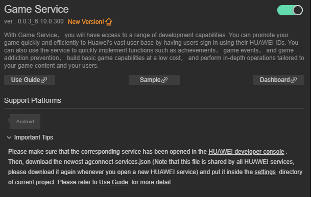
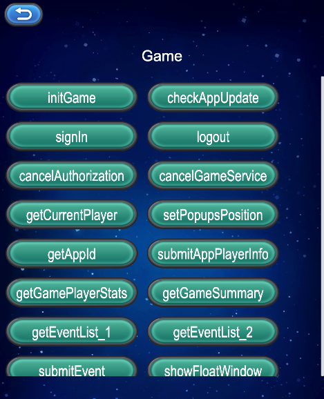

# Game Service(HMS Core) Quick Start

With [Game Service](https://developer.huawei.com/consumer/en/hms/huawei-game), you will have access to a range of development capabilities. You can promote your game quickly and efficiently to Huawei's vast user base by having users sign in using their HUAWEI IDs. You can also use the service to quickly implement functions such as achievements, game events, and game addiction prevention, build basic game capabilities at a low cost, and perform in-depth operations tailored to your game content and your users.

## Functions

Game Service provides the following functions for your game apps, with which you can quickly build basic game capabilities:

- Basic functions: [initialization](https://developer.huawei.com/consumer/en/doc/development/HMSCore-Guides/game-start-0000001050123475) | [update](https://developer.huawei.com/consumer/en/doc/development/HMSCore-Guides/game-update-0000001271748961) | [sign-in](https://developer.huawei.com/consumer/en/doc/development/HMSCore-Guides/game-login-0000001050121526) | [game addiction prevention](https://developer.huawei.com/consumer/en/doc/development/HMSCore-Guides/game-anti-indulgence-0000001050123479) | [floating window](https://developer.huawei.com/consumer/en/doc/development/HMSCore-Guides/game-buoy-0000001050121528)

- Extended functions: [achievements](https://developer.huawei.com/consumer/en/doc/development/HMSCore-Guides/game-achievement-0000001050123477) | [events](https://developer.huawei.com/consumer/en/doc/development/HMSCore-Guides/game-events-0000001050121530) | [leaderboards](https://developer.huawei.com/consumer/en/doc/development/HMSCore-Guides/game-leaderboards-0000001050123481) | [saved games](https://developer.huawei.com/consumer/en/doc/development/HMSCore-Guides/game-archive-0000001050121532) | [player statistics](https://developer.huawei.com/consumer/en/doc/development/HMSCore-Guides/game-playerinfo-0000001050123483) | [basic game information](https://developer.huawei.com/consumer/en/doc/development/HMSCore-Guides/game-baseinfo-0000001050121534) | [GameTurbo engine](https://developer.huawei.com/consumer/en/doc/development/HMSCore-Guides/game-gameturbo-0000001254626641)

### Version Update Description

- Latest Version：[3.x] 1.0.1_6.12.0.300
    - Improve internal implementation
    - new PlayersClient. SavePlayerRole interface, abandoned submitAppPlayerInfo interface
    - Upgrade the SDK to 6.12.0.300

- [3.x] 0.0.4_6.10.0.300

    - Android Version：com.huawei.hms:game:6.10.0.300

    - Optimized code.

    - Added the support for Android 13 to the Game Service SDK.

    - Changed **targetSdkVersion 31** and **compileSdkVersion 31** to **targetSdkVersion 33** and **compileSdkVersion 33**, respectively.

## About SDK Dependencies

The SDK of the latest version can be used only on phones running HMS Core (APK) 6.10.0.300 or later.

## Enable Game Service

- Use Cocos Creator to open the project that needs to be connected to Game Service.

- Click on **Panel -> Service** in the menu bar to open the Service panel, select Game Service service to go to the service detail page, and then click on the **Enable** button in the top right to enable the service. 

    

- Refer to the [Configuring App Information in AppGallery Connect](https://developer.huawei.com/consumer/en/doc/development/HMSCore-Guides/android-config-agc-0000001050163815) documentation to complete developer registration, app creation, enable Huawei Analysis Service parameter configuration, and enable the API.

- Fill in **App installation source** in "Params Config" of Analytics Kit service panel. For example, if the installation source of the application is Huawei AppGallery, you can fill in  **AppGallery**. The installation source name can contain up to 128 characters, including letters, digits, underscores (_), hyphens (-), and spaces. The name cannot start or end with a space if it contains only digits.

### Configs HUAWEI Config File

Most of HUAWEI Services need the `agconnect-services.json` configuration file. If there are operations such as newly opened services, please update the file in time.

- Sign in to [AppGallery Connect](https://developer.huawei.com/consumer/en/service/josp/agc/index.html) find your project from the project list and select the app on the project card.

- On the **Project Setting** page, click the configuration file **agconnect-services.json** to download it. The `agconnect-services.json` file **must be copied manually** to the `settings` directory of the project directory after downloading or updating.

    

- For Creator v2.4.3 and above, if you want to publish to the [HUAWEI AppGallery Connect](https://docs.cocos.com/creator/manual/en/publish/publish-huawei-agc.html), you can select the downloaded or updated configuration file directly in the **Build** panel, no need to copy it manually.

    

## Sample

Developer can get a quick taste of the Location Kit with the sample project.

- Click on the **Sample** button in the Analytics Kit service panel, clone or download, and open the project in Cocos Creator.

- After enabling the Analytics Kit service and configuring the HUAWEI configuration file as described above, you can open the **Build** panel to compile the project by clicking **Project -> Build** in the Creator editor menu bar. Cocos Creator v2.4.1 and above, you could publish to HUAWEI AppGallery Connect. Below Creator v2.4.1 could publish to the Android platform.

- Need to test on Huawei or Honor brand phones with HMS Core service installed.

- Once the Sample project is running on the phone, click the **Push** button on the homepage for testing.

    

## Developer Guide

Most game service apis are asynchronous callbacks. Can use`huawei.hms.game.gameService.once` get single callback, or use `huawei.hms.game.gameService.on` to monitor the callback.

#### Get game service

```TypeScript
private game: typeof huawei.hms.game.gameService = (typeof huawei ===
'undefined'
? null
: huawei?.hms?.game?.gameService)!;
```

#### Game Initialization

`initGame ():void`

[Guide](https://developer.huawei.com/consumer/en/doc/development/HMSCore-Guides/game-start-0000001050123475)

Example

```TypeScript
this.game.once(huawei.hms.game.API_EVENT_LIST.initGameCallback, (result: huawei.hms.game.ApiCbResult) => {
    console.log(result);
});
this.game.initGame();
```

#### Checking for app updates

`checkAppUpdate(forceUpdate: boolean): void;`

[Guide](https://developer.huawei.com/consumer/en/doc/development/HMSCore-Guides/game-update-0000001271748961)

[API文档](https://developer.huawei.com/consumer/cn/doc/development/HMSCore-References/appupdateclient-0000001050123641#section1113567144514)

parameter description

|parameter|description|
|-|-|
|showUpdateDialog|true: The app update pop-up displays only the update button and the user must update the app.
false: The app update pop-up displays both the update and cancel buttons. The user can tap the cancel button to cancel the update.|

Example

```TypeScript
this.game.once(huawei.hms.game.API_EVENT_LIST.checkAppUpdateCallback, (result: huawei.hms.game.ApiCbResult) => {
    console.log(result);
});
this.game.checkAppUpdate(true);
```

#### Sign-in Solution for New Games

`signIn(useAuthorizationMode: boolean): void;`

[Guide](https://developer.huawei.com/consumer/en/doc/development/HMSCore-Guides/game-login-0000001050121526)

parameter description

|parameter|description|
|-|-|
|useAuthorizationMode|Whether to use the authorization mode to log in. Otherwise, use the silent mode to log in|

Example

```TypeScript
this.game.once(huawei.hms.game.API_EVENT_LIST.signInCallback, (result: huawei.hms.game.ApiCbResult) => {
    console.log(result);
});
this.game.signIn(true);
```

#### Signing Out of an ID

`logout(): void;`

[Guide](https://developer.huawei.com/consumer/en/doc/development/HMSCore-Guides/logout-0000001050050849)

Example

```TypeScript
this.game.once(huawei.hms.game.API_EVENT_LIST.logoutCallback, (result: huawei.hms.game.ApiCbResult) => {
    console.log(result);
});
this.game.logout();
```

#### Canceling Authorization

`cancelAuthorization(): void;`

[Guide](https://developer.huawei.com/consumer/en/doc/development/HMSCore-Guides/cancelauthorization-0000001050050857)

[API文档](https://developer.huawei.com/consumer/cn/doc/development/HMSCore-References/accountauthservice-0000001050199395#section9140325133319)

Example

```TypeScript
this.game.once(huawei.hms.game.API_EVENT_LIST.cancelAuthorizationCallback, (result: huawei.hms.game.ApiCbResult) => {
    console.log(result);
});
this.game.cancelAuthorization();
```

#### Cancel the game service authorization

`cancelGameService ():void` 

[References](https://developer.huawei.com/consumer/en/doc/development/HMSCore-References/gamesclient-0000001050123611#section58133387544)

Example

```TypeScript
this.game.once(huawei.hms.game.API_EVENT_LIST.cancelGameServiceCallback, (result: huawei.hms.game.ApiCbResult) => {
    console.log(result);
});
this.game.cancelGameService();
```

Gets the current logged-in player object data.

`getCurrentPlayer ():void`

[References](https://developer.huawei.com/consumer/en/doc/development/HMSCore-References/playersclient-0000001050121668#section1442582231216)

Example

```TypeScript
this.game.once(huawei.hms.game.API_EVENT_LIST.getCurrentPlayerCallback, (result: huawei.hms.game.ApiCbResult) => {
    console.log(result);
});
this.game.getCurrentPlayer();
```

#### Sets the position for displaying the game greeting and achievement unlocking pop-ups on the screen.

`setPopupsPosition(position:number):void`

Note

- If this API is not called, the pop-ups will be displayed at the top of the screen by default.

- Position for displaying the game greeting and achievement unlocking pop-ups on the screen. Currently, only the **1** option is available, indicating that the pop-ups are displayed at the top of the screen.

[References](https://developer.huawei.com/consumer/en/doc/development/HMSCore-References/gamesclient-0000001050123611#section66001857175314)

parameter description

|parameter|description|
|-|-|
|position|Position for displaying the game greeting and achievement unlocking pop-ups on the screen. Currently, only the 1 option is available, indicating that the pop-ups are displayed at the top of the screen.|

Example

```TypeScript
this.game.once(huawei.hms.game.API_EVENT_LIST.setPopupsPositionCallback, (result: huawei.hms.game.ApiCbResult) => {
    console.log(result);
});
this.game.setPopupsPosition(1);
```

#### Obtains the app ID of a game

`getAppId ():void`

[References](https://developer.huawei.com/consumer/en/doc/development/HMSCore-References/gamesummary-0000001050121662#section13187143319208)

Example

```TypeScript
this.game.once(huawei.hms.game.API_EVENT_LIST.getAppIdCallback, (result: huawei.hms.game.ApiCbResult) => {
   console.log(result);
});
this.game.getAppId();
```

#### [deprecated]Stores the information about a player in a game, such as the level and region.

`submitAppPlayerInfo (info: { area: string; rank: string; role: string; sociaty: string; }): void;`

[References](https://developer.huawei.com/consumer/en/doc/development/HMSCore-References/playersclient-0000001050121668#section183401219425)

Example

```TypeScript
this.game.once(huawei.hms.game.API_EVENT_LIST.submitAppPlayerInfoCallback, (result: huawei.hms.game.ApiCbResult) => {
    console.log(result);
});
this.game.submitAppPlayerInfo({
    area: "server region1", rank: "level1", role: "role1", sociaty: "Test guild information1"
});
```

#### Save the player's character information in the game, such as area uniforms, character names, etc.

`savePlayerRole (info: { serverId: string; serverName: string; roleId: string; roleName: string; }): void;`

[References](https://developer.huawei.com/consumer/cn/doc/HMSCore-References/playersclient-0000001050121668#section14448819342)

示例

```TypeScript
this.game.once(huawei.hms.game.API_EVENT_LIST.savePlayerRoleCallback, (result: huawei.hms.game.ApiCbResult) => {
    this.consolePanel.log(result);
});
this.game.savePlayerRole({
    serverId: "123", serverName: "server1", roleId: "321", roleName: "role1"
});
```

#### Obtains the statistics of the current player, such as the session duration and rank

`getGamePlayerStats (isRealTime: boolean):void`

[References](https://developer.huawei.com/consumer/en/doc/development/HMSCore-References/gameplayerstatisticsclient-0000001050123613#section202215288110)

parameter description

|parameter|description|
|-|-|
|isRealTime|Indicates whether to obtain data from Huawei game server. The options are as follows:
true: Obtain data from Huawei game server.
false: Obtain data from the local cache. Data is kept in the local cache for 5 minutes. If there is no local cache or the cache times out, data will be obtained from Huawei game server.|

Example

```TypeScript
this.game.once(huawei.hms.game.API_EVENT_LIST.getGamePlayerStatsCallback, (result: huawei.hms.game.ApiCbResult) => {
    console.log(result);
});
//Obtain data from Huawei game server
this.game.getGamePlayerStats(true);
```

#### Obtains the information about the game

`getGameSummary (fromLocal: boolean):void`

[Guide](https://developer.huawei.com/consumer/en/doc/development/HMSCore-Guides/game-baseinfo-0000001050121534)

[References](https://developer.huawei.com/consumer/en/doc/development/HMSCore-References/gamesummaryclient-0000001050123615)

parameter description

|parameter|description|
|-|-|
|fromLocal|Whether to obtain it from the local cache or from the Huawei game server|

Example

```TypeScript
this.game.once(huawei.hms.game.API_EVENT_LIST.getGameSummaryCallback, (result: huawei.hms.game.ApiCbResult) => {
    console.log(result);
});
//Obtain data from Huawei game server
this.game.getGameSummary(false);
```

#### Obtains the list of all game achievements of the current player.

`getAchievementList (forceReload: boolean):void`

[Guide](https://developer.huawei.com/consumer/en/doc/development/HMSCore-Guides/game-achievement-0000001050123477)

[References](https://developer.huawei.com/consumer/en/doc/development/HMSCore-References/achievementsclient-0000001050121648#section1887812284306)

parameter description

|parameter|description|
|-|-|
|forceReload|true: server   false: client|

Example

```TypeScript
this.game.once(huawei.hms.game.API_EVENT_LIST.getGameSummaryCallback, (result: huawei.hms.game.ApiCbResult) => {
    console.log(result);
});
//Obtain data from Huawei game server
this.game.getGameSummary(false);
```

#### Get show the achievement list page

`getShowAchievementListIntent ():void`

[Guide](https://developer.huawei.com/consumer/en/doc/development/HMSCore-Guides/game-achievement-0000001050123477)

[References](https://developer.huawei.com/consumer/en/doc/development/HMSCore-References/achievementsclient-0000001050121648#section53667366810)

Example

```TypeScript
this.game.once(huawei.hms.game.API_EVENT_LIST.getShowAchievementListIntentCallback, (result: huawei.hms.game.ApiCbResult) => {
    console.log(result);
});
this.game.getShowAchievementListIntent();
```

#### Event Reporting - Get an event list 

`getEventList (eventIds: string[], forceReload: boolean):void`

[Guide](https://developer.huawei.com/consumer/en/doc/development/HMSCore-Guides/game-events-0000001050121530)

[References](https://developer.huawei.com/consumer/en/doc/development/HMSCore-References/eventsclient-0000001050123609#section4400461198)

parameter description

|parameter|description|
|-|-|
|eventIds|IDs of the events to be obtained. The value is a string array.|
|forceReload|Indicates whether to load the event list stored on the server or cached locally. The options are as follows:
true: server
false: local cache|

Example

```TypeScript
this.game.once(huawei.hms.game.API_EVENT_LIST.getEventListCallback, (result: huawei.hms.game.ApiCbResult) => {
    this.consolePanel.log(result);
});
this.game.getEventList(null, true);
```

#### Event Reporting - Submit an event

`submitEvent (eventId: string, growAmount: number): boolean;`

[Guide](https://developer.huawei.com/consumer/en/doc/development/HMSCore-Guides/game-events-0000001050121530)

[References](https://developer.huawei.com/consumer/en/doc/development/HMSCore-References/eventsclient-0000001050123609#section143383141844)

parameter description

|parameter|description|
|-|-|
|eventId|ID of the event to be submitted. The value is obtained after you configure the event.|
|growAmount|Increment amount of the existing event value.|

Example

```TypeScript
let bol = this.game.submitEvent("xxxxxx", 1);
```

#### Show Float Window

`showFloatWindow ():void`

[G](https://developer.huawei.com/consumer/en/doc/development/HMSCore-Guides/game-buoy-0000001050121528)[uide](https://developer.huawei.com/consumer/en/doc/development/HMSCore-Guides/game-buoy-0000001050121528)

[References](https://developer.huawei.com/consumer/en/doc/development/HMSCore-References/buoyclient-0000001050123633)

Example

```TypeScript
this.game.showFloatWindow();
```

#### Hide Float Window

`hideFloatWindow ():void`

[Guide](https://developer.huawei.com/consumer/en/doc/development/HMSCore-Guides/game-buoy-0000001050121528)

[References](https://developer.huawei.com/consumer/en/doc/development/HMSCore-References/buoyclient-0000001050123633)

Example

```TypeScript
this.game.hideFloatWindow();
```

## [Achievements](https://developer.huawei.com/consumer/en/doc/development/HMSCore-Guides/game-achievement-0000001050123477)

#### [AppGallery Connect](https://developer.huawei.com/consumer/cn/service/josp/agc/index.html)

#### Execute the interface associated with the achievement

`doAchievementEvent (funcName: string, jsonData: string = "{}"):void`

parameter description

|parameter|description|
|-|-|
|funcName|Indicates the name of an executable interface visualizeWithResult / visualize / growWithResult / grow / makeStepsWithResult / makeSteps / reachWithResult / reach|
|jsonData|json Parameter in string form|

#### doAchievementEvent description

|Interface Name|Function|References|Sample Code|
|-|-|-|-|
|visualizeWithResult|reveal achievement|[Link](https://developer.huawei.com/consumer/en/doc/development/HMSCore-References/achievementsclient-0000001050121648#section1225662310354)|{            achievementId: "XXX",}|
|visualize|reveal achievement|[Link](https://developer.huawei.com/consumer/en/doc/development/HMSCore-References/achievementsclient-0000001050121648#section65981041143316)|The same as the visualizeWithResult|
|growWithResult|Synchronously increases an achievement by the given number of steps.|[Link](https://developer.huawei.com/consumer/en/doc/development/HMSCore-References/achievementsclient-0000001050121648#section183194537284)|{            achievementId: "XXX",//multiple steps achievement1            stepsNum: 1        }|
|grow|Synchronously increases an achievement by the given number of steps.|[Link](https://developer.huawei.com/consumer/en/doc/development/HMSCore-References/achievementsclient-0000001050121648#section8337723122610)|The same as the growWithResult|
|makeStepsWithResult|Synchronously sets an achievement to have the given number of steps completed|[Link](https://developer.huawei.com/consumer/en/doc/development/HMSCore-References/achievementsclient-0000001050121648#section144876556371)|{            achievementId: "XXX",//multiple steps achievement2            stepsNum: 3        }|
|makeSteps|Synchronously sets an achievement to have the given number of steps completed|[Link](https://developer.huawei.com/consumer/en/doc/development/HMSCore-References/achievementsclient-0000001050121648#section157492333365)|The same as the makeStepsWithResult|
|reachWithResult|unlocks an achievement|[Link](https://developer.huawei.com/consumer/en/doc/development/HMSCore-References/achievementsclient-0000001050121648#section1510825220405)|info = {            achievementId: "XXX",//test achievement1        }|
|reach|unlocks an achievement|[Link](https://developer.huawei.com/consumer/en/doc/development/HMSCore-References/achievementsclient-0000001050121648#section1774516813914)|The same as the reachWithResult|

Example

```TypeScript
this.game.once(huawei.hms.game.API_EVENT_LIST.doAchievementEventCallback, (result: huawei.hms.game.ApiCbResult) => {
    console.log(result);
});
let info = {
    achievementId: "XXX",
}
this.game.doAchievementEvent("visualizeWithResult", JSON.stringify(info));
```

## [Leaderboards](https://developer.huawei.com/consumer/en/doc/development/HMSCore-Guides/game-leaderboards-0000001050123481)

#### [AppGallery Connect](https://developer.huawei.com/consumer/cn/service/josp/agc/index.html)

#### rankings APIs

`doRankingsEvent (funcName: string, jsonData: string = "{}"):void`

parameter description

|parameter|description|
|-|-|
|funcName|The executable interface name getRankingSwitchStatus / setRankingSwitchStatus / submitRankingScore / submitScoreWithResult|
|jsonData|json string argument|

#### doRankingsEvent description

|Interface Name|Function|References|Sample Code|
|-|-|-|-|
|getRankingSwitchStatus|query the player's leaderboard switch setting|[Link](https://developer.huawei.com/consumer/en/doc/development/HMSCore-References/rankingsclient-0000001050121670#section8941538134716)|{}|
|setRankingSwitchStatus|set the switch to 1|[Link](https://developer.huawei.com/consumer/en/doc/development/HMSCore-References/rankingsclient-0000001050121670#section0820175112495)|{            stateValue: 1}|
|submitRankingScore|If the leaderboard switch is set to 1, your game submits the updated score of the player|[Link](https://developer.huawei.com/consumer/en/doc/development/HMSCore-References/rankingsclient-0000001050121670#section19891954194113)|{            <br>rankingId: "XXX",            <br>score: "80",            <br>scoreTips: "A",//leaderboard has a custom unit，Only characters in [a-zA-Z0-9 -] are supported.}|
|submitScoreWithResult|If the leaderboard switch is set to 1, your game submits the updated score of the player|[Link](https://developer.huawei.com/consumer/en/doc/development/HMSCore-References/rankingsclient-0000001050121670#section1747331610431)|The same as the submitRankingScore|

Example

```TypeScript
this.game.once(huawei.hms.game.API_EVENT_LIST.doRankingsEventCallback, (result: huawei.hms.game.ApiCbResult) => {
    console.log(result);
});
this.game.doRankingsEvent("getRankingSwitchStatus", "{}");
```

## [Saved Games](https://developer.huawei.com/consumer/en/doc/development/HMSCore-Guides/game-archive-0000001050121532)

#### Archive APIs

`doArchiveEvent (funcName: string, jsonData: string = "{}"):void`

parameter description

|parameter|description|
|-|-|
|funcName|The executable interface name setScopeList / addArchive / removeArchive / getLimitThumbnailSize / getLimitDetailsSize / getShowArchiveListIntent / getArchiveSummaryList / loadArchiveDetails ｜ updateArchive|
|jsonData|json string argument|

#### doArchiveEvent description

|Interface Name|Function|References|Sample Code|
|-|-|-|-|
|setScopeList|To use the saved game function, call AccountAuthParamsHelper.setScopeList when a player signs in to your game to request the scope of DRIVE_APP_DATA|无|{}|
|addArchive|submits an archive，adds an archive|[Link](https://developer.huawei.com/consumer/en/doc/development/HMSCore-References/archivesclient-0000001050123603#section919631562213)|{            <br>activeTime: "5000",//Set the game duration for save changes. (Timestamp of how long the changes were archived.)            <br>currentProgress: "50",//Set the progress of the archive. (archive progress value, the unit shall be defined by developers.)            <br>descInfo: "savedata" + Math.ceil(Math.random() * 100), //设置存档的描述。(存档的描述。)            <br>// thumbnail: "archiveIcon.png",//The description of the setup file. (Description of the archive.)            <br>// thumbnailMimeType: "png",//Mime type of the encased image.            <br>archiveDetails: "time = 5000,progress = 50",            <br>isSupportCache: "0",//Whether to support network exceptions to the local cache first, network recovery before submission. "1" : Yes, others: No        }|
|removeArchive|Deletes an archive|[Link](https://developer.huawei.com/consumer/en/doc/development/HMSCore-References/archivesclient-0000001050123603#section11235115492320)|{            archiveId: "XXXXX",  }|
|getLimitThumbnailSize|Obtains the maximum size of an archive cover file allowed by Huawei game server|[Link](https://developer.huawei.com/consumer/en/doc/development/HMSCore-References/archivesclient-0000001050123603#section988591510251)|{}|
|getLimitDetailsSize|Obtains the maximum size of an archive cover file allowed by Huawei game server|[Link](https://developer.huawei.com/consumer/en/doc/development/HMSCore-References/archivesclient-0000001050123603#section744706263)|{}|
|getShowArchiveListIntent|Obtains the Intent object for an app to load the saved game list page|[Link](https://developer.huawei.com/consumer/en/doc/development/HMSCore-References/archivesclient-0000001050123603#section060419457266)|{            <br>title: "My archive",      //The name of the archive displayed on the interface.            <br>allowAddBtn: "0",       //Whether to allow a new archive button." 1" Allow others not allowed.            <br>allowDeleteBtn: "0",    //Whether the delete archive button is allowed. 1" Allow others not allowed.            <br>maxArchive: "-1",          //Show the maximum number of archives, "-1" means show all. }|
|getArchiveSummaryList|Obtains all archive metadata of the current player. The data can be obtained from the local cache.|[Link](https://developer.huawei.com/consumer/en/doc/development/HMSCore-References/archivesclient-0000001050123603#section20922651183118)|{            isRealTime: "1",      //Whether to connect to the Internet to fetch data." 1" Yes, means to get data from Huawei game server. No, the data is fetched from the local cache. The local cache time is 5 minutes, if the local cache is not available or the cache has expired, it will be obtained from the Huawei game server.}|
|loadArchiveDetails|Reads archive metadata based on the ArchiveMetadata object|[Link](https://developer.huawei.com/consumer/en/doc/development/HMSCore-References/archivesclient-0000001050123603#section410921163316)|{            <br>diffStrategy: "STRATEGY_TOTAL_PROGRESS",//https://developer.huawei.com/consumer/cn/doc/development/HMSCore-References/archivesclient-0000001050123603#section073211610341            <br>archiveId: selectInfo.archiveId, }|
|updateArchive|Uses the modified archive metadata and archive file content to resolve a data conflict asynchronously|[Link](https://developer.huawei.com/consumer/en/doc/development/HMSCore-References/archivesclient-0000001050123603#section185311123389)|{            <br>archiveId: selectInfo.archiveId,            <br>activeTime: "8000",            <br>currentProgress: "60",            <br>archiveDetails: "time=8000,progress=60",            <br>descInfo: "savedata" + Math.ceil(Math.random() * 100), }|

Example

```TypeScript
this.game.once(huawei.hms.game.API_EVENT_LIST.doArchiveEventCallback, (result: huawei.hms.game.ApiCbResult) => {
    this.consolePanel.log(result);
});
this.game.doArchiveEvent("setScopeList", "{}");
```

## Else

Detailed functional specifications, please refer to the service[ directory.](https://developer.huawei.com/consumer/en/doc/development/HMSCore-Guides/game-knowledge-0000001296437834)

