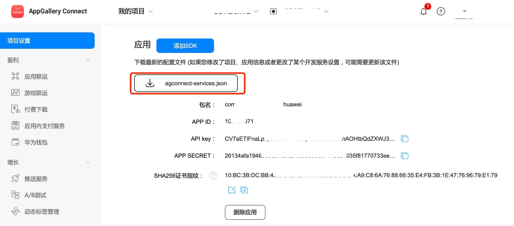

# In-App Purchases (HMS Core) Quick Start

[HUAWEI In-App Purchases](https://developer.huawei.com/consumer/en/hms/huawei-iap/) (IAP) enables you to sell digital products and content directly within your app. To make in-app purchases available in your app, you only need to integrate the IAP SDK and then call its API to launch the IAP checkout screen.

With IAP, you can offer the following types of digital products and content within your app:

- One-time products: Users can purchase with a single, non-recurring charge. There are two types of one-time products.

    - Consumables: Such products are depleted as they are used and can be purchased again, for example, in-game currencies and items.

    - Non-consumables: Such products are purchased once and never expire, for example, extra game levels in a game or permanent membership of an app.

- Subscriptions: They provide users with ongoing access to content or services in your app. Users are charged on a recurring basis until they decide to cancel. Examples include non-permanent memberships of an app, such as a monthly video membership.

### Version Update Description

- Latest Version：[3.x] 1.0.3_6.13.0.300
    - Improve internal implementation

    - SDK upgrade to 6.13.0.300

- [3.x] 0.0.5_6.10.0.300

    - Update the SDK

- SDK version for Android: com.huawei.hms:iap:6.10.0.300

    - Added the [BaseReq](https://developer.huawei.com/consumer/en/doc/development/HMSCore-References/basereq-0000001347850688) class, which is now the base class for [ConsumeOwnedPurchaseReq](https://developer.huawei.com/consumer/en/doc/development/HMSCore-References/consumeownedpurchasereq-0000001050137617), [OwnedPurchasesReq](https://developer.huawei.com/consumer/en/doc/development/HMSCore-References/ownedpurchasesreq-0000001050135762), [ProductInfoReq](https://developer.huawei.com/consumer/en/doc/development/HMSCore-References/productinforeq-0000001050137777), and [PurchaseIntentReq](https://developer.huawei.com/consumer/en/doc/development/HMSCore-References/purchaseintentreq-0000001050135842).

    - Adapted to Android 13 and updated **targetSdkVersion** to 33.

## Enable In-App Purchases Service

- Use Cocos Creator to open the project that needs to be connected to In-App Purchases.

- Click on **Panel -> Service** in the menu bar to open the Service panel, select In-App Purchases service to go to the service detail page, and then click on the **Enable** button in the top right to enable the service. 

    

- Refer to the [Configuring App Information in AppGallery Connect](https://developer.huawei.com/consumer/en/doc/development/HMSCore-Guides/android-config-agc-0000001050163815) documentation to complete developer registration, app creation, enable Huawei Analysis Service parameter configuration, and enable the API.

- Fill in **App installation source** in "Params Config" of Analytics Kit service panel. For example, if the installation source of the application is Huawei AppGallery, you can fill in  **AppGallery**. The installation source name can contain up to 128 characters, including letters, digits, underscores (_), hyphens (-), and spaces. The name cannot start or end with a space if it contains only digits.

### Configs HUAWEI Config File

Most of HUAWEI Services need the `agconnect-services.json` configuration file. If there are operations such as newly opened services, please update the file in time.

- Sign in to [AppGallery Connect](https://developer.huawei.com/consumer/en/service/josp/agc/index.html) find your project from the project list and select the app on the project card.

- On the **Project Setting** page, click the configuration file **agconnect-services.json** to download it. The `agconnect-services.json` file **must be copied manually** to the `settings` directory of the project directory after downloading or updating.

    

- For Creator v2.4.3 and above, if you want to publish to the [HUAWEI AppGallery Connect](https://docs.cocos.com/creator/manual/en/publish/publish-huawei-agc.html), you can select the downloaded or updated configuration file directly in the **Build** panel, no need to copy it manually.

    

## Sample

Developer can get a quick taste of the Location Kit with the sample project.

- Click on the **Sample** button in the Analytics Kit service panel, clone or download, and open the project in Cocos Creator.

- After enabling the Analytics Kit service and configuring the HUAWEI configuration file as described above, you can open the **Build** panel to compile the project by clicking **Project -> Build** in the Creator editor menu bar. Cocos Creator v2.4.1 and above, you could publish to HUAWEI AppGallery Connect. Below Creator v2.4.1 could publish to the Android platform.

- Need to test on Huawei or Honor brand phones with HMS Core service installed.

- Once the Sample project is running on the phone, click the **Account** button on the homepage for testing.

    

## Developer Guide

#### Define the local variable iap

```TypeScript
private iap: typeof huawei.hms.iap.iapService = (typeof huawei ===
        'undefined'
        ? null
        : huawei?.hms?.iap?.iapService)!;
```

#### initialization

`init (publicKey: string, enablePendingPurchase: boolean):void`

Parameter Description

|Parameter|Description|
|-|-|
|publicKey|Pay the public key|
|enablePendingPurchase|Whether to enable delayed payment. If you want to use in your application payment type delay function, need to call this interface before a purchase|

**Example**

```JavaScript
this.iap.once(huawei.hms.iap.API_EVENT_LIST.initCallBack, (res: huawei.hms.iap.ApiCbResult) => {
    console.log(res);
});
this.iap.init("iap Pay the public key", false);
```

#### Determines if in-app payments are supported

`isEnvReady(): void;`

[Interface Documentation](https://developer.huawei.com/consumer/en/doc/development/HMSCore-References/iapclient-0000001050137587#section0680174272414)

**Example**

```JavaScript
this.iap.once(huawei.hms.iap.API_EVENT_LIST.isEnvReadyCallBack, (res: huawei.hms.iap.ApiCbResult) => {
    console.log(res);
});
this.iap.isEnvReady();
```

#### Get the individual product information configured in the background

`obtainProductInfo(productIdArr: string[], priceType: number): void;`

Parameter Description

|Parameter|Description|
|-|-|
|productIdArr|The product id list query must be the product you configured on the AppGallery Connect website|
|priceType|0: consumption products; 1: Non-consumable products; 2: Subscription products|

[Interface Documentation](https://developer.huawei.com/consumer/en/doc/development/HMSCore-References/iapclient-0000001050137587)

Example

```TypeScript
this.iap.once(huawei.hms.iap.API_EVENT_LIST.obtainProductInfoCallBack, (res: huawei.hms.iap.ApiCbResult) => {
    console.log(res);
});
//Consumable product
this.iap.obtainProductInfo([this.consumableProductId], 0);
```

#### Initiate purchase of PMS products

`createPurchaseIntent(productId: string, priceType: number, developerPayload: string, useFriendPay: boolean): void;`

[Interface Documentation](https://developer.huawei.com/consumer/en/doc/development/HMSCore-References/iapclient-0000001050137587#section1255302563115)

Parameter Description

|Parameter|Description|
|-|-|
|productId|Product ID|
|priceType|0: consumption products; 1: Non-consumable products; 2: Subscription products|
|developerPayload|Merchants side to retain information|
|useFriendPay|Whether or not a friend to pay (need in the init enable delay payments)|

Example

```TypeScript
this.iap.once(huawei.hms.iap.API_EVENT_LIST.createPurchaseIntentCallBack, (res: huawei.hms.iap.ApiCbResult) => {
    console.log(res);
});
this.iap.createPurchaseIntent(productId, priceType, developerPayload, false);
```

#### Confirm transaction

`consumeOwnedPurchase(inAppPurchaseData: string): void;`

[Interface Documentation](https://developer.huawei.com/consumer/en/doc/development/HMSCore-References/iapclient-0000001050137587#section16784102213346)

Note:
1. Subscription products are not supported Do not consume or return an error
2. Non-consumable goods are only consumable in the sandbox environment

Parameter Description

|Parameter|Description|
|-|-|
|inAppPurchaseData|[Order Data](https://developer.huawei.com/consumer/en/doc/development/HMSCore-References/json-inapppurchasedata-0000001050986125)|

#### Get the payment information for the corresponding type of product

`obtainOwnedPurchases(priceType: number): void;`

[Interface Documentation](https://developer.huawei.com/consumer/en/doc/development/HMSCore-References/iapclient-0000001050137587#section15126153542812)

Parameter Description

|Parameter|Description|
|-|-|
|priceType|0: consumption products; 1: Non-consumable products; 2: Subscription products|

Example

```TypeScript
this.iap.once(huawei.hms.iap.API_EVENT_LIST.obtainOwnedPurchasesCallBack, (res: huawei.hms.iap.ApiCbResult) => {
    console.log(res);
});
this.iap.obtainOwnedPurchases(0);
```

#### View user purchase history

`obtainOwnedPurchaseRecord(priceType: number): void;`

[Interface Documentation](https://developer.huawei.com/consumer/en/doc/development/HMSCore-References/iapclient-0000001050137587#section769716459358)

Parameter Description

|Parameter|Description|
|-|-|
|priceType|0: consumption products; 1: Non-consumable products; 2: Subscription products|

Example

```TypeScript
this.iap.once(huawei.hms.iap.API_EVENT_LIST.obtainOwnedPurchaseRecordCallBack, (res: huawei.hms.iap.ApiCbResult) => {
    console.log(res);
});
this.iap.obtainOwnedPurchaseRecord(0);
```

#### Go to Manage Subscriptions page/go to Edit subscriptions page

`startIapActivity(type: number, productId: string | null): void;`

[Interface Documentation](https://developer.huawei.com/consumer/en/doc/development/HMSCore-References/iapclient-0000001050137587#section16600172243819)

Parameter Description

|Parameter|Description|
|-|-|
|type|2 (StartIapActivityReq.TYPE_SUBSCRIBE_MANAGER_ACTIVITY) Jump to manage subscription page,3 (StartIapActivityReq.TYPE_SUBSCRIBE_EDIT_ACTIVITY) Jump to manage subscription page|
|productId|Used when subscribing to a product ID type of 3|

Example

```TypeScript
this.iap.once(huawei.hms.iap.API_EVENT_LIST.startIapActivityCallBack, (res: huawei.hms.iap.ApiCbResult) => {
    console.log(res);
});
this.iap.startIapActivity(2, null);
```

## Else

Detailed functional specifications, please refer to the service [directory](https://developer.huawei.com/consumer/en/doc/development/HMSCore-References/iap-api-overview-0000001088308437).


