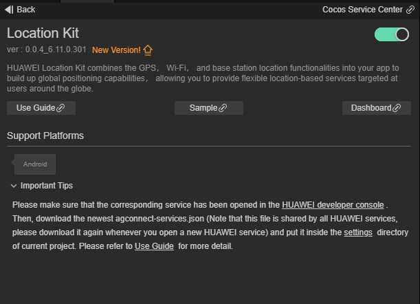
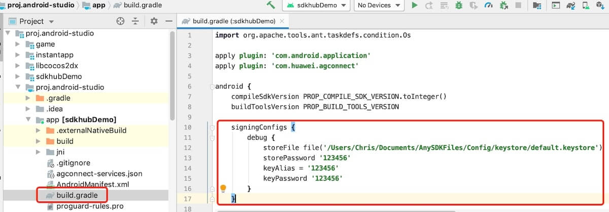
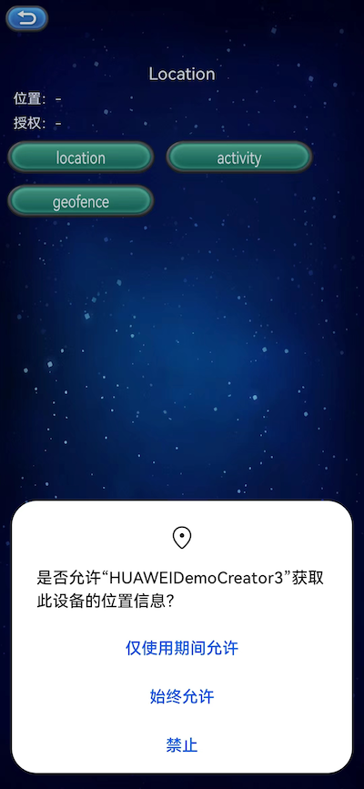
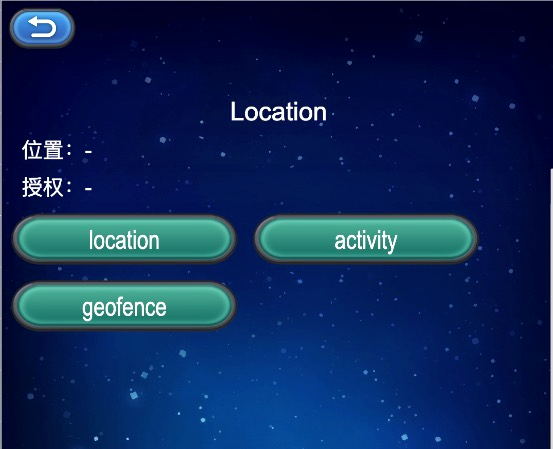

# Location Kit (HMS Core) Quick Start

[HUAWEI Location Kit](https://developer.huawei.com/consumer/en/hms/huawei-locationkit) combines the GPS, Wi-Fi, and base station location functionalities into your app to build up global positioning capabilities, allowing you to provide flexible location-based services targeted at users around the globe. Currently, it provides three main capabilities: fused location, activity identification, and geofence. You can call one or more of these capabilities as needed.

- Fused location: Provides a set of simple and easy-to-use APIs for your app to quickly obtain the device location based on the GPS, Wi-Fi, and base station location data.

- Activity identification: Identifies user motion status through the acceleration sensor, cellular network information, and magnetometer, helping you adapt your app to user behavior.

- Geofence: Allows you to set an interested area through an API so that your app can receive a notification when a specified action (such as leaving, entering, or staying in the area) occurs.

### Fuction

#### Fused Location

If the application needs to request equipment location information, developers can apply for location permissions for the application, then calls the HMS Core request position update interface`requestLocationUpdates()`, according to the need to specify the location, access to the location of the continuous information callback. If you want to cancel the location callback once you have the location information, you can cancel the location update by calling the remove`removeLocationUpdates()`interface.

#### Activity Identification

If the application needs to get the device motion state, for example: Applications such as walking, running, cycling, or need to change to detect the state of motion of the user, so developers can apply for active status identification for the application permissions, update the interface by calling the activity state recognition`createActivityIdentificationUpdates()`, for the current user's active, And remove the activity recognition update just call `deleteActivityIdentificationUpdates()`interface. If need to change to detect the state of motion of the user, you can invoke activity state transition interface `createActivityConversionUpdates()`, through the interface can monitor the activities of the current equipment state transition, and remove the monitor, Just call `deleteActivityConversionUpdates()` interface.

#### Geofence

If you are interested in a particular location, you can create a geofence called `createGeofenceList()` based on the location of the location you want to follow. At the same time, the developer can detect the user's time in the fence and send a notification when the user has been in the fence for a certain amount of time.

### Version Update Description

- Latest Version:[3.x]1.0.5_6.12.0.300

    - Improve internal implementation

- [3.x]1.0.1_6.12.0.300

    - Update to 6.12.0.300

- [3.x]0.0.5_6.11.0.301

    - Update the SDK and add some functions.

## Enable Location Kit Service

- Use Cocos Creator to open the project that needs to be connected to Location Kit.

- Click on **Panel -> Service** in the menu bar to open the Service panel, select Location Kit service to go to the service detail page, and then click on the **Enable** button in the top right to enable the service. 

    

- Refer to the [Configuring App Information in AppGallery Connect](https://developer.huawei.com/consumer/en/doc/development/HMSCore-Guides/android-config-agc-0000001050163815) documentation to complete developer registration, app creation, enable Huawei Analysis Service parameter configuration, and enable the API.

- Fill in **App installation source** in "Params Config" of Analytics Kit service panel. For example, if the installation source of the application is Huawei AppGallery, you can fill in  **AppGallery**. The installation source name can contain up to 128 characters, including letters, digits, underscores (_), hyphens (-), and spaces. The name cannot start or end with a space if it contains only digits.

### Configs HUAWEI Config File

Most of HUAWEI Services need the `agconnect-services.json` configuration file. If there are operations such as newly opened services, please update the file in time.

- Sign in to [AppGallery Connect](https://developer.huawei.com/consumer/en/service/josp/agc/index.html) find your project from the project list and select the app on the project card.

- On the **Project Setting** page, click the configuration file **agconnect-services.json** to download it. The `agconnect-services.json` file **must be copied manually** to the `settings` directory of the project directory after downloading or updating.

    

**Note**:

1. Please make sure that you have completed the [generating/configuring the signing certificate Fingerprint](https://developer.huawei.com/consumer/en/doc/development/HMSCore-Guides/config-agc-0000001050166285#EN-US_TOPIC_0000001054452903__section10260203515546) to config the SHA-256 certificate fingerprint.

2. If the **Debug Mode** is checked in the **Build** panel, the developer needs to configure the Keystore signature file in the `app/build.gradle` file of Android Studio.

    

1. For Creator v2.4.3 and above, if you want to publish to the [HUAWEI AppGallery Connect](https://docs.cocos.com/creator/manual/en/publish/publish-huawei-agc.html), you can select the downloaded or updated configuration file directly in the **Build** panel, no need to copy it manually.

    

### Verify whether the service is integrated successfully

- Can be issued, after the completion of code to add to the Android platform, please make sure that the build release package name in the panel with huawei background set package name consistent.

- After the project runs to the mobile phone for the first time, if the dialog box for applying location permission pops up (see the picture below), it means that the access is successful.

    

- You can view logs in Logcat if you have requested permission.

## Sample Project

Developer can get a quick taste of the Location Kit with the sample project.

- Click on the **Sample** button in the Location Kit service panel, clone or download, and open the project in Cocos Creator.

- After enabling the Location Kit service and configuring the HUAWEI configuration file as described above, you can open the **Build** panel to compile the project by clicking **Project -> Build** in the Creator editor menu bar. Cocos Creator v2.4.1 and above, you could [publish to HUAWEI AppGallery Connect](https://docs.cocos.com/creator/manual/en/publish/publish-huawei-agc.html). Below Creator v2.4.1 could [publish to the Android platform](https://docs.cocos.com/creator/manual/en/publish/publish-native.html).

- Need to test on Huawei or Honor brand phones with HMS Core service installed.

- Once the Sample project is running on the phone, click the **Location** button on the homepage for testing.

    

## Developer Guide

All functions of Location Kit within async callback. Call the function with `huawei.hms.location.locationService.once` to get a single callback, or use `huawei.hms.location.locationService.on` lintener to listen for callbacks.

### Location Service

`huawei.hms.location.locationService`

Refer to [Developing the Location Service](https://developer.huawei.com/consumer/en/doc/development/HMSCore-Guides/location-develop-steps-0000001050746143).

#### Checking the Device Location Settings

`checkLocationSettings(): void`

Checks whether relevant location settings are valid.

**Example**:

```JavaScript
huawei.hms.location.locationService.once(huawei.hms.location.HMS_LOCATION_EVENT_LISTENER_NAME.HMS_LOCATION_SETTINGS, (result) => {
    if (result.code === huawei.hms.location.LocationActivityService.StatusCode.success) {
        console.log('checkLocationSettings...', 'success');
    } else {
        console.log('checkLocationSettings...', 'fail:', result.errMsg);
    }
});

huawei.hms.location.locationService.checkLocationSettings();
```

#### Request location permission

`requestLocationPermission(): void`

Dynamic application location permission method.

**Example**:

```JavaScript
huawei.hms.location.locationService.once(huawei.hms.location.HMS_LOCATION_EVENT_LISTENER_NAME.HMS_LOCATION_PERMISSION, (result) => {
    if (result.code === huawei.hms.location.LocationActivityService.StatusCode.success) 
    {
        console.log('requestLocationPermission...', 'success');
    } else {
        console.log('requestLocationPermission...', 'fail:', result.errMsg);
    }
});
        
huawei.hms.location.locationService.requestLocationPermission();
```

#### Get location data availability

`getLocationAvailability ():void`

**parameter**

|Parameter|Description|
|-|-|
|isLocationAvailable|Check whether the equipment location is known|
|getLocationStatus|Gets the location status of the device|

**Example:**

```JavaScript
huawei.hms.location.locationService.once(huawei.hms.location.API_EVENT_LIST.HMS_LOCATION_GET_LOCATION_AVAILABILITY, (result) => {
    this.consolePanel.log(result);
});
huawei.hms.location.locationService.getLocationAvailability();
```

#### Requests location updates

`requestLocationUpdatesEx(): void`

Requests location updates. This is an extended location service API that supports high-precision location and is compatible with common location APIs.

**Example**:

```JavaScript
huawei.hms.location.locationService.once(huawei.hms.location.HMS_LOCATION_EVENT_LISTENER_NAME.HMS_REQUEST_LOCATION_UPDATE, (result) => {
    if (result.code === huawei.hms.location.LocationActivityService.StatusCode.success) {
        console.log('requestLocationUpdates...', 'success');
    } else {
        console.log('requestLocationUpdates...', 'fail:', result.errMsg);
    }
});

huawei.hms.location.locationService.requestLocationUpdates();
huawei.hms.location.locationService.requestLocationUpdatesEx(); // For high-precision location
```

#### Obtains the available location of the last request

`getLastLocation(): void`

Instead of proactively requesting a location, this method uses the location cached during the last request.

The value **null** may be returned in the following scenarios:

- The location function has never been used.

- The location function is disabled.

- The device is restored to factory settings.

If real-time location is required, you are advised to proactively call `requestLocationUpdates` instead of `getLastLocation`.

**Example**:

```JavaScript
huawei.hms.location.locationService.once(huawei.hms.location.HMS_LOCATION_EVENT_LISTENER_NAME.HMS_LAST_LOCATION, (location) => {
    if (location.code === huawei.hms.location.LocationActivityService.StatusCode.success) {
        console.log('getLastLocation...', 'success', lon:' + location.longitude + ",lat:" + location.latitude);
    } else {
        console.log('getLastLocation...', 'fail:', location.errMsg);
    }
});

huawei.hms.location.locationService.getLastLocation();
```

`getLastLocationWithAddress(): void`

Obtains the available location of the last request, including the detailed address information. If a location is unavailable, `null` will be returned.

**Example**:

```JavaScript
huawei.hms.location.locationService.once(huawei.hms.location.HMS_LOCATION_EVENT_LISTENER_NAME.HMS_GET_HWLOCATION, (result) => {
    if (result.code === huawei.hms.location.LocationService.StatusCode.success) {
        console.log('getLastLocationWithAddress success, data is ', JSON.stringify(result));
    } else {
        console.log('getLastLocationWithAddress fail, reason ', result.errMsg);
    }
});

huawei.hms.location.locationService.getLastLocationWithAddress();
```

#### Flush location

`flushLocations(): void`

Updates the location under processing.

**Note**: Currently, the `flushLocations()` method is not provided, nor implemented in the HMS SDK.

**Example**:

```JavaScript
huawei.hms.location.locationService.once(huawei.hms.location.HMS_LOCATION_EVENT_LISTENER_NAME.HMS_FLUSH_LOCATIONS, (result) => {
    if (result.code === huawei.hms.location.LocationService.StatusCode.success) {
        console.log('flushLocations success,data is ', result.toString());
    } else {
        console.log('flushLocations fail ,reason ', result.errMsg);
    }
});

huawei.hms.location.locationService.flushLocations();
```

#### Using the Mock Location Function

This function is used for a test environment. Open Android Settings menu, go to **System & updates > Developer options > Select mock location app and select the desired app**. If Developer options is unavailable, open Android Settings menu, go to **About phone** and tap **Build number** for seven consecutive times. Then, **Developer options** will be displayed on **System & updates**.

Apply for the mock location permission in the AndroidManifest.xml file.

```JavaScript
<uses-permission
android:name="android.permission.ACCESS_MOCK_LOCATION"
tools:ignore="MockLocation,ProtectedPermissions" />
```

**Set mock mode**:

`setMockMode(mockMode: boolean): void`

Sets whether to use the location mock mode. If the value **true** is passed, the GPS or network location is not used and the location set through `setMockLocation` is directly returned (see below for the reference of `setMockLocation`).

**Parameter Description**:

|Parameter|Description|
|-|-|
|mockMode|If this parameter is set to **true**, the mock mode will be enabled. Can be set to **false** when mock mode is no longer needed.|

**Example**:

```JavaScript
huawei.hms.location.locationService.once(huawei.hms.location.HMS_LOCATION_EVENT_LISTENER_NAME.HMS_MOCK_MODE, (result) => {
    if (location.code === huawei.hms.location.LocationActivityService.StatusCode.success) {
        console.log('setMockMode...', 'success');
    } else {
        console.log('setMockMode...', 'fail:', result.errMsg);
    }
});

huawei.hms.location.locationService.setMockMode(true);
```

**Sets a specific mock location**

`setMockLocation(latitude: string, longitude: string): void`

You must call the `setMockMode (boolean)` method and set it to true before calling this method.

**Parameter Description**:

|Parameter|Description|
|-|-|
|latitude|value of latitude|
|longitude|value of longitude|

**Example**:

```JavaScript
huawei.hms.location.locationService.once(huawei.hms.location.HMS_LOCATION_EVENT_LISTENER_NAME.HMS_MOCK_LOCATION, (result) => {
    if (location.code === huawei.hms.location.LocationActivityService.StatusCode.success)
    {
        console.log('setMockLocation...', 'success');
    } else {
        console.log('setMockLocation...', 'fail:', result.errMsg);
    }
});

//set longitude and latitude
huawei.hms.location.locationService.setMockLocation(24.4813889,118.1590724);
```

### Activity Identification Service

`huawei.hms.location.locationActivityService`

Refer to [Developing the Activity Identification Service](https://developer.huawei.com/consumer/en/doc/development/HMSCore-Guides/activity-recognition-develop-steps-0000001050706110).

#### Assigning App Permissions

`requestRecognitionPermission(): void`

[The preceding permissions](https://developer.huawei.com/consumer/en/doc/development/HMSCore-Guides/activity-recognition-develop-steps-0000001050706110) are dangerous permissions and need to be dynamically applied.

**Example**:

```JavaScript
huawei.hms.location.locationActivityService.requestRecognitionPermission();
```

#### Registers activity identification updates

`createActivityIdentificationUpdates(intervalMillis: number): void`

[Registers activity identification updates](https://developer.huawei.com/consumer/en/doc/HMSCore-References-V5/activityidentificationservice-0000001050986183-V5#ZH-CN_TOPIC_0000001050986183__section177364246397).

**Parameter Description**:

|Parameter|Description|
|-|-|
|intervalMillis|Interval for detecting activity updates, in milliseconds. Larger values will result in fewer activity detections. Smaller values will result in more activity detections.|

**Example**:

```JavaScript
huawei.hms.location.locationActivityService.once(huawei.hms.location.HMS_LOCATION_EVENT_LISTENER_NAME.HMS_CREATE_ACTIVITY_IDENTIFICATION_UPDATES, (result) => {
    if (result.code === huawei.hms.location.LocationActivityService.StatusCode.success) {
        console.log('requestActivityUpdates...', 'success');
    } else {
        console.log('requestActivityUpdates...', 'fail:', result.errMsg);
    }
});

huawei.hms.location.locationActivityService.createActivityIdentificationUpdates(parseInt(time) || 5000);
```

#### Set listener for location activity service update

**Example**:

```JavaScript
huawei.hms.location.locationActivityService.on(huawei.hms.location.HMS_LOCATION_EVENT_LISTENER_NAME.HMS_ACTIVITY_UPDATES, (result) => {
    console.log('HMS_ACTIVITY_UPDATES...', JSON.stringify(result));
}, this);

huawei.hms.location.locationActivityService.on(huawei.hms.location.HMS_LOCATION_EVENT_LISTENER_NAME.HMS_CONVERSION_UPDATES, (result) => {
    console.log('HMS_CONVERSION_UPDATES...', JSON.stringify(result));
}, this);
```

#### Removes activity identification updates associated

`deleteActivityIdentificationUpdates(): void`

**Example**:

```JavaScript
huawei.hms.location.locationActivityService.once(huawei.hms.location.HMS_LOCATION_EVENT_LISTENER_NAME.HMS_REMOVE_ACTIVITY_CONVERSION_UPDATES, (result) => {
    if (result.code === huawei.hms.location.LocationActivityService.StatusCode.success) {
        console.log('deleteActivityUpdates...', 'success');
    } else {
        console.log('deleteActivityUpdates...', 'fail:', result.errMsg);
    }
}); 

huawei.hms.location.locationActivityService.deleteActivityIdentificationUpdates();
```

#### Detects activity conversions

`createActivityConversionUpdates(params: any): void`

Detects activity conversions (entering and exit), for example, detecting user status change from walking to bicycling.

**Example**:

```JavaScript
huawei.hms.location.locationActivityService.once(huawei.hms.location.HMS_LOCATION_EVENT_LISTENER_NAME.HMS_CREATE_ACTIVITY_CONVERSION_UPDATES, (result) => {
    if (result.code === huawei.hms.location.LocationActivityService.StatusCode.success) {
        console.log('createActivityConversionUpdates...', 'success');
    } else {
        console.log('createActivityConversionUpdates...', 'fail:', result.errMsg);
    }
});
let cls = huawei.hms.location.ConversionInfo;
let type = huawei.hms.location.ACTIVITY_IDENTIFICATION_ENUM;
let cType = huawei.hms.location.ACTIVITY_CONVERSION_TYPE;
let infoList = [
    new cls(type.STILL, cType.ENTER_ACTIVITY_CONVERSION),
    new cls(type.STILL, cType.EXIT_ACTIVITY_CONVERSION),
];

huawei.hms.location.locationActivityService.createActivityConversionUpdates(infoList);
```

#### Removes activity conversion updates

`deleteActivityConversionUpdates(): void`

**Example**:

```JavaScript
huawei.hms.location.locationActivityService.once(huawei.hms.location.HMS_LOCATION_EVENT_LISTENER_NAME.HMS_REMOVE_ACTIVITY_CONVERSION_UPDATES, (result) => {
    if (result.code === huawei.hms.location.LocationActivityService.StatusCode.success) {
        console.log('deleteActivityConversionUpdates...', 'success');
    } else {
        console.log('deleteActivityConversionUpdates...', 'fail:', result.errMsg);
    }
});

huawei.hms.location.locationActivityService.deleteActivityConversionUpdates();
```

### Geofence Service

`huawei.hms.location.locationGeofenceService`

Refer to [Developing the Geofence Service](https://developer.huawei.com/consumer/en/doc/development/HMSCore-Guides/geofence-develop-steps-0000001050986159).

#### Set listener for geofence service

**Example**:

```JavaScript
huawei.hms.location.locationGeofenceService.on(huawei.hms.location.HMS_LOCATION_EVENT_LISTENER_NAME.HMS_RECEIVE_GEOFENCE_DATA, (result) => {
    console.log('HMS_RECEIVE_GEOFENCE_DATA...', JSON.stringify(result));
}, this);
```

#### Adds geofences

`createGeofenceList(list: Array<GeofenceData>, type: HMS_LOCATION_GEOFENCEREQUEST)`

**Example**:

```JavaScript
huawei.hms.location.locationGeofenceService.once(huawei.hms.location.HMS_LOCATION_EVENT_LISTENER_NAME.HMS_CREATE_GEOFENCE_LIST, (result) => {
    if (result.code === huawei.hms.location.LocationActivityService.StatusCode.success) {
        console.log('createGeofenceList...', 'success');
    } else {
        console.log('createGeofenceList...', 'fail:', result.errMsg);
    }
});
let cls = huawei.hms.location.GeofenceData;
let type = huawei.hms.location.GEOFENCE_TYPE;
let list = [
    new cls(
        this.editBox.string,    //setUniqueId
        type.DWELL_GEOFENCE_CONVERSION | type.ENTER_GEOFENCE_CONVERSION | type.EXIT_GEOFENCE_CONVERSION,  //setConversions
        24.4813889,             //setRoundArea, latitude
        118.1590724,            //setRoundArea, longitude
        2000,                   //setRoundArea, radius
        60 * 60 * 1000,         //setValidContinueTime
        1000                    //setDwellDelayTime
)];
let requestType = huawei.hms.location.HMS_LOCATION_GEOFENCEREQUEST;
let initType = requestType.EXIT_INIT_CONVERSION | requestType.ENTER_INIT_CONVERSION | requestType.DWELL_INIT_CONVERSION;
console.log('createGeofenceList...', 'params=', JSON.stringify(list), 'init type=', initType);

huawei.hms.location.locationGeofenceService.createGeofenceList(list, initType);
```

#### remove a geofence through PendingIntent

`removeWithIntent(): void`

**Example**:

```JavaScript
huawei.hms.location.locationGeofenceService.once(huawei.hms.location.HMS_LOCATION_EVENT_LISTENER_NAME.HMS_REMOVE_GEOFENCE_WITH_INTENT, (result) => {
    if (result.code === huawei.hms.location.LocationActivityService.StatusCode.success) {
        console.log('removeWithIntent...', 'success');
    } else {
        console.log('removeWithIntent...', 'fail:', result.errMsg);
    }
});

huawei.hms.location.locationGeofenceService.removeWithIntent();
```

#### Remove a geofence by geofence ID

`removeWithID(removeID: string): void`

**Example**:

```JavaScript
huawei.hms.location.locationGeofenceService.once(huawei.hms.location.HMS_LOCATION_EVENT_LISTENER_NAME.HMS_REMOVE_GEOFENCE_WITH_ID, (result) => {
    if (result.code === huawei.hms.location.LocationActivityService.StatusCode.success) {
        console.log('removeWithID...', 'success');
    } else {
        console.log('removeWithID...', 'fail:', result.errMsg);
    }
});

var removeID = "ID1";
huawei.hms.location.locationGeofenceService.removeWithID(removeID);
```

## API Reference

Please refer to the [Location Kit - API Reference](https://service.cocos.com/document/api/modules/huawei.hms.location.html).

- Refer to the [Configuring App Information in AppGallery Connect](https://developer.huawei.com/consumer/en/doc/development/HMSCore-Guides/android-config-agc-0000001050163815) documentation to complete developer registration, app creation, enable Huawei Analysis Service parameter configuration, and enable the API.

- Fill in **App installation source** in "Params Config" of Analytics Kit service panel. For example, if the installation source of the application is Huawei AppGallery, you can fill in  **AppGallery**. The installation source name can contain up to 128 characters, including letters, digits, underscores (_), hyphens (-), and spaces. The name cannot start or end with a space if it contains only digits.

