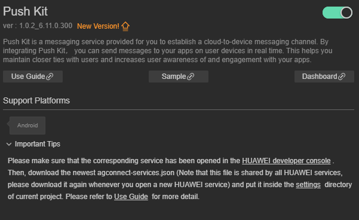
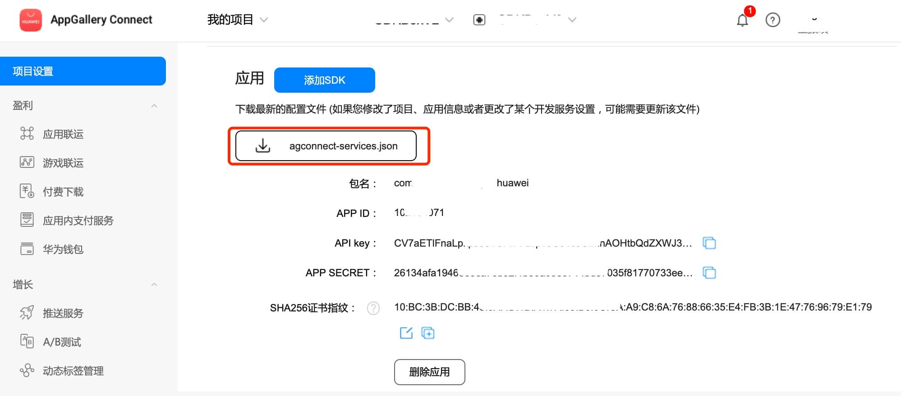
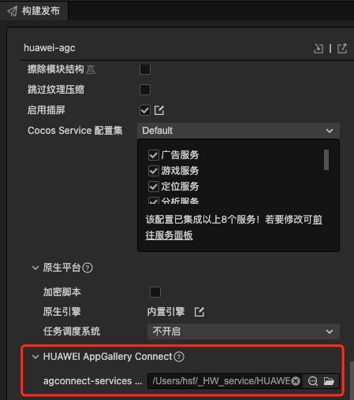
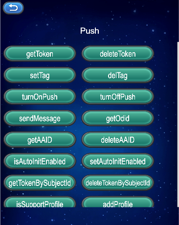

# Push Kit(HMS Core) Quick Start

## Overview

[Push Kit](https://developer.huawei.com/consumer/en/hms/huawei-pushkit) is a messaging service provided for you to establish a cloud-to-device messaging channel. By integrating Push Kit, you can send messages to your apps on user devices in real time. This helps you maintain closer ties with users and increases user awareness of and engagement with your apps.

You can access Push Kit in the following modes:

[Android](https://developer.huawei.com/consumer/en/doc/development/HMSCore-Guides/android-app-quickstart-0000001071490422): The Push SDK for Android provides your Android apps with APIs for sending messages. This mode is applicable to mobile phones and tablets. These APIs mainly relate to functions such as sending notification and data messages to various audiences, customizing the notification message style, and subscribing to topics.

[HarmonyOS (Java)](https://developer.huawei.com/consumer/en/doc/development/HMSCore-Guides/harmony-java-quickstart-0000001153706156): The Push Java SDK for HarmonyOS provides your HarmonyOS apps with APIs for sending messages. This mode is applicable to Huawei phones and tablets. These APIs mainly relate to sending notification and data messages based on tokens.

[iOS](https://developer.huawei.com/consumer/en/doc/development/HMSCore-Guides/ios-dev-progress-0000001062221191): The Push SDK for iOS provides your iOS apps with APIs for sending messages. This mode is applicable to iPhones running iOS 10.0 and later. These APIs mainly relate to sending notification and data messages based on tokens.

[Web](https://developer.huawei.com/consumer/en/doc/development/HMSCore-Guides/web-dev-progress-0000001080676256): Push Kit provides your web apps with APIs for sending notification messages.

[Quick app](https://developer.huawei.com/consumer/en/doc/development/HMSCore-Guides/quick-dev-0000001050042109): Push Kit provides your Huawei quick apps with APIs for sending notification messages.

**REST API**: REST APIs of Push Kit allows you to call relevant capabilities of Push Kit via HTTPS. This mode is applicable to all the above platforms. These APIs mainly relate to functions such as [sending downlink messages](https://developer.huawei.com/consumer/en/doc/development/HMSCore-References/https-send-api-0000001050986197), [sending receipts for downlink messages](https://developer.huawei.com/consumer/en/doc/development/HMSCore-References/https-send-receipt-api-0000001051066120), and [subscribing to a topic](https://developer.huawei.com/consumer/en/doc/development/HMSCore-References/topic-sub-api-0000001051066122).

## Supported Devices

|SDK|Device Type|OS Version|HMS Core (APK) Version|
|-|-|-|-|
|Android|Huawei phone and tablet|EMUI 3.0 or later|3.0.0 or later|
||Non-Huawei phone and tablet|Android 4.4 - 13||
|iOS|iPhone|iOS 10 or later|-|
|HarmonyOS (Java)|Huawei phone and tablet|HarmonyOS 2.0 or later|5.0.0 or later|

### Version Update Description

- Latest Version:[3.x] 0.0.5_6.10.0.300

    - Update the SDK

## Enable In-App Purchases Service

- Use Cocos Creator to open the project that needs to be connected to Push Kit.

- Click on **Panel -> Service** in the menu bar to open the Service panel, select Push Kit service to go to the service detail page, and then click on the **Enable** button in the top right to enable the service. 

    

- Refer to the [Configuring App Information in AppGallery Connect](https://developer.huawei.com/consumer/en/doc/development/HMSCore-Guides/android-config-agc-0000001050163815) documentation to complete developer registration, app creation, enable Huawei Analysis Service parameter configuration, and enable the API.

- Fill in **App installation source** in "Params Config" of Analytics Kit service panel. For example, if the installation source of the application is Huawei AppGallery, you can fill in  **AppGallery**. The installation source name can contain up to 128 characters, including letters, digits, underscores (_), hyphens (-), and spaces. The name cannot start or end with a space if it contains only digits.

### Configs HUAWEI Config File

Most of HUAWEI Services need the `agconnect-services.json` configuration file. If there are operations such as newly opened services, please update the file in time.

- Sign in to [AppGallery Connect](https://developer.huawei.com/consumer/en/service/josp/agc/index.html) find your project from the project list and select the app on the project card.

- On the **Project Setting** page, click the configuration file **agconnect-services.json** to download it. The `agconnect-services.json` file **must be copied manually** to the `settings` directory of the project directory after downloading or updating.

    

- For Creator v2.4.3 and above, if you want to publish to the [HUAWEI AppGallery Connect](https://docs.cocos.com/creator/manual/en/publish/publish-huawei-agc.html), you can select the downloaded or updated configuration file directly in the **Build** panel, no need to copy it manually.

    

## Sample

Developer can get a quick taste of the Location Kit with the sample project.

- Click on the **Sample** button in the Analytics Kit service panel, clone or download, and open the project in Cocos Creator.

- After enabling the Analytics Kit service and configuring the HUAWEI configuration file as described above, you can open the **Build** panel to compile the project by clicking **Project -> Build** in the Creator editor menu bar. Cocos Creator v2.4.1 and above, you could publish to HUAWEI AppGallery Connect. Below Creator v2.4.1 could publish to the Android platform.

- Need to test on Huawei or Honor brand phones with HMS Core service installed.

- Once the Sample project is running on the phone, click the **Push** button on the homepage for testing.

    

## Developer Guide

#### Get Push Token

- Do not use push tokens to trace and mark users.

- Do not let your app verify the push token length because it is variable.

- Do not request tokens frequently. An app that is not running in the background requests a token each time when the app is launched. It is prohibited for an app running in the background to request tokens frequently. If tokens must be requested periodically, it is recommended that the request period be greater than one day.

- Use the [getToken](https://developer.huawei.com/consumer/en/doc/development/HMSCore-References/hms-instanceid-0000001050255634#section1796315281618) method to obtain a push token only after you [enable Push Kit](https://developer.huawei.com/consumer/en/doc/development/HMSCore-Guides/android-config-agc-0000001050170137#section9471122085218) in AppGallery Connect.

- **Declare both the [getToken](https://developer.huawei.com/consumer/en/doc/development/HMSCore-References/hms-instanceid-0000001050255634#section1796315281618) and [onNewToken](https://developer.huawei.com/consumer/en/doc/development/HMSCore-References/hmsmessageservice-0000001050173839#section343314205) methods in the code** to ensure that the push token can be returned.

[Guide](https://developer.huawei.com/consumer/en/doc/development/HMSCore-Guides/android-client-dev-0000001050042041)

Parameter Description

|parameter|Description|
|-|-|
|appId|appId for the application|

Example

```TypeScript
huawei.hms.push.pushService.once(huawei.hms.push.API_EVENT_LIST.getTokenCallback, (result: huawei.hms.push.ApiCbResult) => {
    console.log(result);
}, this)
huawei.hms.push.pushService.getToken(this.appId);
```

#### Get Push Token

`getTokenBySubjectId(subjectId: string): void;`

[Guide](https://developer.huawei.com/consumer/en/doc/development/HMSCore-Guides/android-client-dev-0000001050042041)

Parameter Description

|parameter|Description|
|-|-|
|subjectId|project ID|

Example

```TypeScript
huawei.hms.push.pushService.once(huawei.hms.push.API_EVENT_LIST.getTokenBySubjectIdCallback, (result: huawei.hms.push.ApiCbResult) => {
    console.log(result);
}, this)
huawei.hms.push.pushService.getTokenBySubjectId(this.subjectId);
```

#### Deleting a Push Token

`deleteToken (appId: string): void`

NOTE

- Do not delete push tokens frequently.

- To delete a push token, ensure that the HMS Core (APK) version is 3.0.0 or later.

- If you do not want your app to receive notification messages, you can call the [turnOffPush](https://developer.huawei.com/consumer/en/doc/development/HMSCore-References/hmsmessaging-0000001050255650#section943612533595) method to disable the function of displaying notification messages.

- The user agreement and privacy statement of your app must include and comply with the [HUAWEI Push Service Agreement](https://developer.huawei.com/consumer/en/doc/app/10134) and [SDK Privacy and Security Statement](https://developer.huawei.com/consumer/en/doc/development/HMSCore-Guides/sdk-data-security-0000001050042177).

[Guide](https://developer.huawei.com/consumer/en/doc/development/HMSCore-Guides/android-client-dev-0000001050042041)

Parameter Description

|parameter|Description|
|-|-|
|appId|appId for the application|

Example

```TypeScript
huawei.hms.push.pushService.once(huawei.hms.push.API_EVENT_LIST.deleteTokenCallback, (result: huawei.hms.push.ApiCbResult) => {
    console.log(result);
}, this)
huawei.hms.push.pushService.deleteToken(this.appId);
```

#### Remove the Token based on the project Id

`deleteTokenBySubjectId(subjectId: string): void;`

NOTE

- Do not delete push tokens frequently.

- To delete a push token, ensure that the HMS Core (APK) version is 3.0.0 or later.

- If you do not want your app to receive notification messages, you can call the [turnOffPush](https://developer.huawei.com/consumer/en/doc/development/HMSCore-References/hmsmessaging-0000001050255650#section943612533595) method to disable the function of displaying notification messages.

- The user agreement and privacy statement of your app must include and comply with the [HUAWEI Push Service Agreement](https://developer.huawei.com/consumer/en/doc/app/10134) and [SDK Privacy and Security Statement](https://developer.huawei.com/consumer/en/doc/development/HMSCore-Guides/sdk-data-security-0000001050042177).

[Guide](https://developer.huawei.com/consumer/en/doc/development/HMSCore-Guides/android-client-dev-0000001050042041)

Parameter Description

|parameter|Description|
|-|-|
|subjectId|project ID|

示例

```TypeScript
huawei.hms.push.pushService.once(huawei.hms.push.API_EVENT_LIST.deleteTokenBySubjectIdCallback, (result: huawei.hms.push.ApiCbResult) => {
   console.log(result);
}, this)
huawei.hms.push.pushService.deleteTokenBySubjectId(this.subjectId);
```

#### Enables the display of notification messages

`turnOnPush(): void;`

[API Guide](https://developer.huawei.com/consumer/en/doc/development/HMSCore-References/hmsmessaging-0000001050255650#section867613695918)

Example

```TypeScript
huawei.hms.push.pushService.once(huawei.hms.push.API_EVENT_LIST.turnOnPushCallback, (result: huawei.hms.push.ApiCbResult) => {
    console.log(result);
}, this)
huawei.hms.push.pushService.turnOnPush();
```

#### Disables the display of notification messages

`turnOffPush(): void;`

[API Guide](https://developer.huawei.com/consumer/en/doc/development/HMSCore-References/hmsmessaging-0000001050255650#section867613695918)

Example

```TypeScript
huawei.hms.push.pushService.once(huawei.hms.push.API_EVENT_LIST.turnOffPushPushCallback, (result: huawei.hms.push.ApiCbResult) => {
    console.log(result);
}, this)
huawei.hms.push.pushService.turnOffPush();
```

#### Subscribes to topics in asynchronous mode.

`setTag (tag: string): void`

[API Description](https://developer.huawei.com/consumer/en/doc/development/HMSCore-References/hmsmessaging-0000001050255650#section1222313413551)  [Guide](https://developer.huawei.com/consumer/en/doc/development/HMSCore-Guides/android-topic-based-sending-0000001050040114)

Parameter Description

|parameter|Description|
|-|-|
|tag|Topic to be subscribed to. The topic name must match the following regular expression: [\u4e00-\u9fa5\w-_.~%]{1,900}|

Example

```TypeScript
huawei.hms.push.pushService.once(huawei.hms.push.API_EVENT_LIST.setTagCallback, (result: huawei.hms.push.ApiCbResult) => {
    console.log(result);
}, this)
huawei.hms.push.pushService.setTag("xxxxxxx");
```

#### Unsubscribes from topics in asynchronous mode.

`delTag (tag: string): void`

[API Description](https://developer.huawei.com/consumer/en/doc/development/HMSCore-References/hmsmessaging-0000001050255650#section1222313413551)  [Guide](https://developer.huawei.com/consumer/en/doc/development/HMSCore-Guides/android-topic-based-sending-0000001050040114)

 Parameter Description

|parameter|Description|
|-|-|
|tag|（topic）The name of the topic to unsubscribe from.|

Example

```TypeScript
huawei.hms.push.pushService.once(huawei.hms.push.API_EVENT_LIST.delTagCallback, (result: huawei.hms.push.ApiCbResult) => {
    console.log(result);
}, this)
huawei.hms.push.pushService.delTag("xxxxxxx");
```

#### Huawei Push server calls this interface through HTTPS to push uplink messages to your server

[Guide](https://developer.huawei.com/consumer/en/doc/development/HMSCore-Guides/android-upstream-message-sending-0000001050040118)

`sendMessage (params: string): void`

 Parameter Description

|parameter|Description|
|-|-|
|params|Json format string content|

Example

```TypeScript
huawei.hms.push.pushService.once(huawei.hms.push.API_EVENT_LIST.sendMessageCallback, (result: huawei.hms.push.ApiCbResult) => {
    console.log(result);
}, this)

let params = {
    "messageId": "messageId" + Math.ceil(Math.random() * 100000),
    "messageType": "mType1",
    "collapseKey": "0",
    "sendMode": "1",
    "receiptMode": "1",
    "ttl": "10000",
    "key1": "value1",
    "key2": "value2",
    "key3": "value3"
}
let str = JSON.stringify(params);
huawei.hms.push.pushService.sendMessage(str);
```

#### Get AAID

[Guide](https://developer.huawei.com/consumer/en/doc/development/HMSCore-Guides/aaid-0000001051142988)

`getAAID (): void`

Example

```TypeScript
huawei.hms.push.pushService.once(huawei.hms.push.API_EVENT_LIST.getAAIDCallback, (result: huawei.hms.push.ApiCbResult) => {
    console.log(result);
}, this)
huawei.hms.push.pushService.getAAID();
```

#### Delete the locally generated AAID and timestamp and delete all generated tokens related to this AAID synchronously.

[Guide](https://developer.huawei.com/consumer/en/doc/development/HMSCore-Guides/aaid-0000001051142988)

`deleteAAID (): void`

Example

```TypeScript
huawei.hms.push.pushService.once(huawei.hms.push.API_EVENT_LIST.deleteAAIDCallback, (result: huawei.hms.push.ApiCbResult) => {
    console.log(result);
}, this)
huawei.hms.push.pushService.deleteAAID()
```

#### Get the ODID

[Guide](https://developer.huawei.com/consumer/en/doc/development/HMSCore-Guides/oaid-0000001050783198)

`getOdid (): void`

Example

```TypeScript
huawei.hms.push.pushService.once(huawei.hms.push.API_EVENT_LIST.getOdidCallback, (result: huawei.hms.push.ApiCbResult) => {
    console.log(result);
}, this)
huawei.hms.push.pushService.getOdid();
```

#### Whether to enable the automatic initialization function

[Guide](https://developer.huawei.com/consumer/en/doc/development/HMSCore-References/hmsmessaging-0000001050255650#section768215326488)

`isAutoInitEnabled (): boolean`

Example

```TypeScript
let bol = huawei.hms.push.pushService.isAutoInitEnabled();
```

#### Settings are automatically initialized

[Guide](https://developer.huawei.com/consumer/en/doc/development/HMSCore-References/hmsmessaging-0000001050255650#section19198183125511)

`setAutoInitEnabled (): void`

Example

```TypeScript
huawei.hms.push.pushService.setAutoInitEnabled(true);
```

#### Determine whether the current terminal equipment support account check function

[Guide](https://developer.huawei.com/consumer/en/doc/development/HMSCore-References/hmsprofile-0000001057586645#section78129196156)

`isSupportProfile(): boolean`

Example

```TypeScript
let bol = huawei.hms.push.pushService.isSupportProfile();
```

#### Adds the relationship between the user and the application on the current device

[Guide](https://developer.huawei.com/consumer/en/doc/development/HMSCore-References/hmsprofile-0000001057586645#section8475185931912)

`addProfile(params: string): void;`

Example

```TypeScript
huawei.hms.push.pushService.once(huawei.hms.push.API_EVENT_LIST.addProfileCallback, (result: huawei.hms.push.ApiCbResult) => {
    console.log(result);
}, this)
let params = {
    "type": "CUSTOM_PROFILE",
    "profileId": "PROFILE_ID_001"
}
huawei.hms.push.pushService.addProfile(JSON.stringify(params));
```

#### Clears the relationship between the logged-in user and the application on the current device

[Guide](https://developer.huawei.com/consumer/en/doc/development/HMSCore-References/hmsprofile-0000001057586645#section655417438283)

`deleteProfile(params: string): void;`

Example

```TypeScript
huawei.hms.push.pushService.once(huawei.hms.push.API_EVENT_LIST.deleteProfileCallback, (result: huawei.hms.push.ApiCbResult) => {
    console.log(result);
}, this)
let params = {
    "subjectId": this.subjectId,  //optional
    "profileId": "PROFILE_ID_001" //interval
}
huawei.hms.push.pushService.deleteProfile(JSON.stringify(params));
```

## Else

Detailed functional specifications, please refer to the service[ directory](https://developer.huawei.com/consumer/en/doc/development/HMSCore-Guides/harmony-java-devguides-0000001199425951).

