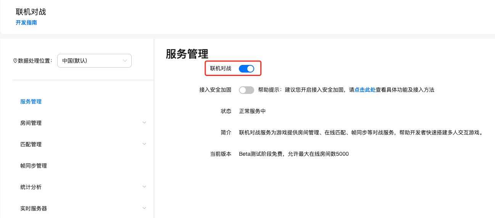
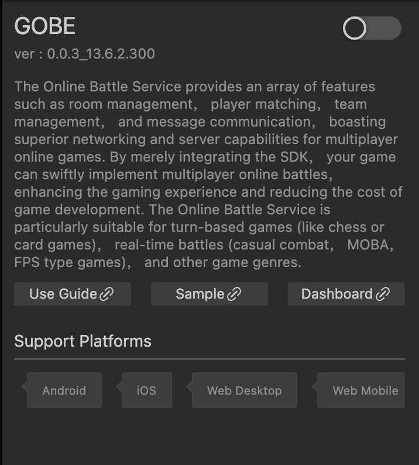
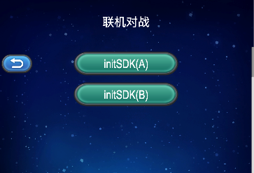
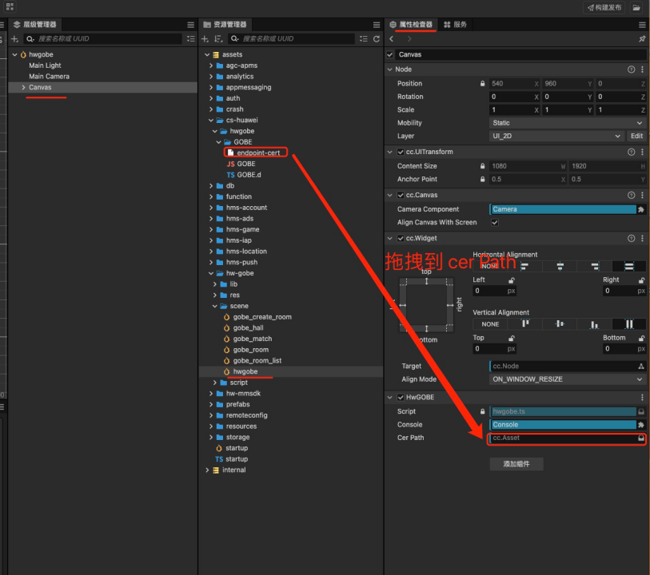
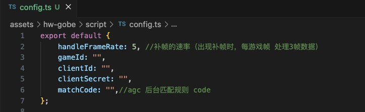

# Quick Start Guide for Online Multiplayer Battles (AppGallery Connect)

[Online Multiplayer Battle Service](https://developer.huawei.com/consumer/cn/doc/development/AppGallery-connect-Guides/gameobe-introduction-0000001185429290) provides features such as room management, player matching, team management, and message communication for multiplayer online games. It has excellent networking and server-side capabilities. Your game only needs to integrate the SDK to quickly realize online multiplayer battles, enhance the game experience, and reduce game development costs. The online multiplayer battle service is mainly suitable for turn-based (chess and cards), real-time battles (casual battles, MOBA, FPS) and other types of games.

### Main Features

|Main Features|Feature Description|
|-|-|
| Room Management |Provides online battle container for game players, supports players joining the room to battle with other players, and provides capabilities such as updating custom status and properties, sending messages in the room, leaving the room, and dissolving the room.|
| Player Matching |Supports custom matching rules through the console, and provides three ways of room matching, online matching, and team matching for player battles in different game scenes. At the same time, it supports automatic filling of robots in the case of insufficient player matching, which can effectively avoid matching failures caused by timeout.|
| Team Management |Supports players to match teammates and opponents by initiating team matching, and provides capabilities such as leaving the team and dissolving the team.|
| Message Communication |Frame Synchronization + Frame Data Storage and Query + Client-Side Communication and Interaction  Provides frame synchronization capabilities for game applications to ensure frame data synchronization during online battles on different terminals, supports automatic frame supplementation in case of frame data loss, and supports storage of frame data in the form of record files for subsequent query playback. At the same time, it provides communication capabilities between different clients, supports sending messages by players in the room, and also supports interaction between the client and the real-time server, which can be used to expand client game logic.   Hosting code to real-time server  Supports deploying and running game logic code based on the server-side development framework on the real-time server, achieving cloud-side computing and management capabilities.|

### Working Principle

The client integrated with the online multiplayer battle service SDK sends various action instructions to the online multiplayer battle server. The server receives and summarizes, and then directly broadcasts the frames to all clients in the room. The client calculates and displays according to the received game actions. You only need to integrate the online multiplayer battle service SDK into the game, and perform simple configuration on the AGC console to quickly build battle capabilities for your game.

## Version Update
- Current Version: [3.x] 1.1.0_14.0.1.300

    - Upgrade the SDK to 14.0.1.300

- [3.x] 1.0.0_13.8.1.300

   - Improve internal implementation
    - Upgrade the SDK to 13.8.1.300

- [3.x] 0.0.2_13.6.2.300

    - Initial Version

## One-Click Access to Online Multiplayer Battles

### Enable Service

- Online multiplayer battle function needs to be enabled in Huawei agc backend

    

- Use Cocos Creator to open the project that needs to be integrated with the multiplayer online battle service.

- Click **Panel -> Services** on the menu bar, open the **Services** panel, select **Online Multiplayer Battle**, enter the service details page. Then click the **Enable** button in the upper right corner to enable the service.

    

### Verify the Service is Enabled Successfully

After enabling, if you see hwgobe related files in the cs-huawei folder under the project's assets, it is successful. If there is no such folder, please check the log information of the editor console.

## Sample Project

Developers can quickly experience the online multiplayer battle service through the Sample project.

- Click the **Sample Project** button on the analysis service panel, Clone or download HUAWEI Sample project, and open it in Cocos Creator.

- After the Sample project runs on the phone, click the **Hwgobe** button on the homepage to enter the function interface for testing.

    

- The Sample project is adapted from Huawei's online multiplayer battle sample code (developed based on cocos creator 3.8.0, some functions have been modified), you can also directly download the original [sample code](https://developer.huawei.com/consumer/cn/doc/development/AppGallery-connect-Examples/gameobe-samplecode-jssdk-0000001226761605), the project provided by Huawei is for cocos creator 2.X.

- If you need to package Android projects, you need to configure endpoint-cert as shown below.

    

- The real-time server code can be found in the gobe_server under the HUAWEIDemoCreator3 folder. The specific development steps can be referred to [Real-time Server Development Guide](https://developer.huawei.com/consumer/cn/doc/development/AppGallery-connect-Guides/gameobe-realtime-server-0000001289210804), and after building, upload it to the Huawei agc backend.

- For the service to be available, you need to modify the config.ts script, you need to change to the parameters corresponding to your own project.

    

## Development Guide

After enabling the service, the "JS SDK" will be automatically integrated into your project. For flexibility, the service does not encapsulate the "JS SDK" a second time. When using the multiplayer online battle service, you can directly refer to Huawei's [Documentation Guide](https://developer.huawei.com/consumer/cn/doc/development/AppGallery-connect-Guides/gameobe-flowchart-overview-js-0000001342697113) for relevant feature development.

## API Documentation

For detailed API documentation, please refer to - [API Reference](https://developer.huawei.com/consumer/cn/doc/development/AppGallery-connect-References/gameobe-overview-js-0000001237750607).
