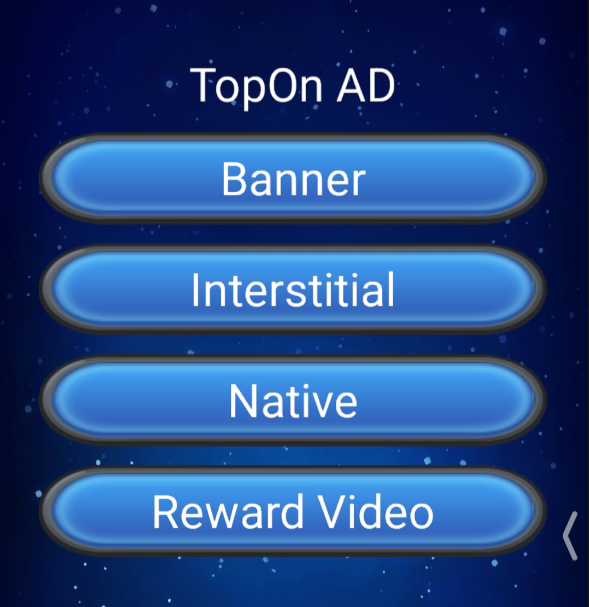

# TonOn（Aggregate Ads）Quick Start

[TonOn Aggregate Ads](https://www.toponad.com), TopOn is an ad mediation platform that helps global app developers to move to the next ad monetization stage. Based on the intelligent algorithm, you will find a perfect fit for your monetization strategy through marvelous advanced features like Real-time Header Bidding, A/B Test, Segment Management and Cross Promotion. At the same time, it is equipped with multi-dimensional data reports, accurately compares the advertising platform API data and displays in detailed key data such as user duration, advertising display frequency, DEU, LTV, retention, etc., to help developers maximize their advertising revenue.

### Version Update Description

- Current Version：2.0.3_5.7.27 

    - Add TonOn Aggregate Ads service。

### Enable APM Service

- Use Cocos Creator to open the project that needs to be connected to TonOn service.

- Click on **Panel -> Service** in the menu bar to open the Service panel, select TonOn service to go to the service detail page, and then click on the **Enable** button in the top right to enable the service. For details, please refer to the Cocos Service [Operation Guide](./index.md#usage) documentation.

  

- If you do not have an account with TopOn aggregate advertising platform, please go to [TopOn](https://app.toponad.com/#/register) to register and follow the [Guide Document](https://docs.toponad.com/#/en-us/android/GetStarted/TopOn_Get_Started) for the corresponding configuration, or the `AppKey` and `AppID` parameters required by the service panel.

* <font color="red">Note: TopOn aggregate ads need to create different AppIDs on iOS and Android platforms, and the two cannot share the same AppID</font>


### Verify whether the service is integrated successfully

- After completing the **TopOn** service access steps, you only need to add two lines of code when the script starts to verify whether the service is successfully connected, the code is as follows:

```ts
// Enable log
topon.toponService.setLogDebug(true);
// Check the integration of third-party ads
topon.toponService.integrationChecking();

```

- After the project is run on the phone, you can see the integration status of the ad in the Android Studio run log or Logcat and Xcode run log.

* <font color="red">Note: On the iOS platform, if TopOn has recently selected Admob or StartApp ads, the above test results will prompt the ad verification failure, but in fact, the integration is successful, just ignore it.</font>

## Sample Project

Developer can get a quick taste of the APM service with the sample project.

- Click on the **Sample** button in the APM service panel, clone or download, and open the project in Cocos Creator.

- Refer to the above to open TopOn and configure the corresponding parameters, you can open the **Build** panel to compile the project by clicking **Project -> Build** in the Creator editor menu bar.

- Once the Sample project is running on the phone, click the **APMS** button on the homepage for testing.

  

## Developer Guide

### 1、Create a banner ad

```ts
getBanner(placementId: string, listener?: BannerListener): Banner;
```

**Parameter Description**：

| Parameter | Description | 
| :---------- | :------------- |  
|  placementId | placementId | 
|  listener | Callback listener, if it is not passed, the setAdListener method of the returned object must be called to display, otherwise the advertisement callback will not be accepted | 

**Example**：

```js
// 详见 TopOn API 文档中的 BannerListener 接口
let listener = {
    ...
}
let banner = topon.toponService.getBanner("placementId", listener);
```

### 2、加载广告
```ts
loadBanner(settings?: {
            banner_ad_size_struct?: {
                width: number;
                height: number;
            };
            width?: number;
            height?: number;
            adaptive_width?: number;
            adaptive_orientation?: 0 | 1 | 2;
            inline_adaptive_width?: number;
            inline_adaptive_orientation?: 0 | 1 | 2;
        }): void;
```

Call this interface to load the advertisement data. If the advertisement listener is not set when the created advertisement is created, choose to call the following interface to set the advertisement listener

```ts
setAdListener(listener: BannerListener): void;
```

When the advertisement is loaded, the `onBannerAdLoaded` callback will be triggered. After receiving this destruction, the interface can be called to display the advertisement.

**Parameter Description**：

| Parameter | Description | 
| :---------- | :------------- |  
|  settings | Advertising extra configuration | 

### 3. Show Ad
```ts
showAdInPosition(position: 'top' | 'bottom'): void;
showAdInRectangle(rect: {
            x: number;
            y: number;
            width: number;
            height: number;
        }): void;
```

**Parameter Description**：

| Parameter | Description | 
| :--- | :---------- | :------------- |  
| first interface |  position | Advertising display position, top: displayed at the top, bottom: displayed at the bottom (not considering the occlusion of notch screen) | 
| second interface |  rect | Advertising display area, displayed according to the incoming coordinates | 

There are two interfaces for display ads
-The first interface can only be displayed on the fixed top or bottom
-The second interface can display the banner according to the incoming coordinates

**Example**：
```ts
if (banner.isAdReady()) banner.showAdInPosition('top');
```

### For other interfaces, please refer to the API documentation


## API Reference

Please refer to the [TopOn - API Reference](https://service.cocos.com/document/api/modules/topon.html)。
