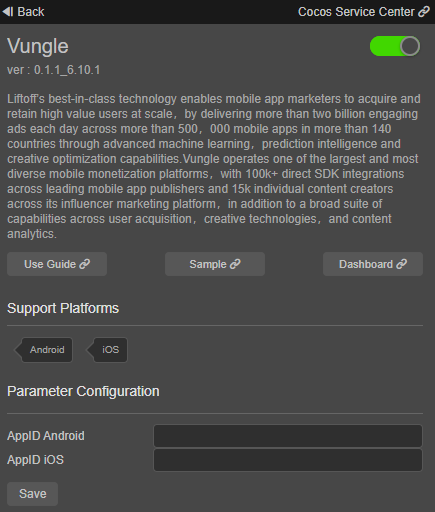
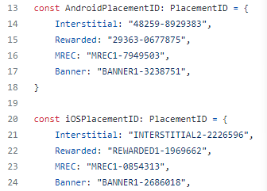

# [Vungle](https://vungle.com/) Quick Start

Vungle’s best-in-class technology enables mobile app marketers to acquire and retain high value users at scale, by delivering more than two billion engaging ads each day across more than 500,000 mobile apps in more than 140 countries through advanced machine learning, prediction intelligence and creative optimization capabilities. Vungle operates one of the largest and most diverse mobile monetization platforms, with 100k+ direct SDK integrations across leading mobile app publishers and 15k individual content creators across its influencer marketing platform, in addition to a broad suite of capabilities across user acquisition, creative technologies, and content analytics.

### Enable Service

- Use Cocos Creator to open the project that needs to be connected to Vungle service.

- Click on **Panel -> Service** in the menu bar to open the Service panel, select Vungle service to go to the service detail page, and then click on the **Enable** button in the top right to enable the service. For details, please refer to the Cocos Service [Operation Guide](./index.md#usage) documentation.



- Get the appid from [Vungle publisher center](https://publisher.vungle.com/applications) and fill in the corresponding configuration field.

- If you do not have a Vungle account, please go to [Vungle](https://app.vungle.com/signup/) to register an account. Then create apps and placements. You can refer to the [Guide Document](https://support.vungle.com/hc/en-us/articles/203610124) .

* <font color="red">Note: Vungle aggregate ads need to create different AppIDs on iOS and Android platforms, and the two cannot share the same AppID</font>


## Sample Project

Developer can get a quick taste of the Vungle service with the sample project.

- Clone [sample project](https://github.com/CocosService/vungleDemo.git) and open it in Cocos Creator.

- Enable Vungle service and configure android/ios appid as mentioned above.

- replace placements in assets/startup.ts with yours.

  

- Click **Project -> Build** in the Creator editor menu bar and build the project.

- After the Sample project successfully built, you will find your android or ios project in the build directory.

## Developer Guide

### Initialize the SDK

Set callbacks including that for initialization, ads loading and ads playing. For details, you can refer to (API docs)[https://test-service.cocos.com/document/api/modules/vungle.html#vunglecallbacks] .
```ts
const vungleCallbacks:vungle.VungleCallbacks = {
  init: {
    // SDK has successfully initialized
    onSuccess: () => {
    },
    // SDK has failed to initialize
    onError: (error: string) => {
    }
  },
  load: {
    // Ad has been successfully loaded for the placement
    onAdLoad: (placementId: string) => {
    },
    // Ad has failed to load for the placement
    onError: (placementId: string, error: string) => {
    }
  },
  play: {
    // Ad experience started
    onAdStart: (placementId: string) => {
    },
    // Ad has rendered
    onAdViewed: (placementId: string) => {
    },
    // Ad experience ended
    onAdEnd: (placementId: string) => {
    },
    // User clicked on ad
    onAdClick: (placementId: string) => {
    },
    // User earned reward for watching an rewarded ad
    onAdRewarded: (placementId: string) => {
    },
    // User has left app during an ad experience
    onAdLeftApplication: (placementId: string) => {
    },
    // Ad failed to play
    onError: (placementId: string, error: string) => {
    },
    // Vungle creative ID to be displayed
    creativeId: (creativeId: string) => {
    }
  }
}

vungle.vungleService.setCallbacks(vungleCallbacks);
```

call [setLogDebug](https://test-service.cocos.com/document/api/classes/vungle.vunglead.html#setlogdebug) when you need debug log。

```ts
vungle.vungleService.setLogDebug(true);
```

We don't need to pass appid as parameter when initializing. Appid input in the service panel will be used.

For details bout initialization setting, you can refer to [API docs](https://test-service.cocos.com/document/api/modules/vungle.html#setting) .

```ts
const vungleSetting: vungle.Setting = {
  // limits for available space on a user’s device before the Vungle SDK initializes
  minimumDiskSpaceForInit: 55,
  // limits for available space on a user’s device before ads fetching
  minimumDiskSpaceForAd: 56,
  // For Android only: Set true to opt out for Android ID collection by SDK or false (default) to opt in
  restrictAndroidID: true,
  // For IOS only: set false to prevent passing the IDFV from the device to the SDK
  setPublishIDFV: true,
}

vungle.vungleService.init(vungleSetting);
```

### Interstitial and rewarded ads

- Load an Ad

Before loading，you can use `isInitialized` method to check init status.
```ts
if (vungle.vungleService.isInitialized()) {
    vungle.vungleService.loadAd(placementId);
}
```

- Play an Ad

Use these options to customize the ad experience for playback. Ror details, you can refer to [API docs](https://test-service.cocos.com/document/api/modules/vungle.html#adconfig) 。
```ts
const adConfig : vungle.AdConfig = {
    muted: true,
    orientation: vungle.OrientationType.AUTO_ROTATE,
    // Alert information that displays when a user prematurely closes a rewarded ad experience
    incentivizedFields: {
        userID: "test_user_id",
        title: "Careful!",
        body: "Are you sure you want to skip this ad? If you do, you might not get your reward",
        keepWatching: "Continue",
        close: "close",
    },
    // Video should start with its audio settings based on the value specified
    ordinal: 1,
}
```

You can call `canPlayAd` method to check ad loaded status.
```ts
if (vungle.vungleService.canPlayAd(placementId)) {
    vungle.vungleService.playAd(placementId, adConfig);
}
```

### Banner and MREC ads

- load a banner/MREC

Vungle provides the following ad size for you to choose. 
```ts
enum AdSize {
    BANNER = "BANNER", // 320x50
    BANNER_SHORT = "BANNER_SHORT", // 300x50
    BANNER_LEADERBOARD = "BANNER_LEADERBOARD",  // 728x90
    MREC = "MREC", // 300x250
}
```

Banner configs
```ts
const adSize : vungle.AdSize = vungle.AdSize.BANNER;
const bannerConfig : vungle.BannerConfig = {
    // banner/MREC ad size
    adSize: adSize,
    // 静音
    muted: false,
}
```

Call `isInitialized` method to check the init status.
```ts
if (vungle.vungleService.isInitialized()) {
  vungle.vungleService.loadBanner(placementId, bannerConfig);
```

- Show a banner/MREC

You can call `canPlayAd` method to check ad loaded status. And you can choose the position to show the ad (TOP or BOTTOM).
```ts
if (vungle.vungleService.canPlayBanner(placementId)) {
    vungle.vungleService.getBanner(placementId, bannerConfig, vungle.BannerPosition.TOP);
}
```

- Destroy a banner/MREC
```ts
vungle.vungleService.destroyBanner(placementId);
```

### update GDPR/CCPA consent status

- GDPR

get consent status and version
```ts
vungle.vungleService.getConsentStatus();
vungle.vungleService.getConsentMessageVersion();
```

update consent status and version
```ts
vungle.vungleService.updateConsentStatus(vungle.ConsentStatus.OPTED_OUT, "1.0.0");
```

- CCPA

get consent status
```ts
vungle.vungleService.getCCPAStatus();
```

update consent status
```ts
vungle.vungleService.updateCCPAStatus(vungle.ConsentStatus.OPTED_OUT);
```

## API Reference

Please refer to the [Vungle - API Reference](https://service.cocos.com/document/api/modules/vungle.html) 。
