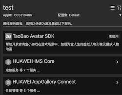
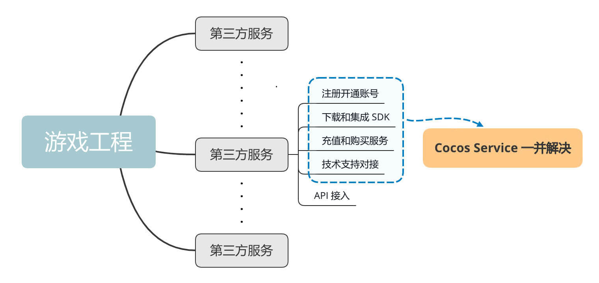

# Cocos Service 简介

Cocos Service 为开发者提供优质服务，以便获得更多引擎之外的扩展能力，让游戏开发工作变得更加简单。

这些服务可能是 Cocos 官方的，也有可能是经过深度集成的第三方服务。

Cocos Service 的主要目的有两个，一是尽最大的可能提高从用户端到达各个服务的便利性以及易用性。我们整合了部分接入流程，带给开发者一键式的接入体验。二是为第三方服务接入 Cocos Service 提供规范和依据，以及提供相应的技术支撑。

## 产品概述

Cocos Service 是集成在 Cocos Creator 内的服务面板，其中提供了一些官方以及第三方的服务，通过服务面板我们可以快捷地在游戏中集成和使用服务。

* 服务，是向游戏提供特定功能或能力的软件包或平台。
* 一键开启，当点击开启时，服务面板会自动下载服务对应的软件包并自动集成到游戏工程。
* JSB 封装，通常第三方服务会以 SDK 的方式提供软件包，并且会针对 Android、iOS 等不同的平台分别提供 SDK。Creator 是一个跨平台游戏开发引擎，采用 JS/TS 进行开发，因此 Cocos Service 针对所有 SDK 均进行了 JSB 封装，让开发者通过 JS/TS 即可直接调用 SDK，抹平了跨平台开发工作。
* 自动集成脚本，是服务面板内置的底层能力，游戏在构建发布时，自动集成脚本会根据构建的目标平台，自动实现集成对应平台的 SDK、资源、相关配置等。
* [Cocos 服务中心](https://account.cocos.com/#/services)，是用户查看和管理游戏使用服务状态、使用量等信息的 WEB 控制台。大部分服务已与 Cocos 账号进行了深度集成，以方便用户进行统一的充值和代扣费管理。

## 产品优势

- **官方甄选，品质更放心**

  线上沟通到线下考察，从商务接洽到技术测试，从公司规模、企业文化到产品能力、技术风险，全方面立体评估，为开发者从同类产品中选出中实力强、产品优的服务。

- **一键集成，省时又省力**

  通常第三方服务提供的 SDK 都是按平台区分的，比如 Android SDK，iOS SDK，而使用 Creator 进行游戏开发时使用的是 JS/TS 语言，在接入这些 SDK 时除了需要熟悉原生平台开发外，调试起来还相当麻烦。通过 Cocos Creator 服务面板，一键接入第三方服务 SDK，简单、易用、高效，告别繁琐的 SDK 接入和测试流程。

- **自动编译，轻松跨平台**

  所有服务的 SDK 均已做好跨平台封装，开发者可以使用熟悉的 JS 开发语言直接调用具体服务的 SDK 功能，发布游戏至 H5\Android\iOS 等不同平台。

- **一个账号，畅享全服务**

  当开发者的 Cocos 账号开通了某个服务，账号下所有游戏均可一键开启此服务，不需重复操作，Cocos 账号后台还可以便捷地管理所有游戏的第三方服务内容。

- **聚众之力，畅享优惠价**

  Cocos Service 创新提供了类团购模式，依托 Cocos 广大开发者的力量，未来开发者可以享受到比官方价还要优惠的团购价，大大节约游戏的开发成本。

## 支持服务

Cocos Service 目前支持集成以下服务：

- [定位服务（HMS Core）](hms-location.md)：采用 GPS、Wi-Fi、基站等多种混合定位模式进行定位，赋予您的应用程序快速、精准地获取用户位置信息的能力。
- [分析服务（HMS Core）](hms-analytics.md)：基于开发者上报的用户行为和属性数据，提供多种分析能力。
- [华为帐号服务（HMS Core）](hms-account.md)为您提供了简单、安全的登录授权功能，方便用户快捷登录。
- [推送服务（HMS Core）](hms-push.md)是华为提供的消息推送平台，建立了从云端到终端的消息推送通道。
- [应用内支付服务（HMS Core）](hms-iap.md)为App提供便捷的应用内支付体验和简便的接入流程。
- [游戏服务（HMS Core）](hms-game.md)是华为向您提供的能够快速开发游戏应用的服务。
- [广告服务（HMS Core）](hms-ads.md)依托华为终端平台与数据能力为您提供流量变现服务，帮助您解决流量变现的难题；同时为广告主提供广告服务，配合华为终端平台向用户提供个性化的营销活动或商业广告。
- [性能管理（AppGallery Connect）](agc-apms.md)：提供分钟级应用性能监控能力，收集应用性能数据。
- [云函数（AppGallery Connect）](agc-function.md)是一项Serverless计算服务，提供FaaS（Function as a Service）能力
- [远程配置（AppGallery Connect）](agc-remoteconfig.md)提供在线的配置项管理能力，开发者可以在线更改应用的行为和外观，无需用户下载应用更新。
- [联机对战（AppGallery Connect）](hw-gobe.md)为多人联机游戏提供了房间管理、玩家匹配、队伍管理、消息通信等功能，具备优质的联网和服务端能力。
- [游戏多媒体（AppGallery Connect）](hw-mmsdk.md)是华为游戏中心推出的一款快速实现游戏内实时语音对讲和IM聊天（Instant Messaging，即时通讯）功能的服务。
- [Taobao Avatar SDK](taobaoavatar.md)开发者可以通过集成SDK，快速拥有虚拟角色的相关能力，使用已有的淘宝人生虚拟角色，用于游戏或软件的开发。
