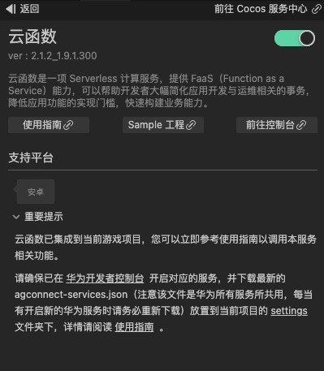
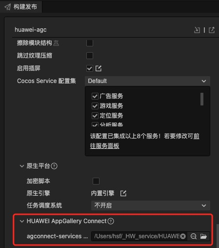

# 云函数快速入门

[云函数](https://developer.huawei.com/consumer/cn/doc/development/AppGallery-connect-Guides/agc-cloudfunction-introduction-0000001059279544)是一项Serverless计算服务，提供FaaS（Function as a Service）能力，一方面云函数将开发测试的对象聚焦到函数级别，可以帮助您大幅简化应用开发与运维相关的事务，另一方面您可以通过在应用中集成云函数SDK，便捷操作云数据库、云存储等，提升业务功能构建的便利性。云函数可以根据函数的实际流量对函数进行弹性伸缩，您无需对服务器资源进行管理，解决了开发者运维管理的难题。

### 主要功能

- 云函数提供了高效可靠的函数开发与运行框架，替开发者完全解决传统应用开发与运维中的诸多复杂事务（如服务器配置与管理、代码部署、负载均衡、弹性伸缩、高可用保证等等），开发者只需聚焦业务逻辑、开发并上传函数代码，即可构建高可用性、可伸缩的 Serverless 应用。

- 云函数作为 Serverless 的核心与枢纽，方便连接和扩展周边云服务，开发者可以像拼搭积木一样自由便捷地组织各项服务来实现业务逻辑。

### 相关概念

通过云函数，开发者可以使用 AGC 当前支持的编程语言开发函数，然后提交到 Serverless 环境中运行函数。函数的每个实例都会在一个隔离的环境中运行、接收并处理事件，然后返回响应。云函数会保证函数实例的高可用性，并且按需自动扩展实例数量。

- 函数：在云函数中运行的脚本或程序，处理事件并返回响应。

- 事件源：AGC 中的其他服务（如云数据库），或者开发者自定义服务。事件源可以发布多种类型事件，以触发函数的执行。

- 触发器：按照配置（事件源 、事件类型、函数的映射关系），监听事件源上的指定类型事件，当事件发生时自动调用函数，将事件数据提交给函数处理。

- 别名：开发者可以为函数创建一个或多个别名，其作用类似于指向特定函数版本的指针。函数调用方（含触发器）通过使用别名，可以访问别名指向的函数。

### 典型应用场景

通过云函数，开发者能够运行函数代码以响应关注的事件，典型的应用场景大致可分为以下几类：

- 向用户发送某些事件通知

- 执行数据库清理和维护任务

- 在云端执行密集型任务

- 集成第三方服务和 API

### 版本更新说明

- 当前版本： [3.X]2.1.3_1.9.1.300

    - 升级sdk版本。

- 0.5.0_1.4.1.300

    - 集成华为 AGC 云函数服务。

## 一键接入云函数服务

### 开通服务

- 确保云函数服务测试资格申请已通过。

- 使用 Cocos Creator 打开需要接入云函数服务的项目工程。

- 点击菜单栏的 **面板 -> 服务**，打开 **服务** 面板，在 **HUAWEI AppGallery Connect** 下选择 **云函数**，进入服务详情页。然后点击右上方的 **启用** 按钮即可开通服务。

    

### 配置华为参数文件

大部分的华为相关项目都需要用到 `agconnect-services.json` 配置文件。若有新开通服务等操作，请及时更新该文件。

- 登录 [AppGallery Connect](https://developer.huawei.com/consumer/cn/service/josp/agc/index.html) 后台，在 **项目列表 -> 应用列表** 中找到对应的应用。

- 在 **项目设置** 页面的 **应用** 区域，点击 `agconnect-services.json` 下载配置文件。`agconnect-services.json` 文件在下载或者更新完成后，**必须手动拷贝** 到工程目录的 `settings` 目录下。

    

- Cocos Creator v2.4.3 及以上版本，若 发布到 HUAWEI AppGallery Connect，开发者可直接在 **构建发布** 面板中选取下载或更新后的配置文件，不需要手动拷贝。

    

## Sample 工程

开发者可以通过 Sample 工程快速体验云函数服务。

- 点击云函数服务面板中的 **Sample 工程** 按钮，Clone 或下载 HUAWEI Sample 工程，并在 Cocos Creator 中打开。

- 可根据[华为文档](https://developer.huawei.com/consumer/cn/doc/development/AppGallery-connect-Guides/create-and-configure-0000001563715033)创建并配置函数

- 参照上文开通云函数服务并配置华为参数文件后，可通过 Creator 编辑器菜单栏的 **项目 -> 构建发布** 打开 **构建发布** 面板来构建编译工程。Creator v2.4.1 及以上版本，可 发布到 HUAWEI AppGallery Connect。Creator v2.4.1 以下的版本可 发布到 Android 平台。

- Sample 工程运行到手机后，点击首页的 **Function** 按钮，即可进入功能界面进行测试。

    

- Sample 工程 对应的云函数代码,可配置到[华为agc后台](https://developer.huawei.com/consumer/cn/service/josp/agc/index.html#/myProject/388421841221566752/9249519184595931747?appId=108702107)

```JavaScript
let myHandler = function (event, context, callback, logger) {
    var res = new context.HTTPResponse(context.env, {
        "res-type": "context.env",
        "faas-content-type": "json",
    }, "application/json", "200");

    
    if (event.body != null && event.body !="" && event.body !="{}" ) {
        let _body = {
            code:"200",
            msg: "云函数调用成功",
            hasParam: "携带参数",
            paramType: "参数类型: "+typeof (event.body),
            param: JSON.parse(event.body),
        }
        res.body = _body;
        context.callback(res);
    } else {
        let _body = {
            code:"200",
            msg: "云函数调用成功",
            hasParam: "未携带参数",
            paramType: "无",
            param: null,
        }
        res.body = _body;
        context.callback(res);
    }
}
module.exports.func = myHandler;
```


## 开发指南

本文档对应 [华为云函数服务 — 调用函数](https://developer.huawei.com/consumer/cn/doc/development/AppGallery-connect-Guides/android-call-function-0000001071314156)。

通过 `wrap` 方法设置函数，在方法中传入触发器标识。

`wrap(trigger: string): AGCFunctionCallable`

**示例**：

```JavaScript
var function = huawei.agc.func.AGCFunctionService.wrap("func-$latest");
```

再通过 `call` 方法调用函数。

`call(cb: FunctionCallback, param = {}): void`

**示例**：

```JavaScript
// without params
function.call((err, data) => {
    if (err !== null) {
        console.log("Cloud Function", `error: ${JSON.stringify(err)}`);
    }
    console.log("Cloud Function", `result: ${JSON.stringify(data)}`);
});

// with params
function.call((err, data) => {
    if (err !== null) {
        console.log("Cloud Function", `error: ${JSON.stringify(err)}`);
    }
    console.log("Cloud Function", `result: ${JSON.stringify(data)}`);
}, {
    param1: "value1",
    param2: {
        param3: "value3",
        param4: 123
    }
});
```

## 其他

详细的功能接口和 API 说明，请参考华为[云函数](https://developer.huawei.com/consumer/cn/doc/development/AppGallery-connect-Guides/agc-cloudfunction-introduction-0000001059279544)相关开发文档。


