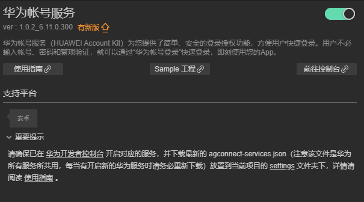
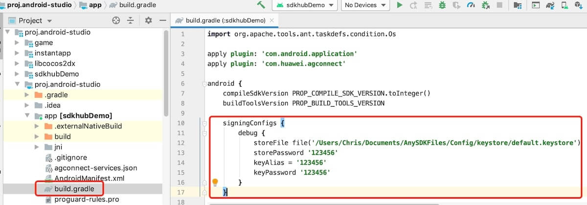
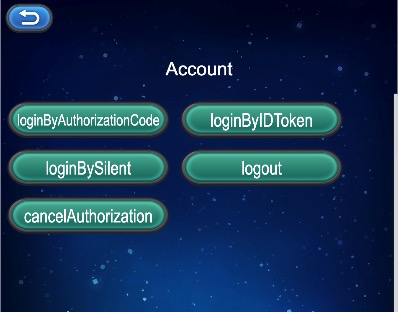

# 华为帐号服务（HMS Core）快速入门

[华为帐号服务](https://developer.huawei.com/consumer/cn/hms/huawei-accountkit)（HUAWEI Account Kit）为您提供了简单、安全的登录授权功能，方便用户快捷登录。用户不必输入帐号、密码和繁琐验证，就可以通过“华为帐号登录”快速登录，即刻使用您的App。

### 支持的设备

|平台|设备类型|OS版本|HMS Core（APK）版本|
|-|-|-|-|
|Android|手机、平板、华为智慧屏、车机|EMUI 3.0及以上、Android 4.4及以上|4.0.0.300及以上|
|HarmonyOS（Java）|手机、平板|HarmonyOS 2.0及以上|5.0.0.300及以上|
||车机|HarmonyOS 2.0及以上|6.2.0.300及以上|
||华为智慧屏、智能手表|HarmonyOS 2.0及以上|6.5.0.300及以上|
|HarmonyOS（JavaScript）|手机、平板|HarmonyOS 2.0及以上|5.0.0.300及以上|
||车机|HarmonyOS 2.0及以上|6.2.0.300及以上|
||华为智慧屏、智能手表|HarmonyOS 2.0及以上|6.5.0.300及以上|

## 版本更新说明

- 当前版本：[3.x] 1.1.1_6.12.0.300

    - 完善内部实现
    - 账号信息不提供account、accessToken内容
    - SDK 升级到 6.12.0.300

- [3.X] 1.0.3_6.11.0.300

    - 升级sdk版本

## 一键接入华为帐号服务

### 开通服务

- 使用 Cocos Creator 打开需要接入华为帐号服务的项目工程。

- 点击菜单栏的 **面板 -> 服务**，打开 **服务** 面板， 在 **HUAWEI HMS Core** 内选择 **华为帐号服务**，进入服务详情页。然后点击右上方的 **启用** 按钮即可开通服务。

    

### 配置华为参数文件

大部分的华为相关项目都需要用到 `agconnect-services.json` 配置文件。若有新开通服务等操作，请及时更新该文件。

- 登录 [AppGallery Connect](https://developer.huawei.com/consumer/cn/service/josp/agc/index.html) 后台，在 **项目列表 -> 应用列表** 中找到对应的应用。

- 在 **项目设置** 页面的 **应用** 区域，点击 `agconnect-services.json` 下载配置文件。`agconnect-services.json` 文件在下载或者更新完成后，**必须手动拷贝** 到工程目录的 `settings` 目录下。

    

**注意**：

1. 务必确认完成 生成/配置签名证书指纹 步骤，配置 SHA256 证书指纹。

2. 在构建时若勾选了 **调试模式**，开发者需要在 Android Studio 的 `app/build.gradle` 文件中，自行配置 Keystore 签名文件。

    

1. Cocos Creator v2.4.3 及以上版本，若 发布到 HUAWEI AppGallery Connect，开发者可直接在 **构建发布** 面板中选取下载或更新后的配置文件，不需要手动拷贝。

    

## Sample 工程

开发者可以通过 Sample 工程快速体验账号服务。

- 点击定位服务面板中的 **Sample 工程** 按钮，Clone 或下载 HUAWEI Sample 工程，并在 Cocos Creator 中打开。

- 参照上文开通服务并配置华为参数文件后，可通过 Creator 编辑器菜单栏的 **项目 -> 构建发布** 打开 **构建发布** 面板来构建编译工程。Creator v2.4.1 及以上版本，可 发布到 HUAWEI AppGallery Connect，Creator v2.4.1 以下的版本可 发布到 Android 平台。

- 需要在已安装 HMS Core 服务的华为手机上测试。

- Sample 工程运行到手机后，点击首页的 **Account** 按钮，即可进入功能界面进行测试。点击下放按钮即可显示对应功能的按钮列表

    

## 开发指南

账号服务所有的 API 均是异步回调。可使用 `huawei.hms.account.accountService.once` 获取单次回调，或者使用 `huawei.hms.account.accountService.on` 监听回调。

#### 登陆

`login(type: string): void;`

**参数说明**

|参数|说明|
|-|-|
|type|AuthorizationCode ｜ IDToken ｜ Silent （[查看详细描述](https://developer.huawei.com/consumer/cn/doc/development/HMSCore-Guides/dev-guide-account-0000001050048888)）|

**示例**

```JavaScript
this.account.once(huawei.hms.account.API_EVENT_LIST.loginCallback, (result: huawei.hms.account.ApiCbResult) => {
   console.log(result);
}, this)
this.account.login("AuthorizationCode");
```

#### 注销

`logout(): void;`

**示例**

```JavaScript
this.account.once(huawei.hms.account.API_EVENT_LIST.logoutCallback, (result: huawei.hms.account.ApiCbResult) => {
    console.log(result);
}, this)
this.account.logout();
```

#### 取消授权

`cancelAuthorization(): void;`

**示例**

```JavaScript
this.account.once(huawei.hms.account.API_EVENT_LIST.cancelAuthorizationCallback, (result: huawei.hms.account.ApiCbResult) => {
    console.log(result);
}, this)
this.account.cancelAuthorization();
```

## 其他

详细的功能说明，请参考服务[指南](https://developer.huawei.com/consumer/cn/doc/development/HMSCore-Guides/dev-guide-account-0000001050048888)。


