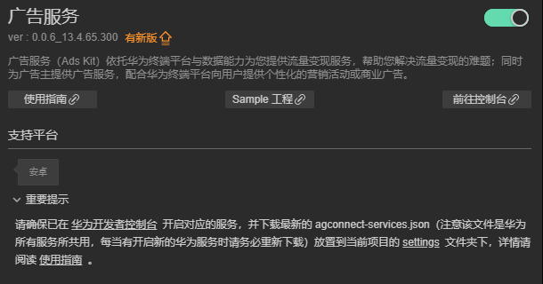
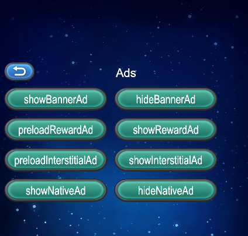

# 广告服务（HMS Core）快速入门

[广告服务](https://developer.huawei.com/consumer/cn/hms/huawei-adskit)（Ads Kit）依托华为终端平台与数据能力为您提供流量变现服务，帮助您解决流量变现的难题；同时为广告主提供广告服务，配合华为终端平台向用户提供个性化的营销活动或商业广告。

### 主要功能

#### 流量变现服务

鲸鸿动能流量变现服务（以下简称为流量变现服务）是广告服务依托华为终端强大的平台与数据能力为您提供的App流量变现服务，您通过该服务可以在自己的App中获取并向用户展示精美的、高价值的广告内容，并从中获得广告收益。

#### 广告标识服务

广告服务提供广告标识符和转化跟踪能力方便广告平台和广告主进行个性化广告投放和广告转化渠道跟踪。

- 广告标识符（OAID）：是一种非永久性设备标识符，基于广告标识符，可在保护用户个人数据隐私安全的前提下，向用户提供个性化广告，同时三方监测平台也可以向广告主提供转化归因分析。

- App转化跟踪参数（Install Referrer）：您和广告主可通过华为开放的API，获得App转化跟踪参数。广告主可基于转化跟踪参数进行App推广渠道分析，清楚掌握各渠道转化效果分析。

## 版本更新说明

- 当前版本：[3.x] 1.0.2_13.4.68.300

    - 完善内部实现

    - SDK 升级到 13.4.68.300
    
- [3.x] 0.0.7_13.4.65.300

    - 升级sdk版本

## 一键接入广告服务

### 开通服务

- 使用 Cocos Creator 打开需要接入定位服务的项目工程。

- 点击菜单栏的 **面板 -> 服务**，打开 **服务** 面板，在 **HUAWEI HMS Core** 内选择 **广告服务**，进入服务详情页。然后点击右上方的 **启用** 按钮即可开通服务。

    

- 详细操作文档请参考 [华为](https://developer.huawei.com/consumer/cn/doc/development/HMSCore-Guides/publisher-service-integrating-sdk-0000001050066913)[广告](https://developer.huawei.com/consumer/cn/doc/development/HMSCore-Guides/publisher-service-integrating-sdk-0000001050066913)[服务开发准备](https://developer.huawei.com/consumer/cn/doc/development/HMSCore-Guides/publisher-service-integrating-sdk-0000001050066913) 文档，完成开发者注册、创建应用、以及打开相关服务。

## Sample 工程

开发者可以通过 Sample 工程快速体验广告服务。

- 点击定位服务面板中的 **Sample 工程** 按钮，Clone 或下载 HUAWEI Sample 工程，并在 Cocos Creator 中打开。

- 参照上文开通服务并配置华为参数文件后，可通过 Creator 编辑器菜单栏的 **项目 -> 构建发布** 打开 **构建发布** 面板来构建编译工程。Creator v2.4.1 及以上版本，可 发布到 HUAWEI AppGallery Connect，Creator v2.4.1 以下的版本可 发布到 Android 平台。

- 需要在已安装 HMS Core 服务的华为手机上测试。

- Sample 工程运行到手机后，点击首页的 **Ads** 按钮，即可进入功能界面进行测试

    


## 开发指南

广告服务所有的 API 均是异步回调。可使用 `huawei.hms.ads.adsService.once` 获取单次回调，或者使用 `huawei.hms.ads.adsService.on` 监听回调。


#### 广告类型

|广告类型|说明|
|-|-|
|Banner|Banner广告是在应用程序顶部、中部或底部占据一个位置的矩形图片，广告内容每隔一段时间会自动刷新，点击内容时会跳转到广告主的页面|
|Reward|激励广告是一种全屏幕的视频广告，用户可以选择点击观看，以换取相应奖励。|
|Interstitial|插屏广告是一种在应用开启、暂停或退出时以全屏的形式弹出的广告形式，展示时机巧妙避开用户对应用的正常体验，尺寸大，曝光效果好。|
|Native|原生广告是与应用内容融于一体的广告，通过“和谐”的内容呈现广告信息，在不破坏用户体验的前提下，为用户提供有价值的信息，展示形式包含图片、文字和视频，支持您自由定制界面|

#### 监听广告事件

- 广告的显示，点击，关闭，视频开始播放 等等事件可用以下方法进行监听，返回的数据内都会包含 `adType`（广告类型） 和 `adId`（广告id） 字段，用于区分广告。

```JavaScript
huawei.hms.ads.adsService.on(huawei.hms.ads.API_EVENT_LIST.showAdsCallback, (res: huawei.hms.ads.ApiCbResult) => { this.consolePanel && this.consolePanel.log("showAdsCallback\n" + res.toString()); }, this, false);
huawei.hms.ads.adsService.on(huawei.hms.ads.API_EVENT_LIST.preloadAdsCallback, (res: huawei.hms.ads.ApiCbResult) => { this.consolePanel && this.consolePanel.log("preloadAdsCallback\n" + res.toString()); }, this, false);
huawei.hms.ads.adsService.on(huawei.hms.ads.API_EVENT_LIST.onAdLoadedCallback, (res: huawei.hms.ads.ApiCbResult) => { this.consolePanel && this.consolePanel.log("onAdLoadedCallback\n" + res.toString()); }, this, false);
huawei.hms.ads.adsService.on(huawei.hms.ads.API_EVENT_LIST.onAdFailedCallback, (res: huawei.hms.ads.ApiCbResult) => { this.consolePanel && this.consolePanel.log("onAdFailedCallback\n" + res.toString()); }, this, false);
huawei.hms.ads.adsService.on(huawei.hms.ads.API_EVENT_LIST.onAdOpenedCallback, (res: huawei.hms.ads.ApiCbResult) => { this.consolePanel && this.consolePanel.log("onAdOpenedCallback\n" + res.toString()); }, this, false);
huawei.hms.ads.adsService.on(huawei.hms.ads.API_EVENT_LIST.onAdClickedCallback, (res: huawei.hms.ads.ApiCbResult) => { this.consolePanel && this.consolePanel.log("onAdClickedCallback\n" + res.toString()); }, this, false);
huawei.hms.ads.adsService.on(huawei.hms.ads.API_EVENT_LIST.onAdLeaveCallback, (res: huawei.hms.ads.ApiCbResult) => { this.consolePanel && this.consolePanel.log("onAdLeaveCallback\n" + res.toString()); }, this, false);
huawei.hms.ads.adsService.on(huawei.hms.ads.API_EVENT_LIST.onAdClosedCallback, (res: huawei.hms.ads.ApiCbResult) => { this.consolePanel && this.consolePanel.log("onAdClosedCallback\n" + res.toString()); }, this, false);
huawei.hms.ads.adsService.on(huawei.hms.ads.API_EVENT_LIST.onVideoStartCallback, (res: huawei.hms.ads.ApiCbResult) => { this.consolePanel && this.consolePanel.log("onVideoStartCallback\n" + res.toString()); }, this, false);
huawei.hms.ads.adsService.on(huawei.hms.ads.API_EVENT_LIST.onVideoPlayCallback, (res: huawei.hms.ads.ApiCbResult) => { this.consolePanel && this.consolePanel.log("onVideoPlayCallback\n" + res.toString()); }, this, false);
huawei.hms.ads.adsService.on(huawei.hms.ads.API_EVENT_LIST.onVideoEndCallback, (res: huawei.hms.ads.ApiCbResult) => { this.consolePanel && this.consolePanel.log("onVideoEndCallback\n" + res.toString()); }, this, false);
huawei.hms.ads.adsService.on(huawei.hms.ads.API_EVENT_LIST.onRewardAdOpenedCallback, (res: huawei.hms.ads.ApiCbResult) => { this.consolePanel && this.consolePanel.log("onRewardAdOpenedCallback\n" + res.toString()); }, this, false);
huawei.hms.ads.adsService.on(huawei.hms.ads.API_EVENT_LIST.onRewardAdClosedCallback, (res: huawei.hms.ads.ApiCbResult) => { this.consolePanel && this.consolePanel.log("onRewardAdClosedCallback\n" + res.toString()); }, this, false);
huawei.hms.ads.adsService.on(huawei.hms.ads.API_EVENT_LIST.onRewardAdFailedToShowCallback, (res: huawei.hms.ads.ApiCbResult) => { this.consolePanel && this.consolePanel.log("onRewardAdFailedToShowCallback\n" + res.toString()); }, this, false);
huawei.hms.ads.adsService.on(huawei.hms.ads.API_EVENT_LIST.onRewardedCallback, (res: huawei.hms.ads.ApiCbResult) => { this.consolePanel && this.consolePanel.log("onRewardedCallback\n" + res.toString()); }, this, false);
```


#### 显示广告

`showAds(adType: string, jsonInfo: string): void;`

**说明**

- 注意：使用 Native 原生广告，再次调用显示广告方法前，请确保先前的请求已经完成。

**参数说明**

|参数名|填写格式|说明|
|-|-|-|
|adType|"Interstitial" "Native" "Reward" "Banner"|广告类型|
|adId|"testx9dtjwj8hp"|广告 ID，Native 原生广告中，广告 ID 对应不同展示形式的原生广告|
|pos|"0"|广告位置，Banner 情况下可选，默认为 "0"。 "0"：正下方 "1"：正中 "2"：正上方|
|adSize|"BANNER_SIZE_360_144"|广告尺寸，Banner 情况下可选，默认为 "BANNER_SIZE_360_57"，传入值可参考 [广告尺寸](https://developer.huawei.com/consumer/cn/doc/development/HMSCore-Guides/publisher-service-banner-0000001050066915#ZH-CN_TOPIC_0000001057202899__section1395312137311) 文档。|
|nativeLayout|"native_small" "native_full"|Native 情况下可选，对应插件自带的两种 [原生广告模板文件](https://developer.huawei.com/consumer/cn/doc/development/HMSCore-Guides/publisher-service-native-0000001050064968#ZH-CN_TOPIC_0000001057043311__section424619410104)，用户也可直接在对应 `.xml` 文件中修改布局，默认为 "native_full"|
|requestCustomDislikeThisAd|"1"|Native 情况下可选，不再显示该广告 开关，用户可以自行隐藏或关闭不感兴趣的广告，默认值为 "0"，该功能大陆地区不可用，若需调试需要在 Log 中查看输出信息。|
|choicesPosition|"TOP_LEFT" "TOP_RIGHT" "BOTTOM_RIGHT" "BOTTOM_LEFT" "INVISIBLE"|Native 广告且 `requestCustomDislikeThisAd` = "1" 情况下可选，[设置广告选项的展示位置](https://developer.huawei.com/consumer/cn/doc/HMSCore-References/nativeadconfiguration-builder-0000001050064912-V5#ZH-CN_TOPIC_0000001055645257__section8995193618112)，默认为 "TOP_RIGHT"|
|videoConfiguration|"1"|Native 情况下可选，[视频广告参数设置](https://developer.huawei.com/consumer/cn/doc/development/HMSCore-References/videoconfiguration-builder-0000001050064890)。默认为 "0"，设为 "1" 情况下，可设置以下参数|
|audioFocusType|"GAIN_AUDIO_FOCUS_ALL" "NOT_GAIN_AUDIO_FOCUS_WHEN_MUTE" "NOT_GAIN_AUDIO_FOCUS_ALL"|Native 广告且 `videoConfiguration` = "1" 情况下可选，[设置视频的](https://developer.huawei.com/consumer/cn/doc/development/HMSCore-References/videoconfiguration-builder-0000001050064890)[音频焦点类型](https://developer.huawei.com/consumer/cn/doc/development/HMSCore-References-V5/videoconfiguration-builder-0000001050064890-V5)，默认为 "GAIN_AUDIO_FOCUS_ALL"|
|startMuted|"0"|Native 广告且 `videoConfiguration` = "1" 情况下可选，[设置视频的初始静音状态](https://developer.huawei.com/consumer/cn/doc/development/HMSCore-References/videoconfiguration-builder-0000001050064890)，默认为 "1"|

**示例**

```JavaScript
let params = {
      adId: "testw6vs28auh3",
      pos: "0",
      adSize: "BANNER_SIZE_320_50"
};
huawei.hms.ads.adsService.showAds("Banner", JSON.stringify(params));
```


#### 隐藏广告

`hideAds(adType: string, jsonInfo: string): void;`

**参数说明**

|参数|填写格式|说明|
|-|-|-|
|adType|"Banner" "Native"|广告类型|
|jsonInfo|{ adId: "testw6vs28auh3",  }|广告ID|

**示例**

```JavaScript
let params = {
    adId: "testw6vs28auh3",
};
huawei.hms.ads.adsService.hideAds("Banner", JSON.stringify(params));
```


#### **预加载广告**

`preloadAds(adType: string, jsonInfo: string): void;`

**参数说明**

|参数|填写格式|说明|
|-|-|-|
|adType|"Reward" "Interstitial"|广告类型|
|jsonInfo|{ adId: "testb4znbuh3n2"}|广告ID|

**示例**

```JavaScript
let params = {
    adId: "testb4znbuh3n2",
};
huawei.hms.ads.adsService.preloadAds("Interstitial", JSON.stringify(params));
```


## 其他

详细的功能说明，请参考服务[指南](https://developer.huawei.com/consumer/cn/doc/development/HMSCore-Guides/publisher-service-introduction-0000001070671805)。


