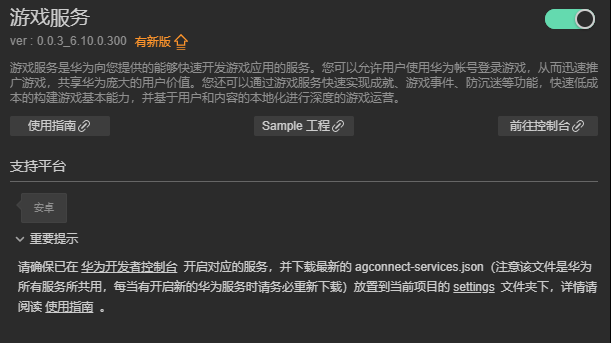

# 游戏服务（HMS Core）快速入门

[游戏服务](https://developer.huawei.com/consumer/cn/hms/huawei-game)是华为向您提供的能够快速开发游戏应用的服务。您可以允许用户使用华为帐号登录游戏，从而迅速推广游戏，共享华为庞大的用户价值。您还可以通过游戏服务快速实现成就、游戏事件、防沉迷等功能，快速低成本的构建游戏基本能力，并基于用户和内容的本地化进行深度的游戏运营。

## 主要功能

游戏服务当前向您的游戏应用提供了以下功能，您可以快速构建游戏基本能力。

- 必选功能：[游戏初始化](https://developer.huawei.com/consumer/cn/doc/development/HMSCore-Guides/game-start-0000001050123475) | [游戏升级](https://developer.huawei.com/consumer/cn/doc/development/HMSCore-Guides/game-update-0000001271748961) | [游戏登录](https://developer.huawei.com/consumer/cn/doc/development/HMSCore-Guides/game-login-0000001050121526) | [防沉迷](https://developer.huawei.com/consumer/cn/doc/development/HMSCore-Guides/game-anti-indulgence-0000001050123479) | [浮标](https://developer.huawei.com/consumer/cn/doc/development/HMSCore-Guides/game-buoy-0000001050121528)

- 可选功能：[成就](https://developer.huawei.com/consumer/cn/doc/development/HMSCore-Guides/game-achievement-0000001050123477) | [事件上报](https://developer.huawei.com/consumer/cn/doc/development/HMSCore-Guides/game-events-0000001050121530) | [排行榜](https://developer.huawei.com/consumer/cn/doc/development/HMSCore-Guides/game-leaderboards-0000001050123481) | [游戏存档](https://developer.huawei.com/consumer/cn/doc/development/HMSCore-Guides/game-archive-0000001050121532) | [玩家信息统计](https://developer.huawei.com/consumer/cn/doc/development/HMSCore-Guides/game-playerinfo-0000001050123483) | [游戏基本信息获取](https://developer.huawei.com/consumer/cn/doc/development/HMSCore-Guides/game-baseinfo-0000001050121534) | [底层功能](https://developer.huawei.com/consumer/cn/doc/development/HMSCore-Guides/game-gameturbo-0000001254626641)

## 版本更新说明


- 当前版本：[3.x] 1.0.1_6.12.0.300

    - 完善内部实现
    - 新增PlayersClient.savePlayerRole接口,废弃submitAppPlayerInfo接口
    - SDK 升级到 6.12.0.300

- 当前版本：[3.x] 0.0.4_6.10.0.300

    - Android版本：com.huawei.hms:game:6.10.0.300

    - 代码内部优化。

    - GameService SDK支持Android 13。

    - Android Studio开发环境适配的targetSdkVersion和compileSdkVersion从31修改为33。

## SDK依赖说明

最新版本SDK需要用户手机上安装HMS Core（APK）6.10.0.300及以上版本。

## 一键接入游戏服务

- 使用 Cocos Creator 打开需要接入游戏服务的项目工程。

- 点击菜单栏的 **面板 -> 服务**，打开 **服务** 面板，在 **HUAWEI HMS Core** 选择 **游戏服务**，进入服务详情页。然后点击右上方的 **启用** 按钮即可开通服务。

    

- 如果华为后台的 **游戏服务** 服务尚未开通，需登录 [AppGallery Connect](https://developer.huawei.com/consumer/cn/service/josp/agc/index.html) 后台，开通服务。

### 配置华为参数文件

大部分的华为相关项目都需要用到 `agconnect-services.json` 配置文件。若有新开通服务等操作，请及时更新该文件。

- 登录 [AppGallery Connect](https://developer.huawei.com/consumer/cn/service/josp/agc/index.html) 后台，在 **项目列表 -> 应用列表** 中找到对应的应用。

- 在 **项目设置** 页面的 **应用** 区域，点击 `agconnect-services.json` 下载配置文件。`agconnect-services.json` 文件在下载或者更新完成后，**必须手动拷贝** 到工程目录的 `settings` 目录下。

    

- Cocos Creator v2.4.3 及以上版本，若 发布到 HUAWEI AppGallery Connect，开发者可直接在 **构建发布** 面板中选取下载或更新后的配置文件，不需要手动拷贝。

    

## Sample 工程

开发者可以通过 Sample 工程快速体验推送服务。

- 点击分析服务面板中的 **Sample 工程** 按钮，Clone 或下载 HUAWEI Sample 工程，并在 Cocos Creator 中打开。

- 参照上文开通分析服务并配置华为参数文件后，可通过 Creator 编辑器菜单栏的 **项目 -> 构建发布** 打开 **构建发布** 面板来构建编译工程。Creator v2.4.1 及以上版本，可 发布到 HUAWEI AppGallery Connect，Creator v2.4.1 以下的版本可 发布到 Android 平台。

- 需要在已安装 HMS Core 服务的华为手机上测试。

- Sample 工程运行到手机后，点击首页的 Game 按钮，即可进入功能界面进行测试。

    

## 开发指南

游戏服务大多数 API 均是异步回调。可使用 `huawei.hms.game.gameService.once` 获取单次回调，或者使用 `huawei.hms.game.gameService.on` 监听回调。

#### 获取游戏服务

```TypeScript
private game: typeof huawei.hms.game.gameService = (typeof huawei ===
'undefined'
? null
: huawei?.hms?.game?.gameService)!;
```

#### 游戏初始化

`initGame ():void`

[指南](https://developer.huawei.com/consumer/cn/doc/development/HMSCore-Guides/game-start-0000001050123475)

示例

```TypeScript
this.game.once(huawei.hms.game.API_EVENT_LIST.initGameCallback, (result: huawei.hms.game.ApiCbResult) => {
    console.log(result);
});
this.game.initGame();
```

#### 检查应用更新

`checkAppUpdate(forceUpdate: boolean): void;`

[指南](https://developer.huawei.com/consumer/cn/doc/development/HMSCore-Guides/game-update-0000001271748961) 

[API文档](https://developer.huawei.com/consumer/cn/doc/development/HMSCore-References/appupdateclient-0000001050123641#section1113567144514)

参数说明

|参数|说明|
|-|-|
|showUpdateDialog|true：升级提示框只有升级按钮，无取消按钮，用户只能选择升级。
false：升级提示框有升级按钮和取消按钮，用户可选择不升级|

示例

```TypeScript
this.game.once(huawei.hms.game.API_EVENT_LIST.checkAppUpdateCallback, (result: huawei.hms.game.ApiCbResult) => {
    console.log(result);
});
this.game.checkAppUpdate(true);
```

#### 游戏登录

`signIn(useAuthorizationMode: boolean): void;`

[指南](https://developer.huawei.com/consumer/cn/doc/development/HMSCore-Guides/game-login-0000001050121526)

参数说明

|参数|说明|
|-|-|
|useAuthorizationMode|是否采用授权方式登陆，否则采用静默方式登录|

示例

```TypeScript
this.game.once(huawei.hms.game.API_EVENT_LIST.signInCallback, (result: huawei.hms.game.ApiCbResult) => {
    console.log(result);
});
this.game.signIn(true);
```

#### 退出帐号

`logout(): void;`

[指南](https://developer.huawei.com/consumer/cn/doc/development/HMSCore-Guides/logout-0000001050050849)

示例

```TypeScript
this.game.once(huawei.hms.game.API_EVENT_LIST.logoutCallback, (result: huawei.hms.game.ApiCbResult) => {
    console.log(result);
});
this.game.logout();
```

#### 取消账号授权

`cancelAuthorization(): void;`

[指南 ](https://developer.huawei.com/consumer/cn/doc/development/HMSCore-Guides/cancelauthorization-0000001050050857)

[API文档](https://developer.huawei.com/consumer/cn/doc/development/HMSCore-References/accountauthservice-0000001050199395#section9140325133319)

示例

```TypeScript
this.game.once(huawei.hms.game.API_EVENT_LIST.cancelAuthorizationCallback, (result: huawei.hms.game.ApiCbResult) => {
    console.log(result);
});
this.game.cancelAuthorization();
```

#### 取消游戏服务授权

`cancelGameService ():void` 

[API文档](https://developer.huawei.com/consumer/cn/doc/development/HMSCore-References/gamesclient-0000001050123611#section58133387544)

示例

```TypeScript
this.game.once(huawei.hms.game.API_EVENT_LIST.cancelGameServiceCallback, (result: huawei.hms.game.ApiCbResult) => {
    console.log(result);
});
this.game.cancelGameService();
```

获取当前登录的玩家对象数据

`getCurrentPlayer ():void`

[API文档](https://developer.huawei.com/consumer/cn/doc/development/HMSCore-References/playersclient-0000001050121668#section1442582231216)

示例

```TypeScript
this.game.once(huawei.hms.game.API_EVENT_LIST.getCurrentPlayerCallback, (result: huawei.hms.game.ApiCbResult) => {
    console.log(result);
});
this.game.getCurrentPlayer();
```

#### 设置欢迎提示语和完成成就提示框展示的位置

`setPopupsPosition(position:number):void`

说明

- 如果不调用本接口，将默认在页面顶部展示。

- 当前只支持传入“1”，表示在页面顶部展示欢迎提示语和完成成就提示框

[API文档](https://developer.huawei.com/consumer/cn/doc/development/HMSCore-References/gamesclient-0000001050123611#section66001857175314)

参数说明

|参数|说明|
|-|-|
|position|当前只支持传入“1”，表示在页面顶部展示欢迎提示语和完成成就提示框|

示例

```TypeScript
this.game.once(huawei.hms.game.API_EVENT_LIST.setPopupsPositionCallback, (result: huawei.hms.game.ApiCbResult) => {
    console.log(result);
});
this.game.setPopupsPosition(1);
```

#### 获取游戏的应用ID

`getAppId ():void`

[API文档](https://developer.huawei.com/consumer/cn/doc/development/HMSCore-References/gamesummary-0000001050121662#section13187143319208)

示例

```TypeScript
this.game.once(huawei.hms.game.API_EVENT_LIST.getAppIdCallback, (result: huawei.hms.game.ApiCbResult) => {
   console.log(result);
});
this.game.getAppId();
```

#### [废弃]保存玩家在游戏内的信息，如等级、区服等。

`submitAppPlayerInfo (info: { area: string; rank: string; role: string; sociaty: string; }): void;`

[API文档](https://developer.huawei.com/consumer/cn/doc/development/HMSCore-References/playersclient-0000001050121668#section183401219425)

示例

```TypeScript
this.game.once(huawei.hms.game.API_EVENT_LIST.submitAppPlayerInfoCallback, (result: huawei.hms.game.ApiCbResult) => {
    console.log(result);
});
this.game.submitAppPlayerInfo({
    area: "测试区服1", rank: "测试等级1", role: "测试角色1", sociaty: "测试工会消息1"
});
```

#### 保存玩家在游戏内的角色信息，如区服、角色名称等。

`savePlayerRole (info: { serverId: string; serverName: string; roleId: string; roleName: string; }): void;`

[API文档](https://developer.huawei.com/consumer/cn/doc/HMSCore-References/playersclient-0000001050121668#section14448819342)

示例

```TypeScript
this.game.once(huawei.hms.game.API_EVENT_LIST.savePlayerRoleCallback, (result: huawei.hms.game.ApiCbResult) => {
    this.consolePanel.log(result);
});
this.game.savePlayerRole({
    serverId: "123", serverName: "测试等级1", roleId: "321", roleName: "测试角色1"
});
```

#### 获取当前玩家的统计信息，如在线时长、在线名次等

`getGamePlayerStats (isRealTime: boolean):void`

[API文档](https://developer.huawei.com/consumer/cn/doc/development/HMSCore-References/gameplayerstatisticsclient-0000001050123613#section202215288110)

参数说明

|参数|说明|
|-|-|
|isRealTime|是否联网获取数据。
true：是，表示从华为游戏服务器获取数据。
false：否，表示从本地缓存获取数据。本地缓存时间为5分钟，如果本地无缓存或缓存超时，则从华为游戏服务器获取。|

示例

```TypeScript
this.game.once(huawei.hms.game.API_EVENT_LIST.getGamePlayerStatsCallback, (result: huawei.hms.game.ApiCbResult) => {
    console.log(result);
});
//联网获取
this.game.getGamePlayerStats(true);
```

#### 获取游戏基本信息

`getGameSummary (fromLocal: boolean):void`

[指南](https://developer.huawei.com/consumer/cn/doc/development/HMSCore-Guides/game-baseinfo-0000001050121534)

[API文档](https://developer.huawei.com/consumer/cn/doc/development/HMSCore-References/gamesummaryclient-0000001050123615)

参数说明

|参数|说明|
|-|-|
|fromLocal|是否从本地缓存获取，否则从服务器获取|

示例

```TypeScript
this.game.once(huawei.hms.game.API_EVENT_LIST.getGameSummaryCallback, (result: huawei.hms.game.ApiCbResult) => {
    console.log(result);
});
//联网获取
this.game.getGameSummary(false);
```

#### 获取当前玩家的所有状态的成就列表数据

`getAchievementList (forceReload: boolean):void`

[指南](https://developer.huawei.com/consumer/cn/doc/development/HMSCore-Guides/game-achievement-0000001050123477)

[API文档](https://developer.huawei.com/consumer/cn/doc/development/HMSCore-References/achievementsclient-0000001050121648#section1887812284306)

参数说明

|参数|说明|
|-|-|
|forceReload|true：服务器端获取。false：本地客户端获取|

示例

```TypeScript
this.game.once(huawei.hms.game.API_EVENT_LIST.getGameSummaryCallback, (result: huawei.hms.game.ApiCbResult) => {
    console.log(result);
});
//联网获取
this.game.getGameSummary(false);
```

#### 展示成就列表页面

`getShowAchievementListIntent ():void`

[指南](https://developer.huawei.com/consumer/cn/doc/development/HMSCore-Guides/game-achievement-0000001050123477)

[API文档](https://developer.huawei.com/consumer/cn/doc/development/HMSCore-References/achievementsclient-0000001050121648#section53667366810)

示例

```TypeScript
this.game.once(huawei.hms.game.API_EVENT_LIST.getShowAchievementListIntentCallback, (result: huawei.hms.game.ApiCbResult) => {
    console.log(result);
});
this.game.getShowAchievementListIntent();
```

#### 事件上报 - 获取事件列表

`getEventList (eventIds: string[], forceReload: boolean):void`

[指南](https://developer.huawei.com/consumer/cn/doc/development/HMSCore-Guides/game-events-0000001050121530)

[API文档](https://developer.huawei.com/consumer/cn/doc/development/HMSCore-References/eventsclient-0000001050123609#section4400461198)

参数说明

|参数|说明|
|-|-|
|eventIds|需要获取数据的事件ID数组,如果为空则获取全部|
|forceReload|获取服务器端还是本地缓存的事件列表。true：服务器端. false：本地缓存|

示例

```TypeScript
this.game.once(huawei.hms.game.API_EVENT_LIST.getEventListCallback, (result: huawei.hms.game.ApiCbResult) => {
    this.consolePanel.log(result);
});
this.game.getEventList(null, true);
```

#### 事件上报 - 提交事件

`submitEvent (eventId: string, growAmount: number): boolean;`

[指南](https://developer.huawei.com/consumer/cn/doc/development/HMSCore-Guides/game-events-0000001050121530)

[API文档](https://developer.huawei.com/consumer/cn/doc/development/HMSCore-References/eventsclient-0000001050123609#section143383141844)

参数说明

|参数|说明|
|-|-|
|eventId|需要提交数据的事件ID。由开发者在配置事件后获取。|
|growAmount|在已有事件数值的基础上要增量增加的数值。|

示例

```TypeScript
let bol = this.game.submitEvent("xxxxxx", 1);
```

#### 显示浮标

`showFloatWindow ():void`

[指南](https://developer.huawei.com/consumer/cn/doc/development/HMSCore-Guides/game-buoy-0000001050121528)

[API文档](https://developer.huawei.com/consumer/cn/doc/development/HMSCore-References/buoyclient-0000001050123633)

示例

```TypeScript
this.game.showFloatWindow();
```

#### 隐藏浮标

`hideFloatWindow ():void`

[指南](https://developer.huawei.com/consumer/cn/doc/development/HMSCore-Guides/game-buoy-0000001050121528)

[API文档](https://developer.huawei.com/consumer/cn/doc/development/HMSCore-References/buoyclient-0000001050123633)

示例

```TypeScript
this.game.hideFloatWindow();
```

## [成就相关](https://developer.huawei.com/consumer/cn/doc/development/HMSCore-Guides/game-achievement-0000001050123477)

#### [AGC控制台](https://developer.huawei.com/consumer/cn/service/josp/agc/index.html#/myApp/108702107/9249519184595931384)

#### 执行成就相关的接口

`doAchievementEvent (funcName: string, jsonData: string = "{}"):void`

参数说明

|参数|说明|
|-|-|
|funcName|可执行的接口名 visualizeWithResult / visualize / growWithResult / grow / makeStepsWithResult / makeSteps / reachWithResult / reach|
|jsonData|json字符串形式的参数|

#### doAchievementEvent 详细说明

|接口名|功能|Api文档|参数结构示例|
|-|-|-|-|
|visualizeWithResult|揭秘成就|[链接](https://developer.huawei.com/consumer/cn/doc/development/HMSCore-References/achievementsclient-0000001050121648#section1225662310354)|{achievementId:"XXX",}|
|visualize|揭秘成就|[链接](https://developer.huawei.com/consumer/cn/doc/development/HMSCore-References/achievementsclient-0000001050121648#section65981041143316)|与 visualizeWithResult 相同|
|growWithResult|增长成就步长|[链接](https://developer.huawei.com/consumer/cn/doc/development/HMSCore-References/achievementsclient-0000001050121648#section183194537284)|{achievementId: "XXX",stepsNum: 1}|
|grow|增长成就步长|[链接](https://developer.huawei.com/consumer/cn/doc/development/HMSCore-References/achievementsclient-0000001050121648#section8337723122610)|与 growWithResult 相同|
|makeStepsWithResult|设置成就步长|[链接](https://developer.huawei.com/consumer/cn/doc/development/HMSCore-References/achievementsclient-0000001050121648#section144876556371)|{achievementId: "XXX",stepsNum: 3}|
|makeSteps|设置成就步长|[链接](https://developer.huawei.com/consumer/cn/doc/development/HMSCore-References/achievementsclient-0000001050121648#section157492333365)|与 makeStepsWithResult 相同|
|reachWithResult|解锁成就|[链接](https://developer.huawei.com/consumer/cn/doc/development/HMSCore-References/achievementsclient-0000001050121648#section1510825220405)|{achievementId: "XXX",}|
|reach|解锁成就|[链接](https://developer.huawei.com/consumer/cn/doc/development/HMSCore-References/achievementsclient-0000001050121648#section1774516813914)|与 reachWithResult 相同|

示例

```TypeScript
this.game.once(huawei.hms.game.API_EVENT_LIST.doAchievementEventCallback, (result: huawei.hms.game.ApiCbResult) => {
    console.log(result);
});
let info = {
    achievementId: "XXX",
}
this.game.doAchievementEvent("visualizeWithResult", JSON.stringify(info));
```

## [排行榜相关](https://developer.huawei.com/consumer/cn/doc/development/HMSCore-Guides/game-leaderboards-0000001050123481)

#### [AGC控制台](https://developer.huawei.com/consumer/cn/service/josp/agc/index.html#/myApp/108702107/9249519184596018033)

#### 执行排行榜相关的接口

`doRankingsEvent (funcName: string, jsonData: string = "{}"):void`

参数说明

|参数|说明|
|-|-|
|funcName|可执行的接口名 getRankingSwitchStatus / setRankingSwitchStatus / submitRankingScore / submitScoreWithResult|
|jsonData|json字符串形式的参数|

#### doRankingsEvent 详细说明

|接口名|功能|Api文档|参数结构示例|
|-|-|-|-|
|getRankingSwitchStatus|查询玩家在当前排行榜的开关状态|[链接](https://developer.huawei.com/consumer/cn/doc/development/HMSCore-References/rankingsclient-0000001050121670#section8941538134716)|{}|
|setRankingSwitchStatus|设置 排行榜开关 1 打开， 0 关|[链接](https://developer.huawei.com/consumer/cn/doc/development/HMSCore-References/rankingsclient-0000001050121670#section0820175112495)|{stateValue: 1}|
|submitRankingScore|提交玩家分数 排行榜的开关状态要为1|[链接](https://developer.huawei.com/consumer/cn/doc/development/HMSCore-References/rankingsclient-0000001050121670#section19891954194113)|{rankingId:XXX",score: "80",scoreTips: "A",}|
|submitScoreWithResult|提交玩家分数 排行榜的开关状态要为1|[链接](https://developer.huawei.com/consumer/cn/doc/development/HMSCore-References/rankingsclient-0000001050121670#section1747331610431)|与 submitRankingScore 相同|

示例

```TypeScript
this.game.once(huawei.hms.game.API_EVENT_LIST.doRankingsEventCallback, (result: huawei.hms.game.ApiCbResult) => {
    console.log(result);
});
this.game.doRankingsEvent("getRankingSwitchStatus", "{}");
```

## [存档相关](https://developer.huawei.com/consumer/cn/doc/development/HMSCore-Guides/game-archive-0000001050121532)

#### 执行存档相关的接口

`doArchiveEvent (funcName: string, jsonData: string = "{}"):void`

参数说明

|参数|说明|
|-|-|
|funcName|可执行的接口名 setScopeList / addArchive / removeArchive / getLimitThumbnailSize / getLimitDetailsSize / getShowArchiveListIntent / getArchiveSummaryList / loadArchiveDetails / updateArchive|
|jsonData|json字符串形式的参数|

#### doArchiveEvent 详细说明

|接口名|功能|Api文档|参数结构示例|
|-|-|-|-|
|setScopeList|设置登录前的标识位，如果需要使用存档相关功能 需要在登陆接口调用前调用此接口，登陆成功后才可以使用存档相关功能|无|{}|
|addArchive|提交存档记录，增加存档|[链接](https://developer.huawei.com/consumer/cn/doc/development/HMSCore-References/archivesclient-0000001050123603#section919631562213)|{<br>activeTime: "5000",//设置存档变更的游戏时长。(存档变更时长的时间戳。)       <br>currentProgress: "50",//设置存档的进度值。(存档进度值，单位由开发者自行定义。)            <br>descInfo: "savedata" + Math.ceil(Math.random() * 100), //设置存档的描述。(存档的描述。)            <br>// thumbnail: "archiveIcon.png",//存档的封面图片(包含存档封面图片的二进制信息。)            <br>// thumbnailMimeType: "png",//封片图片的Mime类型。            <br>archiveDetails: "time = 5000,progress = 50",            <br>isSupportCache: "0",//是否支持网络异常时先缓存到本地，待网络恢复后再提交。“1”：支持 ，其他：不支持        }|
|removeArchive|删除存档记录|[链接](https://developer.huawei.com/consumer/cn/doc/development/HMSCore-References/archivesclient-0000001050123603#section11235115492320)|{            archiveId: "XXXXX",  }|
|getLimitThumbnailSize|获取服务器允许的封面文件的最大大小|[链接](https://developer.huawei.com/consumer/cn/doc/development/HMSCore-References/archivesclient-0000001050123603#section988591510251)|{}|
|getLimitDetailsSize|获取服务器允许的存档文件的最大大小|[链接](https://developer.huawei.com/consumer/cn/doc/development/HMSCore-References/archivesclient-0000001050123603#section744706263)|{}|
|getShowArchiveListIntent|获取存档数据选择界面的Intent对象|[链接](https://developer.huawei.com/consumer/cn/doc/development/HMSCore-References/archivesclient-0000001050123603#section060419457266)|{            <br>title: "我的存档",      //界面上展示的存档的名称。            <br>allowAddBtn: "0",       //是否允许有新增存档按钮。"1"允许 其他不允许            <br>allowDeleteBtn: "0",    //是否允许有删除存档按钮。"1"允许 其他不允许            <br>maxArchive: "-1",          //展示存档的最大数量，"-1"表示展示全部。 }|
|getArchiveSummaryList|获取当前玩家的所有存档元数据，支持从本地缓存获取。|[链接](https://developer.huawei.com/consumer/cn/doc/development/HMSCore-References/archivesclient-0000001050123603#section20922651183118)|{            isRealTime: "1",      //是否联网获取数据。"1"是，表示从华为游戏服务器获取数据。否，表示从本地缓存获取数据。本地缓存时间为5分钟，如果本地无缓存或缓存超时，则从华为游戏服务器获取。}|
|loadArchiveDetails|打开存档|[链接](https://developer.huawei.com/consumer/cn/doc/development/HMSCore-References/archivesclient-0000001050123603#section410921163316)|{            diffStrategy: "STRATEGY_TOTAL_PROGRESS",[参考链接](https://developer.huawei.com/consumer/cn/doc/development/HMSCore-References/archivesclient-0000001050123603#section073211610341)            archiveId: selectInfo.archiveId, }|
|updateArchive|使用修改后的存档元数据和存档文件内容以异步方式解决数据冲突|[链接](https://developer.huawei.com/consumer/cn/doc/development/HMSCore-References/archivesclient-0000001050123603#section185311123389)|{            <br>archiveId: selectInfo.archiveId,            <br>activeTime: "8000",            <br>currentProgress: "60",            <br>archiveDetails: "time=8000,progress=60",            <br>descInfo: "savedata" + Math.ceil(Math.random() * 100), }|

示例

```TypeScript
this.game.once(huawei.hms.game.API_EVENT_LIST.doArchiveEventCallback, (result: huawei.hms.game.ApiCbResult) => {
    this.consolePanel.log(result);
});
this.game.doArchiveEvent("setScopeList", "{}");
```

## 其他

详细的功能说明，请参考服务[指南](https://developer.huawei.com/consumer/cn/doc/development/HMSCore-Guides/game-knowledge-0000001296437834)。


