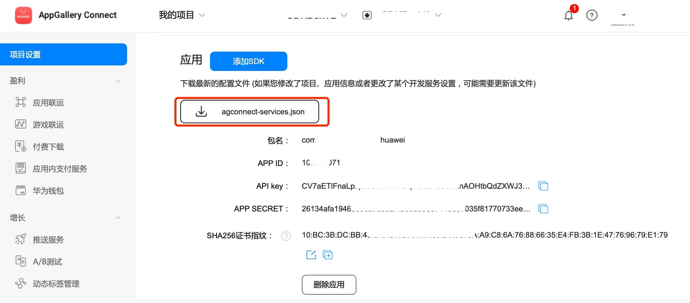

# 游戏服务（HMS Core）快速入门

[游戏服务](https://developer.huawei.com/consumer/cn/hms/huawei-game)是华为向您提供的能够快速开发游戏应用的服务。您可以允许用户使用华为帐号登录游戏，从而迅速推广游戏，共享华为庞大的用户价值。您还可以通过游戏服务快速实现成就、游戏事件、防沉迷等功能，快速低成本的构建游戏基本能力，并基于用户和内容的本地化进行深度的游戏运营。

## 主要功能

游戏服务当前向您的游戏应用提供了以下功能，您可以快速构建游戏基本能力。

- 必选功能：[游戏初始化](https://developer.huawei.com/consumer/cn/doc/development/HMSCore-Guides/game-start-0000001050123475) | [游戏升级](https://developer.huawei.com/consumer/cn/doc/development/HMSCore-Guides/game-update-0000001271748961) | [游戏登录](https://developer.huawei.com/consumer/cn/doc/development/HMSCore-Guides/game-login-0000001050121526) | [防沉迷](https://developer.huawei.com/consumer/cn/doc/development/HMSCore-Guides/game-anti-indulgence-0000001050123479) | [浮标](https://developer.huawei.com/consumer/cn/doc/development/HMSCore-Guides/game-buoy-0000001050121528)

- 可选功能：[成就](https://developer.huawei.com/consumer/cn/doc/development/HMSCore-Guides/game-achievement-0000001050123477) | [事件上报](https://developer.huawei.com/consumer/cn/doc/development/HMSCore-Guides/game-events-0000001050121530) | [排行榜](https://developer.huawei.com/consumer/cn/doc/development/HMSCore-Guides/game-leaderboards-0000001050123481) | [游戏存档](https://developer.huawei.com/consumer/cn/doc/development/HMSCore-Guides/game-archive-0000001050121532) | [玩家信息统计](https://developer.huawei.com/consumer/cn/doc/development/HMSCore-Guides/game-playerinfo-0000001050123483) | [游戏基本信息获取](https://developer.huawei.com/consumer/cn/doc/development/HMSCore-Guides/game-baseinfo-0000001050121534) | [底层功能](https://developer.huawei.com/consumer/cn/doc/development/HMSCore-Guides/game-gameturbo-0000001254626641)

## 版本更新说明

- 当前版本：[3.x] 1.1.0_6.14.0.300
    - 下架存档、排行榜、事件上报、成就等功能
    - SDK 升级到 6.14.0.300

- [3.x] 1.0.2_6.12.0.300

    - 完善内部实现
    - 新增PlayersClient.savePlayerRole接口,废弃submitAppPlayerInfo接口
    - SDK 升级到 6.12.0.300

- [3.x] 0.0.4_6.10.0.300

    - Android版本：com.huawei.hms:game:6.10.0.300

    - 代码内部优化。

    - GameService SDK支持Android 13。

    - Android Studio开发环境适配的targetSdkVersion和compileSdkVersion从31修改为33。

## SDK依赖说明

最新版本SDK需要用户手机上安装HMS Core（APK）6.10.0.300及以上版本。

## 一键接入游戏服务

- 使用 Cocos Creator 打开需要接入游戏服务的项目工程。

- 点击菜单栏的 **面板 -> 服务**，打开 **服务** 面板，在 **HUAWEI HMS Core** 选择 **游戏服务**，进入服务详情页。然后点击右上方的 **启用** 按钮即可开通服务。

    

- 如果华为后台的 **游戏服务** 服务尚未开通，需登录 [AppGallery Connect](https://developer.huawei.com/consumer/cn/service/josp/agc/index.html) 后台，开通服务。

### 配置华为参数文件

大部分的华为相关项目都需要用到 `agconnect-services.json` 配置文件。若有新开通服务等操作，请及时更新该文件。

- 登录 [AppGallery Connect](https://developer.huawei.com/consumer/cn/service/josp/agc/index.html) 后台，在 **项目列表 -> 应用列表** 中找到对应的应用。

- 在 **项目设置** 页面的 **应用** 区域，点击 `agconnect-services.json` 下载配置文件。`agconnect-services.json` 文件在下载或者更新完成后，**必须手动拷贝** 到工程目录的 `settings` 目录下。

    

- Cocos Creator v2.4.3 及以上版本，若 发布到 HUAWEI AppGallery Connect，开发者可直接在 **构建发布** 面板中选取下载或更新后的配置文件，不需要手动拷贝。

    

## Sample 工程

开发者可以通过 Sample 工程快速体验推送服务。

- 点击分析服务面板中的 **Sample 工程** 按钮，Clone 或下载 HUAWEI Sample 工程，并在 Cocos Creator 中打开。

- 参照上文开通分析服务并配置华为参数文件后，可通过 Creator 编辑器菜单栏的 **项目 -> 构建发布** 打开 **构建发布** 面板来构建编译工程。Creator v2.4.1 及以上版本，可 发布到 HUAWEI AppGallery Connect，Creator v2.4.1 以下的版本可 发布到 Android 平台。

- 需要在已安装 HMS Core 服务的华为手机上测试。

- Sample 工程运行到手机后，点击首页的 Game 按钮，即可进入功能界面进行测试。

    

## 开发指南

游戏服务大多数 API 均是异步回调。可使用 `huawei.hms.game.gameService.once` 获取单次回调，或者使用 `huawei.hms.game.gameService.on` 监听回调。

#### 获取游戏服务

```TypeScript
private game: typeof huawei.hms.game.gameService = (typeof huawei ===
'undefined'
? null
: huawei?.hms?.game?.gameService)!;
```

#### 游戏初始化

`initGame ():void`

[指南](https://developer.huawei.com/consumer/cn/doc/development/HMSCore-Guides/game-start-0000001050123475)

示例

```TypeScript
this.game.once(huawei.hms.game.API_EVENT_LIST.initGameCallback, (result: huawei.hms.game.ApiCbResult) => {
    console.log(result);
});
this.game.initGame();
```

#### 检查应用更新

`checkAppUpdate(forceUpdate: boolean): void;`

[指南](https://developer.huawei.com/consumer/cn/doc/development/HMSCore-Guides/game-update-0000001271748961) 

[API文档](https://developer.huawei.com/consumer/cn/doc/development/HMSCore-References/appupdateclient-0000001050123641#section1113567144514)

参数说明

|参数|说明|
|-|-|
|showUpdateDialog|true：升级提示框只有升级按钮，无取消按钮，用户只能选择升级。
false：升级提示框有升级按钮和取消按钮，用户可选择不升级|

示例

```TypeScript
this.game.once(huawei.hms.game.API_EVENT_LIST.checkAppUpdateCallback, (result: huawei.hms.game.ApiCbResult) => {
    console.log(result);
});
this.game.checkAppUpdate(true);
```

#### 游戏登录

`signIn(useAuthorizationMode: boolean): void;`

[指南](https://developer.huawei.com/consumer/cn/doc/development/HMSCore-Guides/game-login-0000001050121526)

参数说明

|参数|说明|
|-|-|
|useAuthorizationMode|是否采用授权方式登陆，否则采用静默方式登录|

示例

```TypeScript
this.game.once(huawei.hms.game.API_EVENT_LIST.signInCallback, (result: huawei.hms.game.ApiCbResult) => {
    console.log(result);
});
this.game.signIn(true);
```

#### 退出帐号

`logout(): void;`

[指南](https://developer.huawei.com/consumer/cn/doc/development/HMSCore-Guides/logout-0000001050050849)

示例

```TypeScript
this.game.once(huawei.hms.game.API_EVENT_LIST.logoutCallback, (result: huawei.hms.game.ApiCbResult) => {
    console.log(result);
});
this.game.logout();
```

#### 取消账号授权

`cancelAuthorization(): void;`

[指南 ](https://developer.huawei.com/consumer/cn/doc/development/HMSCore-Guides/cancelauthorization-0000001050050857)

[API文档](https://developer.huawei.com/consumer/cn/doc/development/HMSCore-References/accountauthservice-0000001050199395#section9140325133319)

示例

```TypeScript
this.game.once(huawei.hms.game.API_EVENT_LIST.cancelAuthorizationCallback, (result: huawei.hms.game.ApiCbResult) => {
    console.log(result);
});
this.game.cancelAuthorization();
```

#### 获取当前登录的玩家对象数据

`getCurrentPlayer ():void`

[API文档](https://developer.huawei.com/consumer/cn/doc/development/HMSCore-References/playersclient-0000001050121668#section1442582231216)

示例

```TypeScript
this.game.once(huawei.hms.game.API_EVENT_LIST.getCurrentPlayerCallback, (result: huawei.hms.game.ApiCbResult) => {
    console.log(result);
});
this.game.getCurrentPlayer();
```

#### 设置欢迎提示语和完成成就提示框展示的位置

`setPopupsPosition(position:number):void`

说明

- 如果不调用本接口，将默认在页面顶部展示。

- 当前只支持传入“1”，表示在页面顶部展示欢迎提示语和完成成就提示框

[API文档](https://developer.huawei.com/consumer/cn/doc/development/HMSCore-References/gamesclient-0000001050123611#section66001857175314)

参数说明

|参数|说明|
|-|-|
|position|当前只支持传入“1”，表示在页面顶部展示欢迎提示语和完成成就提示框|

示例

```TypeScript
this.game.once(huawei.hms.game.API_EVENT_LIST.setPopupsPositionCallback, (result: huawei.hms.game.ApiCbResult) => {
    console.log(result);
});
this.game.setPopupsPosition(1);
```

#### 获取游戏的应用ID

`getAppId ():void`

[API文档](https://developer.huawei.com/consumer/cn/doc/development/HMSCore-References/gamesummary-0000001050121662#section13187143319208)

示例

```TypeScript
this.game.once(huawei.hms.game.API_EVENT_LIST.getAppIdCallback, (result: huawei.hms.game.ApiCbResult) => {
   console.log(result);
});
this.game.getAppId();
```

#### [废弃]保存玩家在游戏内的信息，如等级、区服等。

`submitAppPlayerInfo (info: { area: string; rank: string; role: string; sociaty: string; }): void;`

[API文档](https://developer.huawei.com/consumer/cn/doc/development/HMSCore-References/playersclient-0000001050121668#section183401219425)

示例

```TypeScript
this.game.once(huawei.hms.game.API_EVENT_LIST.submitAppPlayerInfoCallback, (result: huawei.hms.game.ApiCbResult) => {
    console.log(result);
});
this.game.submitAppPlayerInfo({
    area: "测试区服1", rank: "测试等级1", role: "测试角色1", sociaty: "测试工会消息1"
});
```

#### 保存玩家在游戏内的角色信息，如区服、角色名称等。

`savePlayerRole (info: { serverId: string; serverName: string; roleId: string; roleName: string; }): void;`

[API文档](https://developer.huawei.com/consumer/cn/doc/HMSCore-References/playersclient-0000001050121668#section14448819342)

示例

```TypeScript
this.game.once(huawei.hms.game.API_EVENT_LIST.savePlayerRoleCallback, (result: huawei.hms.game.ApiCbResult) => {
    this.consolePanel.log(result);
});
this.game.savePlayerRole({
    serverId: "123", serverName: "测试等级1", roleId: "321", roleName: "测试角色1"
});
```


#### 显示浮标

`showFloatWindow ():void`

[指南](https://developer.huawei.com/consumer/cn/doc/development/HMSCore-Guides/game-buoy-0000001050121528)

[API文档](https://developer.huawei.com/consumer/cn/doc/development/HMSCore-References/buoyclient-0000001050123633)

示例

```TypeScript
this.game.showFloatWindow();
```

#### 隐藏浮标

`hideFloatWindow ():void`

[指南](https://developer.huawei.com/consumer/cn/doc/development/HMSCore-Guides/game-buoy-0000001050121528)

[API文档](https://developer.huawei.com/consumer/cn/doc/development/HMSCore-References/buoyclient-0000001050123633)

示例

```TypeScript
this.game.hideFloatWindow();
```
