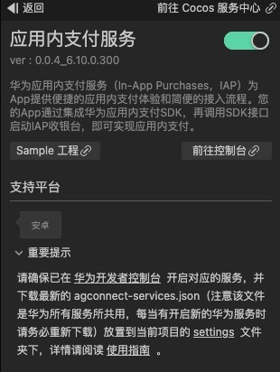
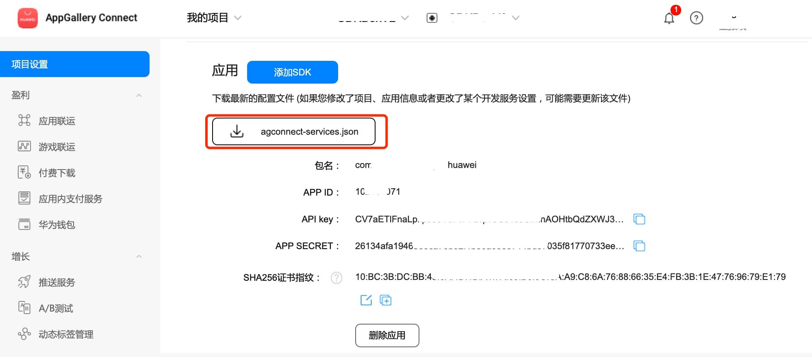
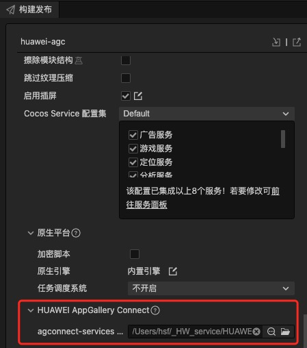
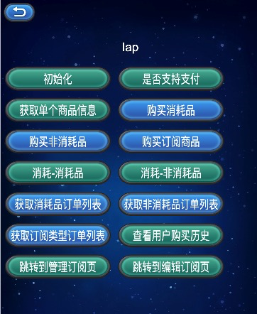

# 应用内支付服务快速入门

[华为应用内支付服务](https://developer.huawei.com/consumer/cn/hms/huawei-iap/)（In-App Purchases，IAP）为App提供便捷的应用内支付体验和简便的接入流程。您的App通过集成华为应用内支付SDK，再调用SDK接口启动IAP收银台，即可实现应用内支付。

通过应用内支付服务，用户可以在您的App内购买各种类型的虚拟商品，包括一次性商品和订阅型商品。

- 一次性商品：用户以一次性付款方式购买的商品，包括消耗型商品和非消耗型商品。

    - 消耗型商品：使用一次后即消耗掉，随使用减少，需要再次购买的商品。例：游戏货币，游戏道具等。

    - 非消耗型商品：一次性购买，永久拥有，无需消耗。例：游戏中额外的游戏关卡、应用中无时限的高级会员等。

- 订阅型商品：用户购买后在一段时间内允许访问增值功能或内容，周期结束后自动续期购买下一期的服务。例：应用中有时限的高级会员，如视频月度会员。

### 版本更新说明

- 当前版本：[3.x] 0.0.5_6.10.0.300

    - 升级sdk版本

- Android版本：com.huawei.hms:iap:6.10.0.300

    - 更新 SDK，新增部分接口。

    - 新增[BaseReq](https://developer.huawei.com/consumer/cn/doc/development/HMSCore-References/basereq-0000001347850688)类，并调整[ConsumeOwnedPurchaseReq](https://developer.huawei.com/consumer/cn/doc/development/HMSCore-References/consumeownedpurchasereq-0000001050137617)、[OwnedPurchasesReq](https://developer.huawei.com/consumer/cn/doc/development/HMSCore-References/ownedpurchasesreq-0000001050135762)、[ProductInfoReq](https://developer.huawei.com/consumer/cn/doc/development/HMSCore-References/productinforeq-0000001050137777)、[PurchaseIntentReq](https://developer.huawei.com/consumer/cn/doc/development/HMSCore-References/purchaseintentreq-0000001050135842)、[PurchaseIntentWithPriceReq](https://developer.huawei.com/consumer/cn/doc/development/HMSCore-References/purchaseintentwithpricereq-0000001054093693)的基类为[BaseReq](https://developer.huawei.com/consumer/cn/doc/development/HMSCore-References/basereq-0000001347850688)。

    - 支持[好友代付](https://developer.huawei.com/consumer/cn/doc/development/HMSCore-Guides/process-entrusted-payment-0000001521998653)功能。

    - 增加错误码60059，具体请参见[错误码](https://developer.huawei.com/consumer/cn/doc/development/HMSCore-References/client-error-code-0000001050746111)。

    - 适配Android 13系统，targetSdkVersion升级到33。

## 一键接入应用内支付服务

### 开通服务

- 使用 Cocos Creator 打开需要接入应用内支付服务的项目工程。

- 点击菜单栏的 **面板 -> 服务**，打开 **服务** 面板，在 **HUAWEI HMS Core** 内选择 **应用内支付服务**，进入服务详情页。然后点击右上方的 **启用** 按钮即可开通服务。



参考 [配置 AppGallery Connect](https://developer.huawei.com/consumer/cn/doc/development/HMSCore-Guides/config-agc-0000001050033072) 文档，完成开发者注册、创建应用、开通服务，完成参数配置和开启 API 步骤。

### 配置华为参数文件

大部分的华为相关项目都需要用到 `agconnect-services.json` 配置文件。若有新开通服务等操作，请及时更新该文件。

- 登录 [AppGallery Connect](https://developer.huawei.com/consumer/cn/service/josp/agc/index.html) 后台，在 **项目列表 -> 应用列表** 中找到对应的应用。

- 在 **项目设置** 页面的 **应用** 区域，点击 `agconnect-services.json` 下载配置文件。`agconnect-services.json` 文件在下载或者更新完成后，**必须手动拷贝** 到工程目录的 `settings` 目录下。

    

- Cocos Creator v2.4.3 及以上版本，若 发布到 HUAWEI AppGallery Connect，开发者可直接在 **构建发布** 面板中选取下载或更新后的配置文件，不需要手动拷贝。

    

## Sample 工程

开发者可以通过 Sample 工程快速体验支付服务。

- 点击分析服务面板中的 **Sample 工程** 按钮，Clone 或下载 HUAWEI Sample 工程，并在 Cocos Creator 中打开。

- 参照上文开通分析服务并配置华为参数文件后，可通过 Creator 编辑器菜单栏的 **项目 -> 构建发布** 打开 **构建发布** 面板来构建编译工程。Creator v2.4.1 及以上版本，可 发布到 HUAWEI AppGallery Connect，Creator v2.4.1 以下的版本可 发布到 Android 平台。

- 需要在已安装 HMS Core 服务的华为手机上测试。

- Sample 工程运行到手机后，点击首页的 **Iap** 按钮，即可进入功能界面进行测试。

    

## 开发指南

#### 定义局部变量iap

```TypeScript
private iap: typeof huawei.hms.iap.iapService = (typeof huawei ===
        'undefined'
        ? null
        : huawei?.hms?.iap?.iapService)!;
```

#### 初始化

`init (publicKey: string, enablePendingPurchase: boolean):void`

参数说明

|参数|说明|
|-|-|
|publicKey|支付公钥|
|enablePendingPurchase|是否启用延迟付款型支付。若要在您的应用中使用延迟付款型支付功能，需要在发起购买前调用本接口|

**示例**

```JavaScript
this.iap.once(huawei.hms.iap.API_EVENT_LIST.initCallBack, (res: huawei.hms.iap.ApiCbResult) => {
    console.log(res);
});
this.iap.init("iap支付公钥", false);
```

#### 获取是否支持应用内支付

`isEnvReady(): void;`

[接口文档](https://developer.huawei.com/consumer/cn/doc/development/HMSCore-References/iapclient-0000001050137587#section0680174272414)

**示例**

```JavaScript
this.iap.once(huawei.hms.iap.API_EVENT_LIST.isEnvReadyCallBack, (res: huawei.hms.iap.ApiCbResult) => {
    console.log(res);
});
this.iap.isEnvReady();
```

#### 获取后台配置的单个商品信息

`obtainProductInfo(productIdArr: string[], priceType: number): void;`

参数说明

|参数|说明|
|-|-|
|productIdArr|商品id列表 查询的商品必须是您在AppGallery Connect网站配置的商品|
|priceType|0：消耗型商品; 1：非消耗型商品; 2：订阅型商品|

[接口文档](https://developer.huawei.com/consumer/cn/doc/development/HMSCore-References/iapclient-0000001050137587#section339016011301)

示例

```TypeScript
this.iap.once(huawei.hms.iap.API_EVENT_LIST.obtainProductInfoCallBack, (res: huawei.hms.iap.ApiCbResult) => {
    console.log(res);
});
//消耗型商品
this.iap.obtainProductInfo([this.consumableProductId], 0);
```

#### 发起购买PMS商品

`createPurchaseIntent(productId: string, priceType: number, developerPayload: string, useFriendPay: boolean): void;`

[接口文档](https://developer.huawei.com/consumer/cn/doc/development/HMSCore-References/iapclient-0000001050137587#section1255302563115)

参数说明 

|参数|说明|
|-|-|
|productId|商品ID|
|priceType|商品类型 0：消耗型商品; 1：非消耗型商品; 2：订阅型商品|
|developerPayload|商户侧保留信息|
|useFriendPay|是否采用好友支付（需要在init时候启用延迟支付）|

示例

```TypeScript
this.iap.once(huawei.hms.iap.API_EVENT_LIST.createPurchaseIntentCallBack, (res: huawei.hms.iap.ApiCbResult) => {
    console.log(res);
});
this.iap.createPurchaseIntent(productId, priceType, developerPayload, false);
```

#### 确认交易

`consumeOwnedPurchase(inAppPurchaseData: string): void;`

[接口文档](https://developer.huawei.com/consumer/cn/doc/development/HMSCore-References/iapclient-0000001050137587#section16784102213346)

注意：

1. 订阅商品不支持 无需消耗 否则返回错误

2. 非消耗型商品仅沙箱环境可消耗

参数说明

|参数|说明|
|-|-|
|inAppPurchaseData|[订单数据](https://developer.huawei.com/consumer/cn/doc/development/HMSCore-References/json-inapppurchasedata-0000001050986125)|

#### 获取对应类型的商品的付款信息

`obtainOwnedPurchases(priceType: number): void;`

[接口文档](https://developer.huawei.com/consumer/cn/doc/development/HMSCore-References/iapclient-0000001050137587#section15126153542812)

参数说明

|参数|说明|
|-|-|
|priceType|0：消耗型商品; 1：非消耗型商品; 2：订阅型商品|

示例

```TypeScript
this.iap.once(huawei.hms.iap.API_EVENT_LIST.obtainOwnedPurchasesCallBack, (res: huawei.hms.iap.ApiCbResult) => {
    console.log(res);
});
this.iap.obtainOwnedPurchases(0);
```

#### 查看用户购买历史

`obtainOwnedPurchaseRecord(priceType: number): void;`

[接口文档](https://developer.huawei.com/consumer/cn/doc/development/HMSCore-References/iapclient-0000001050137587#section769716459358)

参数说明

|参数|说明|
|-|-|
|priceType|0：消耗型商品; 1：非消耗型商品; 2：订阅型商品|

示例

```TypeScript
this.iap.once(huawei.hms.iap.API_EVENT_LIST.obtainOwnedPurchaseRecordCallBack, (res: huawei.hms.iap.ApiCbResult) => {
    console.log(res);
});
this.iap.obtainOwnedPurchaseRecord(0);
```

#### 跳转到管理订阅页/跳转到编辑订阅页

`startIapActivity(type: number, productId: string | null): void;`

[接口文档](https://developer.huawei.com/consumer/cn/doc/development/HMSCore-References/iapclient-0000001050137587#section16600172243819)

参数说明

|参数|说明|
|-|-|
|type|2 (StartIapActivityReq.TYPE_SUBSCRIBE_MANAGER_ACTIVITY) 跳转到管理订阅页，     3 (StartIapActivityReq.TYPE_SUBSCRIBE_EDIT_ACTIVITY) 跳转到管理订阅页|
|productId|订阅商品ID type为3时候使用|

示例

```TypeScript
this.iap.once(huawei.hms.iap.API_EVENT_LIST.startIapActivityCallBack, (res: huawei.hms.iap.ApiCbResult) => {
    console.log(res);
});
this.iap.startIapActivity(2, null);
```

## 其他

详细的功能说明，请参考服务[指南](https://developer.huawei.com/consumer/cn/doc/development/HMSCore-References/iap-api-overview-0000001088308437)。


