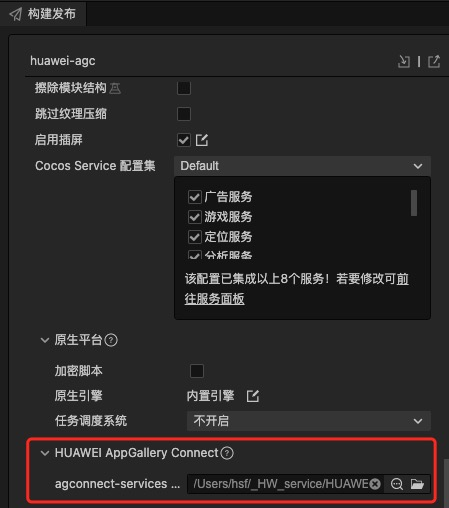

# 推送服务（HMS Core）快速入门

[推送服务](https://developer.huawei.com/consumer/cn/hms/huawei-pushkit)（Push Kit）是华为提供的消息推送平台，建立了从云端到终端的消息推送通道。您通过集成推送服务，可以向客户端应用实时推送消息，构筑良好的用户关系，提升用户的感知度和活跃度。

推送服务现支持如下接入形态：

[Android](https://developer.huawei.com/consumer/cn/doc/development/HMSCore-Guides/android-app-quickstart-0000001071490422)：推送服务Android SDK为您的Android应用开发提供推送消息相关的接口，适用于手机和平板。主要包含根据多种受众用户推送通知栏和透传消息，自定义通知栏消息样式，主题订阅等功能。

[HarmonyOS（Java）](https://developer.huawei.com/consumer/cn/doc/development/HMSCore-Guides/harmony-java-quickstart-0000001153706156)：推送服务HarmonyOS Java SDK为您的HarmonyOS应用开发提供推送消息相关的接口，适用于华为手机和平板。主要功能为根据token推送通知栏和透传消息。

[iOS](https://developer.huawei.com/consumer/cn/doc/development/HMSCore-Guides/ios-dev-progress-0000001062221191)：推送服务iOS SDK为您的iOS应用开发提供推送消息相关的接口，适用于iOS 10及以上的iPhone设备。主要功能为根据token推送通知栏和透传消息。

[Web](https://developer.huawei.com/consumer/cn/doc/development/HMSCore-Guides/web-dev-progress-0000001080676256)：推送服务为您的Web应用开发提供推送通知栏消息相关接口。

[快应用](https://developer.huawei.com/consumer/cn/doc/development/HMSCore-Guides/quick-dev-0000001050042109)：推送服务为您的华为快应用开发提供推送通知栏消息相关的接口。

REST API：推送服务REST API为您提供HTTPS接口，您可以通过HTTPS形式发起请求，调用推送服务相关能力，适用于上述所有平台。主要包含[下行消息](https://developer.huawei.com/consumer/cn/doc/development/HMSCore-References/https-send-api-0000001050986197)、[下行消息回执](https://developer.huawei.com/consumer/cn/doc/development/HMSCore-References/https-send-receipt-api-0000001051066120)、[主题订阅](https://developer.huawei.com/consumer/cn/doc/development/HMSCore-References/topic-sub-api-0000001051066122)等功能。

## 支持的设备

|SDK|设备类型|OS版本|HMS Core（APK）版本|
|-|-|-|-|
|Android|华为手机和平板|EMUI 3.0及以上|3.0.0及以上|
||非华为手机和平板|Android 4.4 - 13||
|iOS|iPhone|iOS 10及以上|-|
|HarmonyOS（Java）|华为手机和平板|HarmonyOS 2.0及以上|5.0.0及以上|

## 更新说明
- 当前版本：[3.x] 1.1.2_6.12.0.300

    - 完善内部实现

    - SDK 升级到 6.12.0.300
- [3.x] 0.0.5_6.10.0.300

    - 升级SDK版本

## 一键接入推送服务

### 开通服务

- 使用 Cocos Creator 打开需要接入推送服务的项目工程。

- 点击菜单栏的 **面板 -> 服务**，打开 **服务** 面板，在 **HUAWEI HMS Core** 内选择 **推送服务**，进入服务详情页。然后点击右上方的 **启用** 按钮即可开通服务。

    

参考 [配置 AppGallery Connect](https://developer.huawei.com/consumer/cn/doc/development/HMSCore-Guides/android-config-agc-0000001050170137) 文档，完成开发者注册、创建应用、开通服务，完成参数配置和开启 API 步骤。

### 配置华为参数文件

大部分的华为相关项目都需要用到 `agconnect-services.json` 配置文件。若有新开通服务等操作，请及时更新该文件。

- 登录 [AppGallery Connect](https://developer.huawei.com/consumer/cn/service/josp/agc/index.html) 后台，在 **项目列表 -> 应用列表** 中找到对应的应用。

- 在 **项目设置** 页面的 **应用** 区域，点击 `agconnect-services.json` 下载配置文件。`agconnect-services.json` 文件在下载或者更新完成后，**必须手动拷贝** 到工程目录的 `settings` 目录下。

    

- Cocos Creator v2.4.3 及以上版本，若 发布到 HUAWEI AppGallery Connect，开发者可直接在 **构建发布** 面板中选取下载或更新后的配置文件，不需要手动拷贝。

    

## Sample 工程

开发者可以通过 Sample 工程快速体验推送服务。

- 点击分析服务面板中的 **Sample 工程** 按钮，Clone 或下载 HUAWEI Sample 工程，并在 Cocos Creator 中打开。

- 参照上文开通分析服务并配置华为参数文件后，可通过 Creator 编辑器菜单栏的 **项目 -> 构建发布** 打开 **构建发布** 面板来构建编译工程。Creator v2.4.1 及以上版本，可 发布到 HUAWEI AppGallery Connect，Creator v2.4.1 以下的版本可 发布到 Android 平台。

- 需要在已安装 HMS Core 服务的华为手机上测试。

- Sample 工程运行到手机后，点击首页的 **Push** 按钮，即可进入功能界面进行测试。

    

## 开发指南

#### 获取接入推送服务所需的Token

`getToken(appId: string): void;`

- 请勿使用Push Token跟踪标记用户。

- 应用不要固定判断Push Token长度，因为后续长度可变。

- 禁止应用频繁申请Token。对于非常驻应用每次启动时获取Token，对于常驻应用严禁定期频繁申请Token，如果一定要周期申请建议周期大于1天。

- 只有在AppGallery Connect平台[打开推送服务](https://developer.huawei.com/consumer/cn/doc/development/HMSCore-Guides/android-config-agc-0000001050170137#section9471122085218)后，[getToken](https://developer.huawei.com/consumer/cn/doc/development/HMSCore-References/hms-instanceid-0000001050255634#section1796315281618)方法才会返回Push Token。

- **请注意您在代码中必须同时声明[getToken](https://developer.huawei.com/consumer/cn/doc/development/HMSCore-References/hms-instanceid-0000001050255634#section1796315281618)方法和[onNewToken](https://developer.huawei.com/consumer/cn/doc/development/HMSCore-References/hmsmessageservice-0000001050173839#section343314205)方法**，确保Push Token成功返回。

[指南](https://developer.huawei.com/consumer/cn/doc/development/HMSCore-Guides/android-client-dev-0000001050042041)

参数说明

|参数|说明|
|-|-|
|appId|应用的 appId|

示例

```TypeScript
huawei.hms.push.pushService.once(huawei.hms.push.API_EVENT_LIST.getTokenCallback, (result: huawei.hms.push.ApiCbResult) => {
    console.log(result);
}, this)
huawei.hms.push.pushService.getToken(this.appId);
```

#### 获取接入推送服务所需的Token

`getTokenBySubjectId(subjectId: string): void;`

[指南](https://developer.huawei.com/consumer/cn/doc/development/HMSCore-Guides/android-client-dev-0000001050042041)

参数说明

|参数|说明|
|-|-|
|subjectId|项目ID|

示例

```TypeScript
huawei.hms.push.pushService.once(huawei.hms.push.API_EVENT_LIST.getTokenBySubjectIdCallback, (result: huawei.hms.push.ApiCbResult) => {
    console.log(result);
}, this)
huawei.hms.push.pushService.getTokenBySubjectId(this.subjectId);
```

#### 删除Token

`deleteToken (appId: string): void`
说明

- 禁止频繁注销Push Token。

- 注销Push Token需要HMS Core（APK）的版本不低于3.0.0。

- 如果您不希望应用接收消息，可以调用[turnOffPush](https://developer.huawei.com/consumer/cn/doc/development/HMSCore-References/hmsmessaging-0000001050255650#section943612533595)方法关闭通知栏消息。

- 您应用的使用协议和隐私声明必须包含并遵守《[华为推送服务使用协议](https://developer.huawei.com/consumer/cn/doc/app/20213)》和《[SDK隐私安全说明](https://developer.huawei.com/consumer/cn/doc/development/HMSCore-Guides/sdk-data-security-0000001050042177)》。

[指南](https://developer.huawei.com/consumer/cn/doc/development/HMSCore-Guides/android-client-dev-0000001050042041)

参数说明

|参数|说明|
|-|-|
|appId|应用的 appid|

示例

```TypeScript
huawei.hms.push.pushService.once(huawei.hms.push.API_EVENT_LIST.deleteTokenCallback, (result: huawei.hms.push.ApiCbResult) => {
    console.log(result);
}, this)
huawei.hms.push.pushService.deleteToken(this.appId);
```

#### 根据项目Id删除Token

`deleteTokenBySubjectId(subjectId: string): void;`
说明

- 禁止频繁注销Push Token。

- 注销Push Token需要HMS Core（APK）的版本不低于3.0.0。

- 如果您不希望应用接收消息，可以调用[turnOffPush](https://developer.huawei.com/consumer/cn/doc/development/HMSCore-References/hmsmessaging-0000001050255650#section943612533595)方法关闭通知栏消息。

- 您应用的使用协议和隐私声明必须包含并遵守《[华为推送服务使用协议](https://developer.huawei.com/consumer/cn/doc/app/20213)》和《[SDK隐私安全说明](https://developer.huawei.com/consumer/cn/doc/development/HMSCore-Guides/sdk-data-security-0000001050042177)》。 

[指南](https://developer.huawei.com/consumer/cn/doc/development/HMSCore-Guides/android-client-dev-0000001050042041)

参数说明

|参数|说明|
|-|-|
|subjectId|项目ID|

示例

```TypeScript
huawei.hms.push.pushService.once(huawei.hms.push.API_EVENT_LIST.deleteTokenBySubjectIdCallback, (result: huawei.hms.push.ApiCbResult) => {
   console.log(result);
}, this)
huawei.hms.push.pushService.deleteTokenBySubjectId(this.subjectId);
```

#### 异步任务打开接收通知栏消息开关

`turnOnPush(): void;`

[API指南](https://developer.huawei.com/consumer/cn/doc/development/HMSCore-References/hmsmessaging-0000001050255650#section867613695918)

示例

```TypeScript
huawei.hms.push.pushService.once(huawei.hms.push.API_EVENT_LIST.turnOnPushCallback, (result: huawei.hms.push.ApiCbResult) => {
    console.log(result);
}, this)
huawei.hms.push.pushService.turnOnPush();
```

#### 异步任务关闭接收通知栏消息开关

`turnOffPush(): void;`

[API指南](https://developer.huawei.com/consumer/cn/doc/development/HMSCore-References/hmsmessaging-0000001050255650#section943612533595)

示例

```TypeScript
huawei.hms.push.pushService.once(huawei.hms.push.API_EVENT_LIST.turnOffPushPushCallback, (result: huawei.hms.push.ApiCbResult) => {
    console.log(result);
}, this)
huawei.hms.push.pushService.turnOffPush();
```

#### 订阅主题

`setTag (tag: string): void`

[API说明](https://developer.huawei.com/consumer/cn/doc/development/HMSCore-References/hmsmessaging-0000001050255650#section1222313413551) [指南](https://developer.huawei.com/consumer/cn/doc/development/HMSCore-Guides/android-topic-based-sending-0000001050040114)

参数说明

|参数|说明|
|-|-|
|tag|（topic）要订阅的主题的名称。必须匹配以下正则表达式：[\u4e00-\u9fa5\w-_.~%]{1,900}。|

示例

```TypeScript
huawei.hms.push.pushService.once(huawei.hms.push.API_EVENT_LIST.setTagCallback, (result: huawei.hms.push.ApiCbResult) => {
    console.log(result);
}, this)
huawei.hms.push.pushService.setTag("xxxxxxx");
```

#### 取消订阅主题

`delTag (tag: string): void`

[API说明](https://developer.huawei.com/consumer/cn/doc/development/HMSCore-References/hmsmessaging-0000001050255650#section7598115275611) [指南](https://developer.huawei.com/consumer/cn/doc/development/HMSCore-Guides/android-topic-based-sending-0000001050040114)

 参数说明

|参数|说明|
|-|-|
|tag|（topic）要取消订阅的主题的名称。|

示例

```TypeScript
huawei.hms.push.pushService.once(huawei.hms.push.API_EVENT_LIST.delTagCallback, (result: huawei.hms.push.ApiCbResult) => {
    console.log(result);
}, this)
huawei.hms.push.pushService.delTag("xxxxxxx");
```

#### 华为Push服务器通过HTTPS方式调用此接口给您的服务器推送上行消息

[指南](https://developer.huawei.com/consumer/cn/doc/development/HMSCore-Guides/android-upstream-message-sending-0000001050040118)

`sendMessage (params: string): void`

 参数说明

|参数|说明|
|-|-|
|params|json形式则字符串内容|

示例

```TypeScript
huawei.hms.push.pushService.once(huawei.hms.push.API_EVENT_LIST.sendMessageCallback, (result: huawei.hms.push.ApiCbResult) => {
    console.log(result);
}, this)

let params = {
    "messageId": "messageId" + Math.ceil(Math.random() * 100000),
    "messageType": "mType1",
    "collapseKey": "0",
    "sendMode": "1",
    "receiptMode": "1",
    "ttl": "10000",
    "key1": "value1",
    "key2": "value2",
    "key3": "value3"
}
let str = JSON.stringify(params);
huawei.hms.push.pushService.sendMessage(str);
```

#### 获取AAID

[指南](https://developer.huawei.com/consumer/cn/doc/development/HMSCore-Guides/aaid-0000001051142988)

`getAAID (): void`

示例

```TypeScript
huawei.hms.push.pushService.once(huawei.hms.push.API_EVENT_LIST.getAAIDCallback, (result: huawei.hms.push.ApiCbResult) => {
    console.log(result);
}, this)
huawei.hms.push.pushService.getAAID();
```

#### 删除本地生成的AAID与时间戳并同步删除已生成的与本AAID相关的所有Token。

[指南](https://developer.huawei.com/consumer/cn/doc/development/HMSCore-Guides/aaid-0000001051142988)

`deleteAAID (): void`

示例

```TypeScript
huawei.hms.push.pushService.once(huawei.hms.push.API_EVENT_LIST.deleteAAIDCallback, (result: huawei.hms.push.ApiCbResult) => {
    console.log(result);
}, this)
huawei.hms.push.pushService.deleteAAID()
```

#### 获取ODID

[指南](https://developer.huawei.com/consumer/cn/doc/development/HMSCore-Guides/oaid-0000001050783198)

`getOdid (): void`

示例

```TypeScript
huawei.hms.push.pushService.once(huawei.hms.push.API_EVENT_LIST.getOdidCallback, (result: huawei.hms.push.ApiCbResult) => {
    console.log(result);
}, this)
huawei.hms.push.pushService.getOdid();
```

#### 获取是否启用了自动初始化功能

[指南](https://developer.huawei.com/consumer/cn/doc/development/HMSCore-References/hmsmessaging-0000001050255650#section768215326488)

`isAutoInitEnabled (): boolean`

示例

```TypeScript
let bol = huawei.hms.push.pushService.isAutoInitEnabled();
```

#### 设置是否自动初始化

[指南](https://developer.huawei.com/consumer/cn/doc/development/HMSCore-References/hmsmessaging-0000001050255650#section19198183125511)

`setAutoInitEnabled (): void`

示例

```TypeScript
huawei.hms.push.pushService.setAutoInitEnabled(true);
```

#### 判断当前终端设备是否支持帐号校验功能

[指南](https://developer.huawei.com/consumer/cn/doc/development/HMSCore-References/hmsprofile-0000001057586645#section78129196156)

`isSupportProfile(): boolean`

示例

```TypeScript
let bol = huawei.hms.push.pushService.isSupportProfile();
```

#### 添加当前设备上的用户与应用的关系

[指南](https://developer.huawei.com/consumer/cn/doc/development/HMSCore-References/hmsprofile-0000001057586645#section8475185931912)

`addProfile(params: string): void;`

示例

```TypeScript
huawei.hms.push.pushService.once(huawei.hms.push.API_EVENT_LIST.addProfileCallback, (result: huawei.hms.push.ApiCbResult) => {
    console.log(result);
}, this)
let params = {
    "type": "CUSTOM_PROFILE",
    "profileId": "PROFILE_ID_001"
}
huawei.hms.push.pushService.addProfile(JSON.stringify(params));
```

#### 清除当前设备上登录的用户与应用的关系

[指南](https://developer.huawei.com/consumer/cn/doc/development/HMSCore-References/hmsprofile-0000001057586645#section655417438283)

`deleteProfile(params: string): void;`

示例

```TypeScript
huawei.hms.push.pushService.once(huawei.hms.push.API_EVENT_LIST.deleteProfileCallback, (result: huawei.hms.push.ApiCbResult) => {
    console.log(result);
}, this)
let params = {
    "subjectId": this.subjectId,  //可选
    "profileId": "PROFILE_ID_001" //必选
}
huawei.hms.push.pushService.deleteProfile(JSON.stringify(params));
```

## 其他

详细的功能说明，请参考服务[指南](https://developer.huawei.com/consumer/cn/doc/development/HMSCore-Guides/harmony-java-devguides-0000001199425951)。

