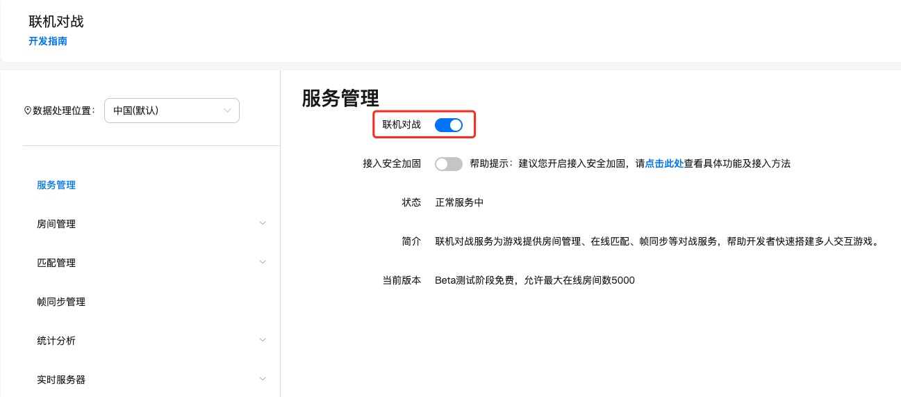
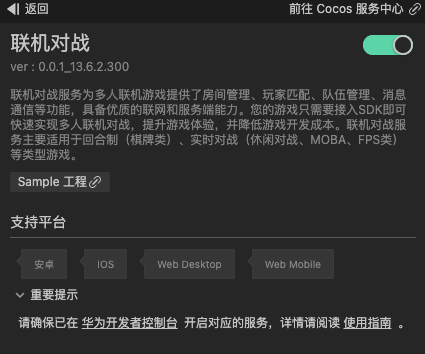
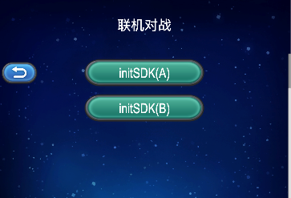
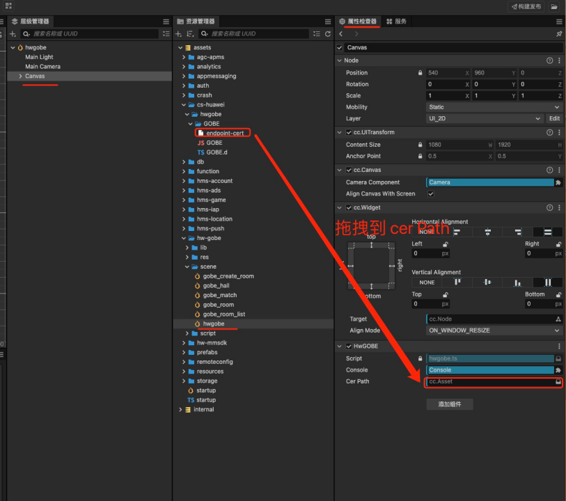
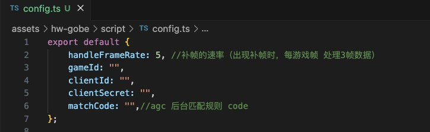

# 联机对战（AppGallery Connect）快速入门

[联机对战服务](https://developer.huawei.com/consumer/cn/doc/development/AppGallery-connect-Guides/gameobe-introduction-0000001185429290)为多人联机游戏提供了房间管理、玩家匹配、队伍管理、消息通信等功能，具备优质的联网和服务端能力。您的游戏只需要接入SDK即可快速实现多人联机对战，提升游戏体验，并降低游戏开发成本。联机对战服务主要适用于回合制（棋牌类）、实时对战（休闲对战、MOBA、FPS类）等类型游戏。

### 主要功能

|主要功能|功能描述|
|-|-|
| 房间管理 |为游戏玩家提供联机对战承载容器，支持玩家加入到房间中与其他玩家对战，并提供了更新自定义状态与属性、房间内发送消息、离开房间、解散房间等能力。|
| 玩家匹配 |支持通过控制台自定义匹配规则，并提供了房间匹配、在线匹配和组队匹配三种方式，用于玩家不同游戏场景下的对战匹配。同时，还支持在玩家匹配不足的情况下自动填充机器人，可有效避免超时而导致匹配失败的问题。|
| 队伍管理 |支持玩家通过发起组队匹配的方式匹配队员和对手，并提供了离开队伍、解散队伍等能力。|
| 消息通信 |帧同步+帧数据存储与查询+端侧通信与交互  为游戏应用提供帧同步能力，保证不同终端联机对战时的帧数据同步，支持在发生帧数据丢失时进行自动补帧，并支持将对局中的帧数据以记录文件形式存储以便后续查询回放。同时，提供了不同客户端之间的通信能力，支持房间内玩家发送消息，并且还支持客户端与实时服务器之间的交互，可用于拓展客户端游戏逻辑。   托管代码到实时服务器  支持在实时服务器部署并运行基于服务端开发框架的游戏逻辑代码，实现云侧计算与管理能力。|

### 工作原理

集成联机对战服务SDK的客户端，将各类动作指令发送到联机对战服务器。服务器接收并汇总，然后直接帧广播给房间内的所有客户端，客户端根据收到的游戏动作来做运算和显示。您只需要将联机对战服务SDK集成到游戏中，并在AGC控制台进行简单配置，即可为您的游戏快速构建对战能力。

## 版本更新说明

- 当前版本：[3.x] 0.0.2_13.6.2.300

    - 初始版本

## 一键接入联机对战

### 开通服务

- 在华为agc后台需要开通联机对战功能

    

- 使用 Cocos Creator 打开需要接入联机对战服务的项目工程。

- 点击菜单栏的**面板 -> 服务**，打开 **服务** 面板，选择 **联机对战**，进入服务详情页。然后点击右上方的 **启用** 按钮即可开通服务。

    

### 验证服务是否开通成功

开启后在项目工程的 assets 下的 cs-huawei 文件夹内如果看到 hwgobe 相关文件，即为成功，如果无此文件夹，请查看编辑器控制台的log信息

## Sample 工程

开发者可以通过 Sample 工程快速体验联机对战服务。

- 点击分析服务面板中的 **Sample 工程** 按钮，Clone 或下载 HUAWEI Sample 工程，并在 Cocos Creator 中打开。

- Sample 工程运行到手机后，点击首页的 **Hwgobe** 按钮，即可进入功能界面进行测试。

    

- Sample 工程 是根据华为的联机对战示例代码改编而成(基于cocos creator 3.8.0开发，功能有所修改)，你也可以直接下载原始的[示例代码](https://developer.huawei.com/consumer/cn/doc/development/AppGallery-connect-Examples/gameobe-samplecode-jssdk-0000001226761605)，目前华为提供的为cocos creator 2.X的项目。

- 如果需要打包 安卓项目，你需要参考下图配置 endpoint-cert。

    

- 实时服务器代码可以在 HUAWEIDemoCreator3 文件夹下的gobe_server找到，具体开发步骤可以参考[实时服务器开发指导](https://developer.huawei.com/consumer/cn/doc/development/AppGallery-connect-Guides/gameobe-realtime-server-0000001289210804)，构建后上传到华为 agc 后台。

- 为了服务可用，你需要修改config.ts脚本,需要改为你自己的项目对应的参数。

    

## 开发指南

开启服务后，会自动将“JS SDK”集成到你的项目中，为了灵活性，服务未对 “JS SDK”进行二次封装，在使用联机对战服务时，可以直接参考华为[文档指南](https://developer.huawei.com/consumer/cn/doc/development/AppGallery-connect-Guides/gameobe-flowchart-overview-js-0000001342697113)进行相关功能的开发。

## API文档

详细的api文档说明请查阅-[API参考](https://developer.huawei.com/consumer/cn/doc/development/AppGallery-connect-References/gameobe-overview-js-0000001237750607)。

