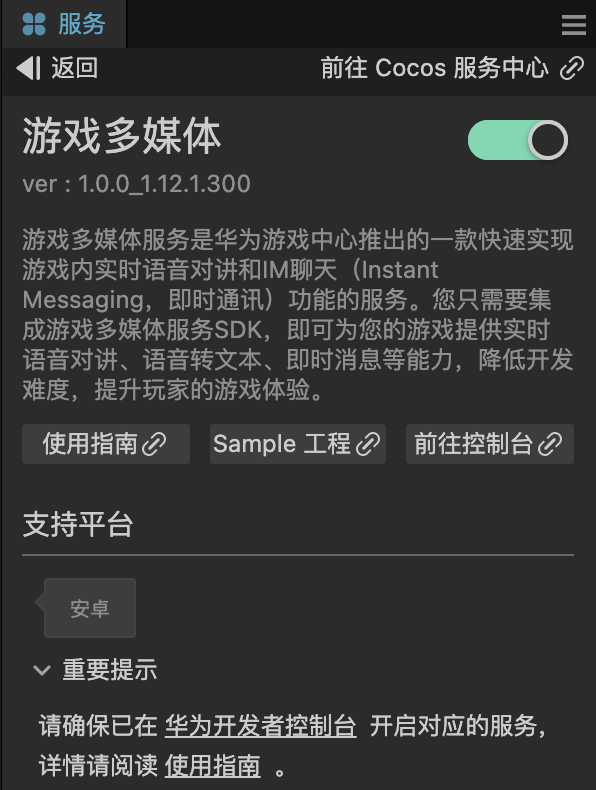

# 游戏多媒体（AppGallery Connect）快速入门

[游戏多媒体服务](https://developer.huawei.com/consumer/cn/doc/development/AppGallery-connect-Guides/gamemme-introduction-0000001226565909)是华为游戏中心推出的一款快速实现游戏内实时语音对讲和IM聊天（Instant Messaging，即时通讯）功能的服务。您只需要集成游戏多媒体服务SDK，即可为您的游戏提供实时语音对讲、语音转文本、即时消息等能力，降低开发难度，提升玩家的游戏体验。

### 主要功能

|主要功能|||功能描述|
|-|-|-|-|
|实时语音|1.房间管理||借助“房间”这一虚拟的音频空间，可以实现语音对讲功能。当前，实时语音聊天提供了加入小队/国战房间、切换房间、转让房主身份、离开房间和获取指定房间信息等能力。|
||2.语音管理||提供设置自身麦克风状态、禁言和屏蔽其他玩家等能力，用于实现静默自身、屏蔽/禁止所属房间中任意玩家语音的功能，并支持获取当前发言玩家列表。|
|IM聊天|1.文本消息|群组管理|借助“群组”这一虚拟的消息通道，可以实现不同客户端之间的IM聊天功能。当前，IM聊天提供了加入和离开临时群组等能力，同一群组内的玩家可以互相发送/接收对方的聊天消息。|
|||消息管理|不同玩家或玩家与群组之间可建立临时会话，发送和接收消息。当前，IM聊天支持“单聊”和“群聊”两种聊天类型。|
||2.语音消息|录制与播放|提供了语音消息录制、下载播放等能力，支持玩家录制一段语音消息，通过IM通道发送给其他玩家，其他玩家通过下载语音消息文件即可播放收听该语音消息内容。|
|||语音转文本|提供了语音转文本能力，支持快速识别语音并转录成文本内容，可用于语音输入等使用场景。|
||3.本地音效播放||提供了本地音效播放能力，可以实现本地音效的播放、暂停、恢复、停止等功能。|

### 工作原理

集成游戏多媒体服务SDK的客户端，将语音信息输入到华为游戏多媒体服务器，服务器接收并处理，然后将语音数据输出给房间内的所有客户端。同时，游戏多媒体服务SDK还提供IM聊天功能，用于不同客户端之间的消息会话。您只需要将游戏多媒体服务SDK集成到您的游戏中，并通过简单的功能开发，即可为您的游戏快速构建语音对讲和即时消息能力。


## 版本更新说明

- 当前版本：[3.x] 0.0.1_13.6.2.300

    - 初始版本

## 一键接入游戏多媒体

### 开通服务

- 在华为agc后台需要开通游戏多媒体功能,并开启“语音转文本”和“IM聊天”功能。（IM聊天除了需要在AGC控制台上手动开启该功能还需要二次申请，具体请参考[服务管理](https://developer.huawei.com/consumer/cn/doc/development/AppGallery-connect-Guides/gamemme-console-servicemanagement-0000001255134391)）


- 使用 Cocos Creator 打开需要接入游戏多媒体的项目工程。

- 点击菜单栏的**面板 -> 服务**，打开 **服务** 面板，在 **HUAWEI AppGallery Connect** 选择 **联机对战**，进入服务详情页。然后点击右上方的 **启用** 按钮即可开通服务。

    


### 验证服务是否开通成功

- 开启后在项目工程的 assets 下的 cs-huawei 文件夹内如果看到 hwmmsdk 相关文件，如果无此文件夹，请查看编辑器控制台的log信息。

- 可参照 Sample 工程，进行初始化，打包成“安卓”或者“HUAWEI AppGallery Connect”平台，在安卓手机上运行后，观察回调是否可以初始化成功，如果失败，请检查初始化参数是否正确和包名是否和agc后台是否一致。

## Sample 工程

开发者可以通过 Sample 工程快速体验联机对战服务。

- 点击分析服务面板中的 **Sample 工程** 按钮，Clone 或下载 HUAWEI Sample 工程，并在 Cocos Creator 中打开。

- 你需要找到 hwmmsdk.ts 脚本并修改数据为您创建的应用信息。

    

- Sample 工程运行到手机后，点击首页的 **Hwmmsdk** 按钮，即可进入功能界面进行测试。

    

## 开发指南

游戏多媒体所有的 API 均是异步回调。可使用 `huawei.game.mmsdk.mmsdkService.once` 获取单次回调，或者使用 `huawei.game.mmsdk.mmsdkService.on` 监听回调。可使用`huawei.game.mmsdk.mmsdkService.off`移除回调


#### 申请权限

`requestPermissions(guideUser: boolean, guideUserTipsText?: string, guideUserBtnText?: string): void;`

参数说明

|参数|说明|
|-|-|
|guideUser|如果用户未授予权限是否显示引导弹窗|
|guideUserTipsText|引导弹窗显示的内容|
|guideUserBtnText|引导弹窗按钮的内容|

代码示例：

```TypeScript
requestPermissions () {
huawei.game.mmsdk.mmsdkService.once(huawei.game.mmsdk.API_EVENT_LIST.requestPermissionsCallback, (result: huawei.game.mmsdk.ApiCbResult) => {
    console.log(result);
})
this.mmsdkService.requestPermissions(true, "需要开启权限才能使用此功能", "去开启");
}
```


#### 初始化（创建实例）

[指南](https://developer.huawei.com/consumer/cn/doc/development/AppGallery-connect-Guides/gamemme-engine-android-0000001193958984)

```TypeScript
init(info: {
    openId: string;
    agcAppId: string;
    agcClientId: string;
    agcClientSecret: string;
    agcApiKey: string;
    logEnable: boolean;
    logSize: number;
    countryCode: string;
    useSign: boolean;
    sign: string;
    nonce: string;
    timeStamp: string;
}): void;
```

参数说明

|参数|说明|
|-|-|
|openId|用户的唯一ID|
|agcAppId|agc后台获取|
|agcClientId|agc后台获取|
|agcClientSecret|agc后台获取|
|agcApiKey|agc后台获取|
|logEnable|是否启用日志|
|logSize|日志存储大小|
|countryCode|国家码，用于网关路由，默认CN|
|useSign|是否使用安全加固|
|sign|开发者生成的接入签名|
|nonce|开发者接入签名的随机数|
|timeStamp|开发者接入签名的时间戳|

代码示例

```TypeScript
huawei.game.mmsdk.mmsdkService.once(huawei.game.mmsdk.API_EVENT_LIST.initCallback, (result: huawei.game.mmsdk.ApiCbResult) => {
    console.log(result);
})
let info = {
    openId: "",
    agcAppId: "",
    agcClientId: "",
    agcClientSecret: "",
    agcApiKey: "",
    logEnable: true,
    logSize: 10240,
    countryCode: "CN",
    useSign: false,
    sign: "",
    nonce: "",
    timeStamp: "",
}
this.mmsdkService.init(info);
```


#### 销毁实例

`destroy(): void;`

[指南](https://developer.huawei.com/consumer/cn/doc/development/AppGallery-connect-Guides/gamemme-engine-android-0000001193958984)

代码示例

```TypeScript
huawei.game.mmsdk.mmsdkService.once(huawei.game.mmsdk.API_EVENT_LIST.onDestroyCallback, (result: huawei.game.mmsdk.ApiCbResult) => {
    console.log(result);
})
huawei.game.mmsdk.mmsdkService.destroy();
```


#### 加入小队房间

`joinTeamRoom(roomId: string): void;`

[指南](https://developer.huawei.com/consumer/cn/doc/development/AppGallery-connect-Guides/gamemme-joinroom-roomid-android-0000001268934473)

参数说明

|参数|说明|
|-|-|
|roomId|自定义的房间id|

代码示例

```TypeScript
huawei.game.mmsdk.mmsdkService.once(huawei.game.mmsdk.API_EVENT_LIST.onJoinTeamRoomCallback, (result: huawei.game.mmsdk.ApiCbResult) => {
    console.log(result);
})
huawei.game.mmsdk.mmsdkService.joinTeamRoom("XXX");
```


#### 加入国战房间

`joinNationalRoom(roomId: string, roleType: number): void;`

[指南](https://developer.huawei.com/consumer/cn/doc/development/AppGallery-connect-Guides/gamemme-joinroom-roomid-android-0000001268934473#section429414312194)

参数说明

|参数|说明|
|-|-|
|roomId|自定义的房间id|
|roleType|玩家角色，1表示指挥官，2表示群众|

代码示例

```TypeScript
huawei.game.mmsdk.mmsdkService.once(huawei.game.mmsdk.API_EVENT_LIST.onJoinNationalRoomCallback, (result: huawei.game.mmsdk.ApiCbResult) => {
    console.log(result);
})
huawei.game.mmsdk.mmsdkService.joinNationalRoom("XXX", 1);
```


#### 切换房间

`switchRoom(roomId: string): void;`

[指南](https://developer.huawei.com/consumer/cn/doc/development/AppGallery-connect-Guides/gamemme-switchroom-android-0000001215529668)

参数说明

|参数|说明|
|-|-|
|roomId|目标房间ID|

代码示例

```TypeScript
huawei.game.mmsdk.mmsdkService.once(huawei.game.mmsdk.API_EVENT_LIST.onSwitchRoomCallback, (result: huawei.game.mmsdk.ApiCbResult) => {
    console.log(result);
})
huawei.game.mmsdk.mmsdkService.switchRoom("XXX");
```


#### 转让房主身份

`transferOwner(roomId: string, ownerId: string): void;`

[指南](https://developer.huawei.com/consumer/cn/doc/development/AppGallery-connect-Guides/gamemme-transferowner-android-0000001271687137)

参数说明

|参数|说明|
|-|-|
|roomId|房间ID|
|ownerId|新的房间主ID|

代码示例

```TypeScript
huawei.game.mmsdk.mmsdkService.once(huawei.game.mmsdk.API_EVENT_LIST.onTransferOwnerCallback, (result: huawei.game.mmsdk.ApiCbResult) => {
    console.log(result);
})
huawei.game.mmsdk.mmsdkService.transferOwner("XXX", "XXX");
```


#### 获取指定房间信息

`getRoom (roomId: string): void;`

[指南](https://developer.huawei.com/consumer/cn/doc/development/AppGallery-connect-Guides/gamemme-getroom-android-0000001245095829)

参数说明

|参数|说明|
|-|-|
|roomId|房间ID|

代码示例

```TypeScript
huawei.game.mmsdk.mmsdkService.once(huawei.game.mmsdk.API_EVENT_LIST.getRoomCallback, (result: huawei.game.mmsdk.ApiCbResult) => {
      console.log(result);
})
huawei.game.mmsdk.mmsdkService.getRoom("XXX");
```


#### 离开房间

`leaveRoom (roomId: string, ownerId?: string): void;`

[指南](https://developer.huawei.com/consumer/cn/doc/development/AppGallery-connect-Guides/gamemme-leaveroom-android-0000001233098849)

参数说明

|参数|说明|
|-|-|
|roomId|房间ID|
|ownerId|新房间主ID|

代码示例

```TypeScript
huawei.game.mmsdk.mmsdkService.once(huawei.game.mmsdk.API_EVENT_LIST.onLeaveRoomCallback, (result: huawei.game.mmsdk.ApiCbResult) => {
    console.log(result);
})
huawei.game.mmsdk.mmsdkService.leaveRoom("XXX", null);
```


#### 设置麦克风状态

`enableMic (isEnabled: boolean): void;`

[指南](https://developer.huawei.com/consumer/cn/doc/development/AppGallery-connect-Guides/gamemme-enablemic-android-0000001197485354)

参数说明

|参数|说明|
|-|-|
|isEnabled|true 表示开启 false 表示关闭|

代码示例

```TypeScript
huawei.game.mmsdk.mmsdkService.once(huawei.game.mmsdk.API_EVENT_LIST.enableMicCallback, (result: huawei.game.mmsdk.ApiCbResult) => {
    console.log(result);
})
huawei.game.mmsdk.mmsdkService.enableMic(true);
```


#### 禁言/解禁指定玩家

`forbidPlayer (roomId: string, openId: string, isForbidden: boolean): void;`

[指南](https://developer.huawei.com/consumer/cn/doc/development/AppGallery-connect-Guides/gamemme-forbidplayer-android-0000001242285225)

参数说明

|参数|说明|
|-|-|
|roomId|房间ID|
|openId|玩家ID|
|isForbidden|true表示禁言,false表示解禁|

代码示例

```TypeScript
huawei.game.mmsdk.mmsdkService.once(huawei.game.mmsdk.API_EVENT_LIST.onForbidPlayerCallback, (result: huawei.game.mmsdk.ApiCbResult) => {
      console.log(result);
  })
huawei.game.mmsdk.mmsdkService.forbidPlayer("XXX", "XXX", true);
```


#### 禁言/解禁全部玩家

`forbidAllPlayers (roomId: string, isForbidden: boolean): void;`

[指南](https://developer.huawei.com/consumer/cn/doc/development/AppGallery-connect-Guides/gamemme-forbidplayer-android-0000001242285225)

参数说明

|参数|说明|
|-|-|
|roomId|房间ID|
|isForbidden|true表示禁言,false表示解禁|

代码示例

```TypeScript
huawei.game.mmsdk.mmsdkService.once(huawei.game.mmsdk.API_EVENT_LIST.onForbidAllPlayersCallback, (result: huawei.game.mmsdk.ApiCbResult) => {
      console.log(result);
  })
huawei.game.mmsdk.mmsdkService.forbidAllPlayers("XXX",true);
```


#### 屏蔽/打开指定玩家语音

`mutePlayer (roomId: string, openId: string, isMuted: boolean): void;`

[指南](https://developer.huawei.com/consumer/cn/doc/development/AppGallery-connect-Guides/gamemme-muteplayer-android-0000001197645332)

参数说明

|参数|说明|
|-|-|
|roomId|房间ID|
|openId|玩家ID|
|isMuted|true表示屏蔽语音,false表示取消屏蔽|

代码示例

```TypeScript
huawei.game.mmsdk.mmsdkService.once(huawei.game.mmsdk.API_EVENT_LIST.onMutePlayerCallback, (result: huawei.game.mmsdk.ApiCbResult) => {
    console.log(result);
})
huawei.game.mmsdk.mmsdkService.mutePlayer("XXX", "XXX", true);
```


#### 屏蔽/打开其他全部玩家语音

`muteAllPlayers (roomId: string, isMuted: boolean): void;`

[指南](https://developer.huawei.com/consumer/cn/doc/development/AppGallery-connect-Guides/gamemme-muteplayer-android-0000001197645332)

参数说明

|参数|说明|
|-|-|
|roomId|房间ID|
|isMuted|true表示屏蔽语音,false表示取消屏蔽|

代码示例

```TypeScript
 huawei.game.mmsdk.mmsdkService.once(huawei.game.mmsdk.API_EVENT_LIST.onMuteAllPlayersCallback, (result: huawei.game.mmsdk.ApiCbResult) => {
    console.log(result);
})
huawei.game.mmsdk.mmsdkService.muteAllPlayers(this._teamRoomId, true);
```


#### 获取当前发言玩家列表

[指南](https://developer.huawei.com/consumer/cn/doc/development/AppGallery-connect-Guides/gamemme-enablespeakersdetection-android-0000001242224953)

`enableSpeakersDetection (roomId: string, interval: number): void;`

参数说明

|参数|说明|
|-|-|
|roomId|房间ID|
|interval|当前发言玩家列表回调的时间间隔,有效值范围为[100, 10000],单位: 毫秒,当传入0时,即关闭音量回调|

代码示例

```TypeScript
huawei.game.mmsdk.mmsdkService.enableSpeakersDetection("XXX", 1000);
```


#### 初始化3d音效

`initSpatialSound (): void;`

[指南](https://developer.huawei.com/consumer/cn/doc/development/AppGallery-connect-References/gamemme-gmme-gamemediaengine-android-0000001238323625#section1685641114101)

代码示例

```TypeScript
huawei.game.mmsdk.mmsdkService.once(huawei.game.mmsdk.API_EVENT_LIST.initSpatialSoundCallback, (result: huawei.game.mmsdk.ApiCbResult) => {
    console.log(result);
})
huawei.game.mmsdk.mmsdkService.initSpatialSound();
```


#### 开启/关闭3D音效

`enableSpatialSound (roomId: string, enable: boolean): void;`

[指南](https://developer.huawei.com/consumer/cn/doc/development/AppGallery-connect-References/gamemme-gmme-gamemediaengine-android-0000001238323625#section1496016465103)

参数说明

|参数|说明|
|-|-|
|roomId|房间ID|
|enable|是否开启3D音效,true表示开启,false表示关闭|

代码示例

```TypeScript
huawei.game.mmsdk.mmsdkService.once(huawei.game.mmsdk.API_EVENT_LIST.enableSpatialSoundCallback, (result: huawei.game.mmsdk.ApiCbResult) => {
    console.log(result);
})
huawei.game.mmsdk.mmsdkService.enableSpatialSound("XXX", true);
```


#### 设置语音接收范围

`setAudioRecvRange (range: number): void;`

[指南](https://developer.huawei.com/consumer/cn/doc/development/AppGallery-connect-References/gamemme-gmme-gamemediaengine-android-0000001238323625#section35878131182)

参数说明

|参数|说明|
|-|-|
|range|范围 整数|

代码示例

```TypeScript
huawei.game.mmsdk.mmsdkService.once(huawei.game.mmsdk.API_EVENT_LIST.setAudioRecvRangeCallback, (result: huawei.game.mmsdk.ApiCbResult) => {
    console.log(result);
})
huawei.game.mmsdk.mmsdkService.setAudioRecvRange(10);
```


#### 更新自身位置

`updateSelfPosition (forward: number, right: number, up: number): void;`

[指南](https://developer.huawei.com/consumer/cn/doc/development/AppGallery-connect-References/gamemme-gmme-gamemediaengine-android-0000001238323625#section11572124810519)

参数说明

|参数|说明|
|-|-|
|forward|玩家在世界坐标系前轴（Z轴）的坐标值。|
|right|玩家在世界坐标系右轴（X轴）的坐标值。|
|up|玩家在世界坐标系上轴（Y轴）的坐标值。|

代码示例

```TypeScript
huawei.game.mmsdk.mmsdkService.once(huawei.game.mmsdk.API_EVENT_LIST.updateSelfPositionCallback, (result: huawei.game.mmsdk.ApiCbResult) => {
    console.log(result);
})
huawei.game.mmsdk.mmsdkService.updateSelfPosition(1, 2, 3);
```


#### 更新其他玩家位置

`updateRemotePosition (openId: string, forward: number, right: number, up: number): void;`

[指南](https://developer.huawei.com/consumer/cn/doc/development/AppGallery-connect-References/gamemme-gmme-gamemediaengine-android-0000001238323625#section3976836369)

参数说明

|参数|说明|
|-|-|
|openId|目标玩家id|
|forward|玩家在世界坐标系前轴（Z轴）的坐标值。|
|right|玩家在世界坐标系右轴（X轴）的坐标值。|
|up|玩家在世界坐标系上轴（Y轴）的坐标值。|

代码示例

```TypeScript
huawei.game.mmsdk.mmsdkService.once(huawei.game.mmsdk.API_EVENT_LIST.updateRemotePositionCallback, (result: huawei.game.mmsdk.ApiCbResult) => {
    console.log(result);
})
huawei.game.mmsdk.mmsdkService.updateRemotePosition("XXX", 1, 2, 3);
```


#### 清理其他玩家位置

`clearRemotePlayerPosition (openId: string): void;`

[指南](https://developer.huawei.com/consumer/cn/doc/development/AppGallery-connect-References/gamemme-gmme-gamemediaengine-android-0000001238323625#section185619282094)

参数说明

|参数|说明|
|-|-|
|openId|目标玩家id|

代码示例

```TypeScript
huawei.game.mmsdk.mmsdkService.once(huawei.game.mmsdk.API_EVENT_LIST.clearRemotePlayerPositionCallback, (result: huawei.game.mmsdk.ApiCbResult) => {
      console.log(result);
})
huawei.game.mmsdk.mmsdkService.clearRemotePlayerPosition("XXX");
```


#### 清理其他所有玩家的位置信息

`clearAllRemotePositions (): void;`

[指南](https://developer.huawei.com/consumer/cn/doc/development/AppGallery-connect-References/gamemme-gmme-gamemediaengine-android-0000001238323625#section859216551087)

代码示例

```TypeScript
huawei.game.mmsdk.mmsdkService.once(huawei.game.mmsdk.API_EVENT_LIST.clearAllRemotePositionsCallback, (result: huawei.game.mmsdk.ApiCbResult) => {
    console.log(result);
})
huawei.game.mmsdk.mmsdkService.clearAllRemotePositions();
```


#### 查询3D音效开启状态

`isEnableSpatialSound (roomId: string): void;`

[指南](https://developer.huawei.com/consumer/cn/doc/development/AppGallery-connect-References/gamemme-gmme-gamemediaengine-android-0000001238323625#section188399396116)

参数说明

|参数|说明|
|-|-|
|roomId|房间ID|

代码示例

```TypeScript
huawei.game.mmsdk.mmsdkService.once(huawei.game.mmsdk.API_EVENT_LIST.isEnableSpatialSoundCallback, (result: huawei.game.mmsdk.ApiCbResult) => {
    console.log(result);
})
huawei.game.mmsdk.mmsdkService.isEnableSpatialSound("XXX");
```


#### 加入范围语音房间

`joinRangeRoom (roomId: string): void;`

[指南](https://developer.huawei.com/consumer/cn/doc/development/AppGallery-connect-References/gamemme-gmme-gamemediaengine-android-0000001238323625#section55155121859)

参数说明

|参数|说明|
|-|-|
|roomId|房间ID|

代码示例

```TypeScript
huawei.game.mmsdk.mmsdkService.once(huawei.game.mmsdk.API_EVENT_LIST.onJoinRangeRoomCallback, (result: huawei.game.mmsdk.ApiCbResult) => {
    console.log(result);
})
huawei.game.mmsdk.mmsdkService.joinRangeRoom("XXX");
```


#### 加入临时群组

`joinGroupChannel (channelId: string): void;`

[指南](https://developer.huawei.com/consumer/cn/doc/development/AppGallery-connect-Guides/gamemme-joingroupchannel-android-0000001372297610)

参数说明

|参数|说明|
|-|-|
|channelId|自定义的群组ID|

代码示例

```TypeScript
huawei.game.mmsdk.mmsdkService.once(huawei.game.mmsdk.API_EVENT_LIST.onJoinChannelCallback, (result: huawei.game.mmsdk.ApiCbResult) => {
    console.log(result);
})
huawei.game.mmsdk.mmsdkService.joinGroupChannel("XXX");
```


#### 离开群组

`leaveChannel (channelId: string): void;`

[指南](https://developer.huawei.com/consumer/cn/doc/development/AppGallery-connect-Guides/gamemme-leavechannel-android-0000001422217617)

参数说明

|参数|说明|
|-|-|
|channelId|自定义的群组ID|

代码示例

```TypeScript
huawei.game.mmsdk.mmsdkService.once(huawei.game.mmsdk.API_EVENT_LIST.onLeaveChannelCallback, (result: huawei.game.mmsdk.ApiCbResult) => {
    console.log(result);
})
huawei.game.mmsdk.mmsdkService.leaveChannel("XXX");
```


#### 获取群组信息

`getChannelInfo (channelId: string): void;`

[指南](https://developer.huawei.com/consumer/cn/doc/development/AppGallery-connect-Guides/gamemme-getchannelinfo-android-0000001422457597)

参数说明

|参数|说明|
|-|-|
|channelId|获取群组信息|

代码示例

```TypeScript
huawei.game.mmsdk.mmsdkService.once(huawei.game.mmsdk.API_EVENT_LIST.getChannelInfoCallback, (result: huawei.game.mmsdk.ApiCbResult) => {
    console.log(result);
})
huawei.game.mmsdk.mmsdkService.getChannelInfo("XXX");
```


#### 发送文本消息

`sendTextMsg (recvId: string, content: string, type: number): void;`

[指南](https://developer.huawei.com/consumer/cn/doc/development/AppGallery-connect-Guides/gamemme-send-recv-msg-android-0000001422017809)

参数说明

|参数|说明|
|-|-|
|recvId|接受者ID, 单聊时传入OpenId，群聊时传入ChannelId|
|content|文本字符串|
|type|1表示单聊, 2表示群聊|

代码示例

```TypeScript
huawei.game.mmsdk.mmsdkService.once(huawei.game.mmsdk.API_EVENT_LIST.onSendMsgCallback, (result: huawei.game.mmsdk.ApiCbResult) => {
    console.log(result);
})
let msg = "这是一条测试消息，现在时间为：" + this.getNowDate();
huawei.game.mmsdk.mmsdkService.sendTextMsg("XXX", msg, 2);
```


#### 录制语音

`startRecordAudioMsg (): void;`

[指南](https://developer.huawei.com/consumer/cn/doc/development/AppGallery-connect-Guides/gamemme-record-play-audio-msg-android-0000001550814805)

代码示例

```TypeScript
huawei.game.mmsdk.mmsdkService.once(huawei.game.mmsdk.API_EVENT_LIST.startRecordAudioMsgCallback, (result: huawei.game.mmsdk.ApiCbResult) => {
    this.console.log(result);
})
huawei.game.mmsdk.mmsdkService.startRecordAudioMsg();
```


#### 停止录制语音

`stopRecordAudioMsg (): void;`

[指南](https://developer.huawei.com/consumer/cn/doc/development/AppGallery-connect-Guides/gamemme-record-play-audio-msg-android-0000001550814805)

代码示例

```TypeScript
huawei.game.mmsdk.mmsdkService.once(huawei.game.mmsdk.API_EVENT_LIST.onRecordAudioMsgCallback, (result: huawei.game.mmsdk.ApiCbResult) => {
    this.console.log(result);
})
huawei.game.mmsdk.mmsdkService.stopRecordAudioMsg();
```


#### 上传音频文件到游戏多媒体服务器

`uploadAudioMsgFile (filePath: string, msTimeOut: number): void;`

[指南](https://developer.huawei.com/consumer/cn/doc/development/AppGallery-connect-Guides/gamemme-record-play-audio-msg-android-0000001550814805)

参数说明

|参数|说明|
|-|-|
|filePath|音频文件的待上传路径|
|msTimeOut|超时时间, 单位：ms, 取值范围[3000, 7000]|

代码示例

```TypeScript
huawei.game.mmsdk.mmsdkService.once(huawei.game.mmsdk.API_EVENT_LIST.onUploadAudioMsgFileCallback, (result: huawei.game.mmsdk.ApiCbResult) => {
    console.log(result);
})
huawei.game.mmsdk.mmsdkService.uploadAudioMsgFile("XXX", 5000);
```


#### 下载音频文件

`downloadAudioMsgFile (fileId: string, filePath: string, msTimeOut: number): void;`

[指南](https://developer.huawei.com/consumer/cn/doc/development/AppGallery-connect-Guides/gamemme-record-play-audio-msg-android-0000001550814805#section124701481487)

参数说明

|参数|说明|
|-|-|
|fileId|待下载文件唯一标识，即文件ID。|
|filePath|文件下载的存储地址。|
|msTimeOut|超时时间，单位：ms，取值范围[3000, 7000]。|

代码示例

```TypeScript
huawei.game.mmsdk.mmsdkService.once(huawei.game.mmsdk.API_EVENT_LIST.onDownloadAudioMsgFileCallback, (result: huawei.game.mmsdk.ApiCbResult) => {
    console.log(result);
})
huawei.game.mmsdk.mmsdkService.downloadAudioMsgFile("XXX", "XXX", 3000);
```


#### 播放语音消息

`playAudioMsg (filePath: string): void;`

参数说明

|参数|说明|
|-|-|
|filePath|音频文件信息的文件路径|

代码示例

```TypeScript
huawei.game.mmsdk.mmsdkService.once(huawei.game.mmsdk.API_EVENT_LIST.onPlayAudioMsgCallback, (result: huawei.game.mmsdk.ApiCbResult) => {
    console.log(result);
})
huawei.game.mmsdk.mmsdkService.playAudioMsg("XXX");
```


#### 停止播放语音消息

`stopPlayAudioMsg (): void;`

代码示例

```TypeScript
huawei.game.mmsdk.mmsdkService.once(huawei.game.mmsdk.API_EVENT_LIST.onPlayAudioMsgCallback, (result: huawei.game.mmsdk.ApiCbResult) => {
    console.log(result);
})
huawei.game.mmsdk.mmsdkService.stopPlayAudioMsg();
```


#### 获取声音文件信息

`getAudioMsgFileInfo (filePath: string): void;`

[指南](https://developer.huawei.com/consumer/cn/doc/development/AppGallery-connect-References/gamemme-model-audiomsgfileinfo-android-0000001499283292#section1515222884713)

参数说明

|参数|说明|
|-|-|
|filePath|音频文件信息的文件路径|

代码示例

```TypeScript
huawei.game.mmsdk.mmsdkService.once(huawei.game.mmsdk.API_EVENT_LIST.getAudioMsgFileInfoCallback, (result: huawei.game.mmsdk.ApiCbResult) => {
    console.log(result);
})
huawei.game.mmsdk.mmsdkService.getAudioMsgFileInfo(filePath);
```


#### 语音转文本 - 开始录音

`startRecordAudioToText (language: string): void;`

参数说明

|参数|说明|
|-|-|
|language|语言编码 只支持zh和en_US两种|

代码示例

```TypeScript
huawei.game.mmsdk.mmsdkService.once(huawei.game.mmsdk.API_EVENT_LIST.startRecordAudioToTextCallback, (result: huawei.game.mmsdk.ApiCbResult) => {
    console.log("正在录音,请说话...")
})
huawei.game.mmsdk.mmsdkService.once(huawei.game.mmsdk.API_EVENT_LIST.onVoiceToTextCallback, (result: huawei.game.mmsdk.ApiCbResult) => {
    console.log(result);
})
huawei.game.mmsdk.mmsdkService.startRecordAudioToText("zh");
```


#### 语音转文本 - 结束录音

`stopRecordAudioToText (): void;`

代码示例

```TypeScript
huawei.game.mmsdk.mmsdkService.once(huawei.game.mmsdk.API_EVENT_LIST.onVoiceToTextCallback, (result: huawei.game.mmsdk.ApiCbResult) => {
    console.log(result);
})
huawei.game.mmsdk.mmsdkService.stopRecordAudioToText();
```


## 其他

详细的功能说明，请参考 [游戏多媒体 - 指南 ](https://developer.huawei.com/consumer/cn/doc/development/AppGallery-connect-Guides/gamemme-introduction-0000001226565909)。


