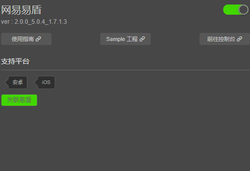
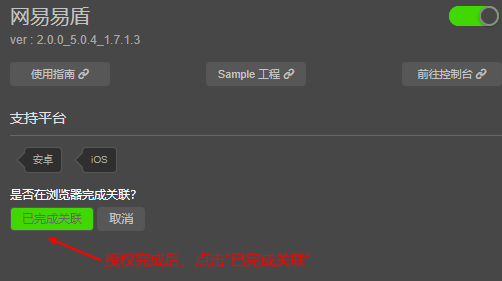
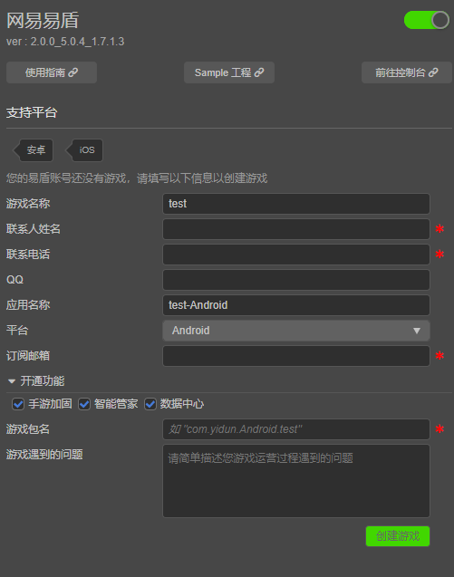
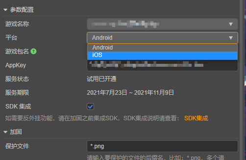
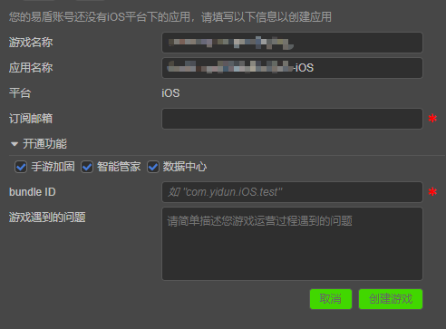
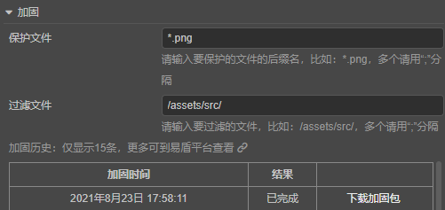
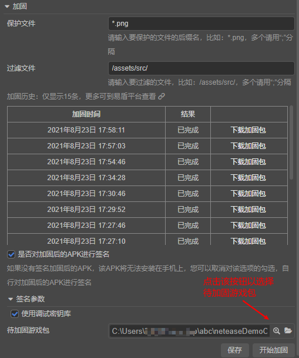
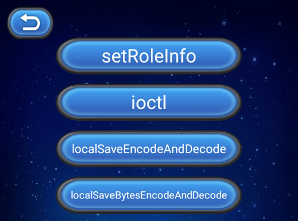

# 易盾（网易）快速入门

[**易盾（网易）**](https://dun.163.com) 为开发者提供游戏包体加固及游戏反外挂能力，开发者构建过程中自助完成SDK集成、构建完成后一键式进行包体加固，开发者无需再为游戏安全防护进行额外开发工作，可以专注于游戏业务，轻松搭建游戏防御体系。支持全平台：Android、iOS、H5。

### 版本更新说明（Cocos Creator 2.x）

- 当前版本：0.5.2_6.4.4.1_5.7.1

    - 新增 网易易盾 服务。

### 版本更新说明（Cocos Creator 3.x）

- 当前版本：2.0.0_6.4.4.1_5.7.1

    - 新增 网易易盾 服务。

## 一键接入易盾服务

### 开通服务

- 使用 Cocos Creator 打开需要接入 易盾 服务的项目工程。

- 点击菜单栏的 **面板 -> 服务**，打开 **服务** 面板，选择 **易盾**，进入服务详情页。然后点击右上方的 **启用** 按钮即可开通服务。详情可参考 [服务面板操作指南](./user-guide.md)。

- 开通服务后，如果您的Cocos账号未关联易盾账号，面板会显示一个关联易盾的按钮，如下：

  

- 点击关联易盾按钮，会弹出对话框，提示：“即将打开浏览器进行关联，请在关联完成后，回到Cocos Creator”，点击确定后，浏览器将会打开易盾关联页面，如下：

  

- 点同意并继续后，可进行账号的登录/注册，如下：

  

- 如果您还没有易盾账号，请点击“免费注册”按钮，填写相关信息以注册易盾账号，注册完后会自动登录；如果您已经有易盾账号了，请输入您已有的易盾账号及密码进行登录。登录完成后，会显示如下的授权页面：

  

- 点击“确认授权”以完成授权操作，授权完成后，回到Cocos Creator中，点击下图中的“已完成关联”。

  

- 完成与易盾账号的关联后，如果该账号下没有任何游戏，面板会显示创建游戏的页面，如下：

  

- 请在填写完相关信息后，点击“创建游戏”以完成游戏的创建。游戏创建完成后，会显示完整的功能页面，如下：

  

* <font color="red">注1：构建时，切记填写的包名/bundle ID要和易盾账号的应用一致。</font>

* <font color="red">注2：如需添加新的包名，请联系易盾团队。</font>

#### 创建其他平台的应用（可选）

- 易盾中， Android 和 iOS 是两个分开的应用，如需开通另外一个平台的应用，请点击“平台”下拉框，选中目标平台（比如“iOS”），如下：

  

- 选中后，如果您没有目标平台的应用，会显示如下的创建应用页面：

  

- 请填写相关参数，最后点“创建游戏”以创建该平台下的应用，如果不想创建，可以点取消以返回功能页面。

### 验证服务是否接入成功

#### 应用加固

在编译完游戏后，可进行应用加固。

- 首先，需要填写“保护文件”和“过滤文件”以告知易盾需要保护的文件有哪些，否则保护效果可能会下降，如下：

  

- 接着，选中待加固的游戏包，如下：

  

- 最后，点击“开始加固”以进行应用加固<font color="red">（注：一定要在下拉框中选择正确的平台，再去加固，比如 APK 游戏包应该要选择 Android 平台的应用）</font>。

- 点击“开始加固”后，界面会显示加固进度，如下：

  

- 加固成功后，会提示您是否要下载加固后的游戏包，选择是将会进行下载，您也可以在加固历史记录中点击某记录的“下载加固包”按钮以进行下载。

#### 反外挂 SDK

如需要反外挂功能，请在加固之前集成 SDK 。

- 首先，您需要勾选下图中的“SDK 集成”，如下：

  

- 注意，勾选“SDK 集成”后，仅会在构建时自动集成 SDK ，您还需要手动调用 SDK 的接口以使用反外挂相关的功能（比如： SDK 的初始化）， SDK 集成说明，请参考：[SDK 集成](https://support.dun.163.com/documents/413846598587424768?docId=418198765332385792)，API文档请参考：[易盾 - Cocos Service API 文档](https://service.cocos.com/document/api/modules/netease.html)。

* <font color="red">注：勾选“SDK 集成”， SDK 仅会在当前平台被集成，如果您需要在其他平台集成 SDK ，请切换到其他平台，然后勾选“SDK 集成”。</font>

- 完成以上步骤后，我们便可以通过在脚本中添加简单的代码，来验证 SDK 接入是否成功。

```ts
// 初始化 SDK
netease.yidun.yidunService.init();
// 默认服务器地区类型是中国大陆，如果您应用所在地区不是中国大陆，
// 需要传递参数告知 SDK 具体的服务器地区类型，如下：
// netease.yidun.yidunService.init(netease.yidun.ServerType.Other);
// 其他 SDK 接口的使用请参考文档或者Sample工程。
```

- 工程运行到手机后，首先在确认没有“appId不正确”之类的提示后，请您到易盾后台的“智能反外挂”板块下的“统计分析”页面，查看用户数量是否增加了。

## Sample 工程

开发者可以通过 Sample 工程快速体验 易盾 服务。

- 点击 易盾 服务面板中的 **Sample 工程** 按钮，克隆或下载 易盾 Sample 工程，并在 Cocos Creator 中打开。

- 参照上文开通 易盾 服务并在相应平台下勾选“SDK 集成”后，可通过 Creator 编辑器菜单栏的 **项目 -> 构建发布**， 打开 **构建发布** 面板来构建编译工程。

- Sample 工程运行到手机后，即可进入功能界面进行测试。

  

  

## 开发指南

完整的代码请参考 Sample 工程。

### 初始化SDK

首先，为了启用反外挂功能，我们需要初始化 SDK ，初始化 SDK 代码如下：

```ts
netease.yidun.yidunService.init();
```

默认情况下，服务器地区类型是中国大陆，如果您应用所在地区不是中国大陆，可以传递服务器地区类型给 `init` 接口，如下：

```ts
netease.yidun.yidunService.init(netease.yidun.ServerType.Other);
```

iOS 平台下，如果需要使用透传功能，需要传递透传服务器地址给 `init` 接口，如下：

```ts
netease.yidun.yidunService.init(netease.yidun.ServerType.ChineseMainland, 'https://www.netease163.com');
```

SDK的大部分反外挂功能是自动运行的，不需要调用额外的接口，但是有些功能是需要手动调用的（比如 `setRoleInfo` 接口），具体可以参考以下的例子以及 [SDK 集成](https://support.dun.163.com/documents/413846598587424768?docId=418198765332385792) 和 [易盾 - Cocos Service API 文档](https://service.cocos.com/document/api/modules/netease.html)。

### 登录接口/设置角色信息

SDK 需要知道当前玩家的角色ID、角色名称等信息，才能将当前作弊行为和具体角色对应起来，给予相应的惩罚，您需要调用 `setRoleInfo` 接口以设置角色信息，示例代码如下：

```ts
const roleId = '123456';
const roleName = '易小盾';
const roleAccount = 'yd@163.com';
const roleServer = '游戏测试服';
const serverId = 123; // Only used on Android
const gameJson = {
  GameVersion: '1.0.1',
  AssetVersion: '1.0.1',
  TransHost: 'test.163.com',
  TransIP: '8.8.8.8',
  TransPort: 80,
};
netease.yidun.yidunService.setRoleInfo(
  roleId,
  roleName,
  roleAccount,
  roleServer,
  serverId,
  JSON.stringify(gameJson)
);
cc.log('setRoleInfo');
cc.log('roleId:', roleId);
cc.log('roleName:', roleName);
cc.log('roleAccount:', roleAccount);
cc.log('roleServer:', roleServer);
cc.log('serverId:', serverId);
cc.log('gameJson:', gameJson);
```

### 通用查询

`ioctlAndroid` 即 `ioctlIos` 接口分别提供了 Android 和 iOS 下的通用查询功能，如查询root、模拟器、版本号等信息以及其他定制功能，由于 Android 和 iOS 下支持的查询和功能不同，故分成两个接口，请您根据具体平台，调用不同的接口。

`ioctlAndroid` 示例代码如下：

```ts
let requestCmdId = netease.yidun.RequestCmdIdAndroid.GetEmulatorName;
cc.log(
  'The name of the emulator:',
  netease.yidun.yidunService.ioctlAndroid(requestCmdId, '')
);

requestCmdId = netease.yidun.RequestCmdIdAndroid.IsRootDevice;
cc.log(
  'Is root device:',
  netease.yidun.yidunService.ioctlAndroid(requestCmdId, '')
);

requestCmdId = netease.yidun.RequestCmdIdIos.QuerySDKVersion;
cc.log(
  'SDK Version:',
  netease.yidun.yidunService.ioctlIos(requestCmdId, '')
);
```

`ioctlIos` 示例代码如下：

```ts
let requestCmdId = netease.yidun.RequestCmdIdIos.QueryRootStatus;
cc.log(
  'Root status:',
  netease.yidun.yidunService.ioctlIos(requestCmdId, '')
);

requestCmdId = netease.yidun.RequestCmdIdIos.QuerySDKVersion;
cc.log(
  'SDK Version:',
  netease.yidun.yidunService.ioctlIos(requestCmdId, '')
);

requestCmdId = netease.yidun.RequestCmdIdIos.QueryYiDunCode;
cc.log(
  'Yidun Code:',
  netease.yidun.yidunService.ioctlIos(requestCmdId, '')
);
```

## API 文档

详细 API 的说明，请参考 [SDK 集成](https://support.dun.163.com/documents/413846598587424768?docId=418198765332385792) 以及 [易盾 - Cocos Service API 文档](https://service.cocos.com/document/api/modules/netease.html)。

## iOS 平台注意事项

### 请在Xcode中编译项目

如果您构建的目标平台是 iOS 且勾选了“SDK 集成” ，则在构建完成后，不要直接点击编译，您需要用 Xcode 打开生成的 Xcode 项目，在 Xcode 中继续编译本项目，否则编译会失败（这是因为在 Cocos Creator 中点击编译，默认会编译模拟器的架构，一般这是 x86\_64 架构，而易盾SDK暂不支持 x86\_64 架构）。

针对Cocos Creator 2.x，生成的 Xcode 项目的路径一般是 {您的项目所在目录}/build/jsb-link/frameworks/runtime-src/proj.ios_mac/{游戏名称}.xcodeproj。

针对Cocos Creator 3.x，生成的 Xcode 工作空间的路径一般是 {您的项目所在目录}/build/{构建任务名}/proj/{游戏名称}.xcodeproj。

### iOS 游戏加固需要开启 bitcode 、SDK 集成 不能开启 bitcode 的问题

如果您构建的目标平台是 iOS ，您需要注意： SDK 的集成需要禁用 bitcode 构建选项（默认是禁用的），而 iOS 游戏加固功能是需要启用 bitcode 构建选项的（需要在 Xcode 中开启），这两个是冲突的需求，且目前 Cocos Creator 暂时不支持开启 bitcode 编译，编译会失败（有些依赖库编译时没有包括 bitcode ），故目前暂时不支持 iOS 游戏的加固，但 SDK 的功能可以正常使用。
