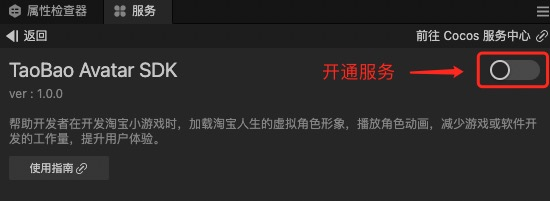
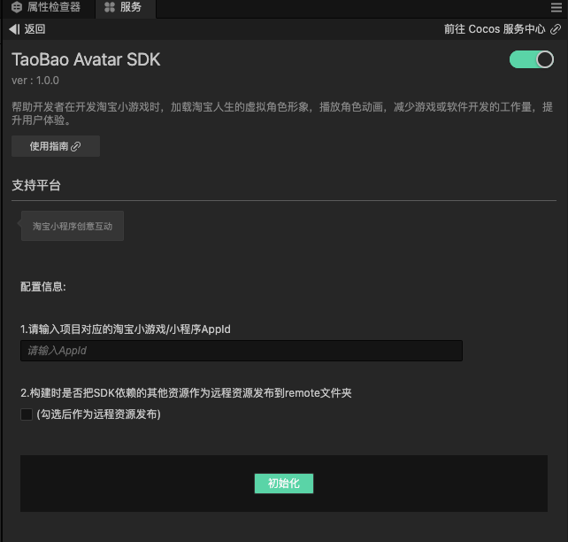
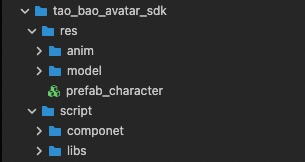
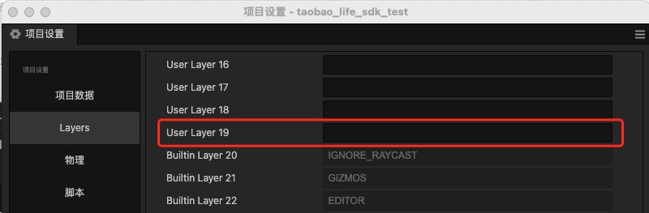
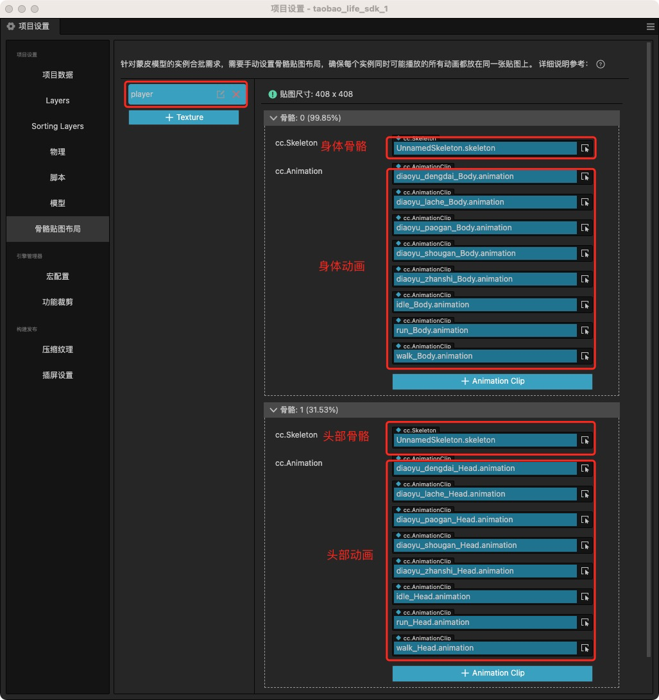

# TAOBAO Avatar SDK 使用指南

TAOBAO Avatar SDK是一款虚拟角色的软件开发包，开发者可以通过集成SDK，快速拥有虚拟角色的相关能力，使用已有的淘宝人生虚拟角色，用于游戏或软件的开发。游戏开发者使用人物形象加载接口，完成人物形象整体的加载，同时提供动画播放口，用于控制人物动作播放。

## 咨询入口

如果您想获取TAOBAO Avatar SDK相关服务，请按照“姓名、公司、职务、邮箱、电话、您想要咨询的内客”的格式，发送相关信息至邮箱[persona@cocos.com](mailto:persona@cocos.com)，我们将尽快联系您。

## 开通服务

- 当您已开通TAOBAO Avatar SDK相关服务后，点击菜单栏的面板服务，打开服务板，选择TAOBAO Avatar SDK，进入服务详情页，点击右上方的开启按钮及可开通服务。

  

- 开通后服务面板图示：

  

## 支持平台：

- 预览模式：浏览器预览  (调试用)。

- 发布：淘宝小程序创意互动。

- 发布：Web手机端/Web桌面端  (调试用)。

## 使用前的初始化

### 填写项目对应的淘宝小游戏/小程序AppId。

- 需要在服务面板内输入项目对应的淘宝小游戏/小程序AppId，（在预览模式或发布Web端可不填写，在发布“淘宝小程序创意互动”平台前需要确保AppId正确填写）。

- 注意：填写AppId 后会在项目的“resources”目录下自动生成tao_bao_appId.json 文件，当开启服务时请勿删除。当关闭服务时不会主动删除此文件，需手动删除。如果误删，可在服务面板内再次输入AppId后恢复。


### 选择是否需要把SDK依赖的部分资源作为远程资源发布到remote文件夹内。

- 说明：SDK依赖的这部分资源（大小约2.5MB），在点击初始化时不会放置到项目中，在构建时才进行自动处理。

- 不勾选：构建项目后，会把资源放置到构建后的项目的“assets”文件夹下，资源文件夹名:“tao_bao_avatar_res”。

- 勾选：构建项目后，会把资源放置到构建后的项目的“remote”文件夹下（处理方式类似把bundle 配置为远程包），资源文件夹名:“tao_bao_avatar_res”。


### 初始化

- 初始化前，请确保项目中不存在旧的SDK资源，且项目根目录 “assets” 文件夹下不能有 “tao_bao_avatar_sdk” 文件夹。

- 点击面板“初始化”按钮，执行初始化，请勿重复点击。

- 初始化完毕后，如果遇到错误提示请查看控制台输出，弹出成功提示后，SDK处于可用状态。会在项目根目录 “assets” 文件夹下中生成“tao_bao_avatar_sdk”文件夹，请等待编辑器内相关资源导入完毕。

- 生成的文件夹根目录（tao_bao_avatar_sdk）建议不要修改位置。当关闭服务时不会删除此文件夹，需手动删除。

- 初始化成功后会在项目的“assets”同级目录下创建出“preview-template”预览模板，目的是为预览模式下提供形象加载能力，请勿删除，当关闭服务时不会主动删除此文件，需手动删除。如果误删，可在服务面板内再次执行初始化后恢复。

- 控制台如果提示“未支持的 GLTF 扩展”，忽略即可，不会对功能造成任何影响。


### SDK相关资源构成

- res文件夹：
anim文件夹：人物动画资源
model文件夹：基础人体FBX模型资源
prefab_character：基础人体Prefab

  1. 随意修改此prefab的结构可能会造成形象加载失败，不建议对此prefab做编辑

  2. 如果确实需要修改此资源，建议在此基础上复制一份后再做编辑

  3. 作用：生成角色形象时候（new Avatar(...)）需要传入实例化此预设后的Node作为参数（basicBodyNode）使用

- script文件夹：
componet文件夹：sdk依赖的组件
libs文件夹：sdk依赖的相关库

- 图示

  

## 注意事项：

- SDK需要使用项目中的Layer,( User Layer 19),请确保此层级未被使用，且未输入任何字符。

  

- SDK依赖的相关资源为 Bundle 形式，名称为 “tao_bao_avatar_res”，请确保开发的项目中的 bundle 不要使用此名称。

- 需要正确配置骨骼贴图布局

  4. 说明：

    5. 不同版本的sdk资源动作文件可能会发生变化，须确保当前版本的全部动画都需要配置，不配置或者配置错误都会导致动画播放错乱

    6. 身体和头部的FBX模型资源在初始化后生成的 tao_bao_avatar_sdk→res→model 文件夹内

    7. 所有的动作资源在初始化后生成的 tao_bao_avatar_sdk→res→anim文件夹内，动画文件内的动画剪辑 以“_Head”结尾的动画clip为头部动画，以“_Body”结尾的动画clip为身体动画

  8. 配置参考（仅做参考，具体动作请查看anim文件夹，需全部配置）：

    

  9. 加载Avatar的过程中回调的加载进度值为 0-100 不连续数值

## SDK使用建议

  10. 初次调用生成的新角色形象时，对资源消耗相对较多，建议放置在进度条中加载，降低加载对业务的影响

  11. 程序中尽量避免同时加载多个形象

## 支持播放的动作列表

版本：1.0.0

  12. 待机 idle

  13. 行走 walk

  14. 跑步 run

  15. 钓鱼待机 diaoyu_dengdai

  16. 钓鱼拉扯 diaoyu_lache

  17. 钓鱼抛竿 diaoyu_paogan

  18. 钓鱼收杆 diaoyu_shougan

  19. 展示鱼 diaoyu_zhanshi

## 关于SDK更新

- 1.更新前建议先备份项目

- 2.查看service面板的版本号是否大于resources下的tao_bao_appId.json文件（初始化后才有此文件）的sdkVersion字段

- 3.手动删除项目中SDK相关资源（文件夹为“tao_bao_avatar_sdk”）

- 4.在service面板重新执行初始化，SDK资源会重新生成

- 5.检查骨骼贴图布局是否正确

- 6.检查基础人体prefab资源引用是否丢失

- 7.api 可能会发生变化，需手动适配

## SDK使用

- 示例：

```TypeScript
 let avatar = new Avatar(...）
```

- 构造参数说明

```TypeScript
    /**
     * 在一个基础人体上加载形象
     * 参数：
     * basicBodyNode:基础人体,在此角色上进行组装形象（实例化prefab_character后的Node节        点,需确保在场景中为激活状态）
     * useBakedAnim:是否启用动画烘焙
     * cfg:淘宝人物形象数据
     * isConvertOverData:是否是转换后的数据
     * castShadow:是否投射阴影
     * succeedCb:创建完毕的回调
     * timeout:超时时间（秒）,默认30秒，当加载时长超过此时间后，代表创建失败,执行timeoutCb
     * timeoutCb:创建失败（超时）的回调
     * progressUpdateCb:加载进度有更新时候的回调
    */
```

## API列表

||API|描述|参数|返回值|说明|
|-|-|-|-|-|-|
|1|playAnim|播放动画|animName: string, 要播放的动画名wrapMode?: number 重新指定循环模式|无|动画之间无过渡，直接切换|
|2|playAnimUseCrossFade|播放动画，动画切换采用过渡方式|animName: string, 要播放的动画名duration: number = 0.3, 动画过渡时长wrapMode?: number重新指定循环模式|无|只有自己的角色调用有效，其他人的动画采用烘焙，无过渡效果|
|3|stopAnim|停止播放动画|无|无||
|4|destroy|销毁形象|destroyBasicBodyNode：是否销毁基础人体 默认为true|无|销毁创建的形象|
|5|isCreateOver|（get）avatar是否创建完毕|无|boolean|返回形象是否完全创建完毕|

- Api使用示例

```TypeScript
let avatar = new Avatar（
    ...
    //加载完毕
    ()=>{
        //播放动画
        avatar. playAnim(Avatar.ANIM_NAME.IDLE);
    },
    //加载进度发生变化
    (info: any) => {
        console.log(info.toString());
    }
） 
```


