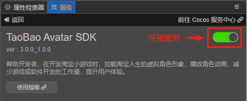
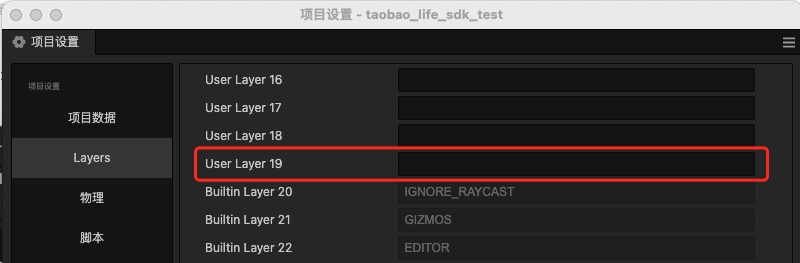

# TAOBAO Avatar SDK 使用指南

TAOBAO Avatar SDK是一款虚拟角色的软件开发包，开发者可以通过集成SDK，快速拥有虚拟角色的相关能力，使用已有的淘宝人生虚拟角色，用于游戏或软件的开发。游戏开发者使用人物加载接口，完成人物形象整体的加载，将获得人物实例化节点挂到Cocos场景中即可呈现人物形象，同时提供动画播放口，用于控制人物动作播放。

## 咨询入口

如果您想获取TAOBAO Avatar SDK相关服务，请按照“姓名、公司、职务、邮箱、电话、您想要咨询的内客”的格式，发送相关信息至邮箱[persona@cocos.com](mailto:persona@cocos.com)，我们将尽快联系您。

## 开通服务

- 当您已开通TAOBAO Avatar SDK相关服务后，点击菜单栏的面板服务，打开服务板，选择TAOBAO Avatar SDK，进入服务详情页，点击右上方的开启按钮及可开通服务。



- 服务面板图示：


## 支持平台：

- 预览模式：浏览器预览  (调试用)。

- 发布：Web手机端  (调试用)。

- 发布：Web桌面端  (调试用)。

- 发布：淘宝小程序创意互动。

## 使用前的初始化

### 填写项目对应的淘宝小游戏/小程序AppId。

- 需要在服务面板内输入项目对应的淘宝小游戏/小程序AppId，（在预览模式或发布Web端可不填写，在发布“淘宝小程序创意互动”平台前需要确保AppId正确填写）。

- 注意：填写AppId 后会在项目的“resources”目录下自动生成tao_bao_appId.json 文件，当开启服务时请勿删除。当关闭服务时不会主动删除此文件，需手动删除。如果误删，可在服务面板内再次输入AppId后恢复。

### 选择是否需要把SDK依赖的资源作为远程资源发布到remote文件夹内。

- 说明：SDK依赖的这部分资源，在点击初始化时未放置到项目中，在构建时处理。

- 不勾选：构建项目后，会把资源放置到构建后的项目的“assets”文件夹下，文件夹名:“tao_bao_avatar_res”。

- 勾选：构建项目后，会把资源放置到构建后的项目的“remote”文件夹下，文件夹名:“tao_bao_avatar_res”。

### 初始化

- 初始化前，请确保项目根目录 “assets” 文件夹下不存在 “tao_bao_avatar_sdk” 文件夹。

- 点击面板“初始化”按钮，执行初始化，请勿重复点击。

- 初始化完毕后，如果遇到错误提示请查看控制台输出，弹出成功提示后，SDK处于可用状态。会在项目根目录 “assets” 文件夹下中生成“tao_bao_avatar_sdk”文件夹，请等待编辑器内相关资源导入完毕。

- 生成的文件夹根目录（tao_bao_avatar_sdk）可根据需求调整到其他位置,子文件夹请勿修改。当关闭服务时不会删除此文件夹，需手动删除。

- 初始化成功后会在项目的“assets”同级目录下创建出“preview-template”预览模板，目的是为预览模式下提供形象加载能力，请勿删除，当关闭服务时不会主动删除此文件，需手动删除。如果误删，可在服务面板内再次执行初始化后恢复。


- SDK需要使用项目中的Layer,( User Layer 19),请确保此层级未被使用，且未输入任何字符。



- SDK相关资源为 Bundle 形式，名称为 “tao_bao_avatar_res”，请确保开发的项目中的 bundle 不要使用此名称。

## SDK使用

- 示例：

```TypeScript
 let avatar = new Avatar(...）
```

- 构造参数说明

```TypeScript
     /**
     * isSelfAvatar:是否是自己的角色，自己的角色动画不进行烘焙。drawcall不参与合并
     * cfg:淘宝人物形象数据json字符串或者object
     * isConvertOverData:是否是转换开放平台后的数据
     * basicBodyNode:基础人体,在此角色上进行组装形象
     * ifNotCreateSetOutOfSight:如果未创建完毕 是否不展示基础身体
     * initPos:创建完毕后设置的局部位置
     * initQuat:创建完毕后设置的局部旋转
     * castShadow:是否投射阴影
     * succeedCb:创建完毕的回调
     * timeout:超时时间（秒）,默认20秒，当加载时长超过此时间后，代表创建失败,执行超时回调
     * timeoutCb:创建失败（超时）的回调
    */
```

## API

- 示例：

||API|描述|参数|返回值|说明|
|-|-|-|-|-|-|
|1|playAnim|播放动画|animName: string, 要播放的动画名wrapMode?: number 重新指定循环模式|无|动画之间无过渡，直接切换|
|2|playAnimUseCrossFade|播放动画，动画切换采用过渡方式|animName: string, 要播放的动画名duration: number = 0.3, 动画过渡时长wrapMode?: number重新指定循环模式|无|只有自己的角色调用有效，其他人的动画采用烘焙，无过渡效果|
|3|stopAnim|停止播放动画|无|无||
|4|destroy|销毁形象|destroyBasicBodyNode：是否销毁基础人体 默认为true|无|销毁创建的形象|
|5|isCreateOver|（get）avatar是否创建完毕|无|boolean|返回形象是否完全创建完毕|


