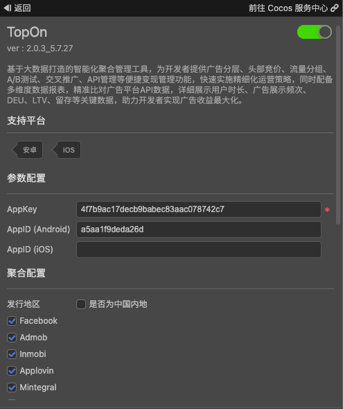

# TopOn（聚合广告）快速入门

[TopOn 聚合广告](https://www.toponad.com)服务，基于大数据打造的智能化聚合管理工具，为开发者提供广告分层、头部竞价、流量分组、A/B测试、交叉推广、API管理等便捷变现管理功能，快速实施精细化运营策略，同时配备多维度数据报表，精准比对广告平台API数据，详细展示用户时长、广告展示频次、DEU、LTV、留存等关键数据，助力开发者实现广告收益最大化。

### 版本更新说明

- 当前版本：2.0.3_5.7.27 

    - 集成 TopOn 聚合广告服务。

## 一键接入 TopOn 服务

### 开通服务

- 使用 Cocos Creator 打开需要接入 TopOn 服务的项目工程。

- 点击菜单栏的 **面板 -> 服务**，打开 **服务** 面板，选择 **TopOn**，进入服务详情页。然后点击右上方的 **启用** 按钮即可开通服务。详情可参考 [服务面板操作指南](./user-guide.md)。

  

- 如果您还没有 TopOn 聚合广告平台的账号，请前往 [TopOn](https://app.toponad.com/#/register) 进行注册，并根据[指引文档](https://docs.toponad.com/#/zh-cn/android/GetStarted/TopOn_Get_Started)进行相应的配置，或者服务面板所需要的 `AppKey` 以及 `AppID` 等参数。

* <font color="red">注：TopOn 聚合广告在 iOS 和 Android 平台上需要创建不同的 AppID，两者不能公用同一个 AppID。</font>


### 验证服务是否接入成功

- 完成 **TopOn** 服务接入步骤后，只需要在脚本启动时添加两行代码即可验证服务是否接入成功，代码如下

```ts
// 启用日志
topon.toponService.setLogDebug(true);
// 检查第三方广告的集成情况
topon.toponService.integrationChecking();

```

- 工程运行到手机后，在 Android Studio 的运行日志或者 Logcat 中以及 Xcode 运行日志中均能看到广告的集成状态

* <font color="red">注：TopOn 在 iOS 平台上，如果您选择了 Admob 或者 StartApp 广告，以上的检测结果会提示广告验证失败，但实际上集成成功的，无视即可。</font>

## Sample 工程

开发者可以通过 Sample 工程快速体验 TopOn 服务。

- 点击 TopOn 服务面板中的 **Sample 工程** 按钮，Clone 或下载 TopOn Sample 工程，并在 Cocos Creator 中打开。

- 参照上文开通 TopOn 并配置相应参数后，可通过 Creator 编辑器菜单栏的 **项目 -> 构建发布** 打开 **构建发布** 面板来构建编译工程。

- Sample 工程运行到手机后，即可进入功能界面进行测试。

  

## 开发指南

### 1、创建 Banner 广告

```ts
getBanner(placementId: string, listener?: BannerListener): Banner;
```

**参数说明**：

| 参数 | 说明 |  
| :---------- | :------------- |  
|  placementId | placementId | 
|  listener | 回调监听器，如果不传，必须调用返回对象的setAdListener方法显示，否则不接受广告回调 | 

**示例**：

```js
// 详见 TopOn API 文档中的 BannerListener 接口
let listener = {
    ...
}
let banner = topon.toponService.getBanner("placementId", listener);
```

### 2、加载广告
```ts
loadBanner(settings?: {
            banner_ad_size_struct?: {
                width: number;
                height: number;
            };
            width?: number;
            height?: number;
            adaptive_width?: number;
            adaptive_orientation?: 0 | 1 | 2;
            inline_adaptive_width?: number;
            inline_adaptive_orientation?: 0 | 1 | 2;
        }): void;
```

调用此接口加载广告数据，如果在创建创建的广告的时候没有设置广告监听器，则选择调用以下接口设置广告监听器

```ts
setAdListener(listener: BannerListener): void;
```

当广告加载完成后会触发 `onBannerAdLoaded` 回调，收到此毁掉之后即可调用接口显示广告了

**参数说明**：

| 参数 | 说明 |  
| :---------- | :------------- |  
|  settings | 广告额外配置 | 

### 3、显示广告
```ts
showAdInPosition(position: 'top' | 'bottom'): void;
showAdInRectangle(rect: {
            x: number;
            y: number;
            width: number;
            height: number;
        }): void;
```

**参数说明**：

| | 参数 | 说明 |  
| :--- | :---------- | :------------- |  
| 接口一 |  position | 广告显示位置，top: 显示在顶部、bottom: 显示在底部 (不考虑刘海屏的遮挡) | 
| 接口二 |  rect | 广告显示区域，根据传入的坐标进行显示 | 

显示广告有两个接口
- 第一个接口只能显示在固定的顶部或者底部
- 第二个接口可以根据传入的坐标进行 banner 的显示

**示例**：
```ts
if (banner.isAdReady()) banner.showAdInPosition('top');
```

### 其他接口参考 API 文档说明即可


## API 文档

详细的功能接口和 API 说明，请参考 [TopOn - API 文档](https://service.cocos.com/document/api/modules/topon.html)。
