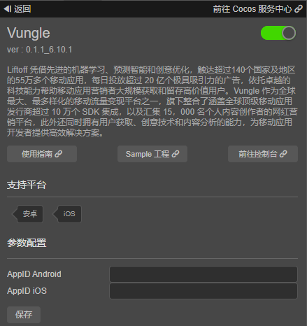
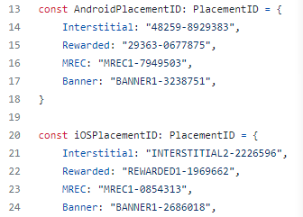
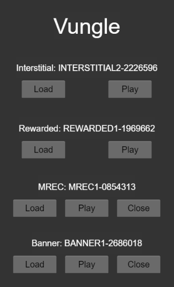

# Vungle（聚合广告）快速入门

[Vungle 聚合广告](https://vungle.com/) 

## 一键接入Vungle服务

### 开通服务


- 使用 Cocos Creator 打开需要接入 Vungle 服务的项目工程。

- 点击菜单栏的 **面板 -> 服务**，打开 **服务** 面板，选择 **Vungle**，进入服务详情页。然后点击右上方的 **启用** 按钮即可开通服务。详情可参考 [服务面板操作指南](./user-guide.md)。

  

- 参数配置：参数配置中的appid需要您从Vungle服务后台获取。Vungle 聚合广告在 iOS 和 Android 平台上需要创建不同的 AppID，两者不能公用同一个 AppID。

- 如果您还没有 Vungle 聚合广告平台的账号，请前往 [Vungle官网](https://app.vungle.com/signup/) 进行注册，在Vungle控制台中创建APP和广告位，详情可参考[Vungle文档](https://support.vungle.com/hc/en-us/articles/203610124) 。


## Sample 工程

开发者可以通过 Sample 工程快速体验 Vungle 服务。

- 点击 Vungle 服务面板中的 **Sample 工程** 按钮，Clone 或下载 Vungle Sample 工程，并在 Cocos Creator 中打开。

- 参照上文创建 Vungle，配置 appid 参数，并修改代码(assets/startup.ts)中的广告位ID。

  

- 构建项目：可通过 Creator 编辑器菜单栏的 **项目 -> 构建发布** 打开 **构建发布** 面板来构建编译工程。

- Sample 工程运行到手机后，即可进行测试。

  

## 开发指南

### 初始化SDK

设置回调，包含SDK初始化，广告加载和播放的回调。每一个回调函数的具体信息可以查看[API文档](https://test-service.cocos.com/document/api/modules/vungle.html#vunglecallbacks) 。
```ts
const vungleCallbacks:vungle.VungleCallbacks = {
  init: {
    // SDK初始化成功
    onSuccess: () => {
    },
    // SDK初始化失败
    onError: (error: string) => {
    }
  },
  load: {
    // 广告加载成功
    onAdLoad: (placementId: string) => {
    },
    // 广告加载失败
    onError: (placementId: string, error: string) => {
    }
  },
  play: {
    // 广告开始播放
    onAdStart: (placementId: string) => {
    },
    // 广告已渲染
    onAdViewed: (placementId: string) => {
    },
    // 广告开始结束
    onAdEnd: (placementId: string) => {
    },
    // 用户点击广告
    onAdClick: (placementId: string) => {
    },
    // 用户获得奖励
    onAdRewarded: (placementId: string) => {
    },
    // 用户在广告播放过程中退出APP
    onAdLeftApplication: (placementId: string) => {
    },
    // 广告播放失败
    onError: (placementId: string, error: string) => {
    },
    // 广告的Creative ID
    creativeId: (creativeId: string) => {
    }
  }
}

// 设置回调
vungle.vungleService.setCallbacks(vungleCallbacks);
```

开发过程中，如果需要查看调试日志，可以调用[setLogDebug](https://test-service.cocos.com/document/api/classes/vungle.vunglead.html#setlogdebug) 。
```ts
vungle.vungleService.setLogDebug(true);
```

SDK初始化，我们不需要传递App ID作为参数，它会自动使用服务面板填写的App ID。
setting中每一项的具体信息可以参考[API文档](https://test-service.cocos.com/document/api/modules/vungle.html#setting) 。
```ts
const vungleSetting: vungle.Setting = {
  // 广告播放时需要的最小存储空间，单位为MB
  minimumDiskSpaceForInit: 55,
  // 广告播放时需要的最小存储空间，单位为MB
  minimumDiskSpaceForAd: 56,
  // 只用于Android：设置为True来禁止Vungle SDK获取Android ID
  restrictAndroidID: true,
  // 只用于IOS：设置为False来禁止Vungle SDK获取IDFV
  setPublishIDFV: true,
}
// 初始化
vungle.vungleService.init(vungleSetting);
```

### 插屏或奖励广告

- 加载
  
加载广告前，可以使用`isInitialized`接口来判断广告是否已经初始化完成。
```ts
if (vungle.vungleService.isInitialized()) {
    vungle.vungleService.loadAd(placementId);
}
```

- 播放

SDK提供静音、广告方向、弹窗信息等配置，具体可以查看[API文档](https://test-service.cocos.com/document/api/modules/vungle.html#adconfig) 。
```ts
const adConfig : vungle.AdConfig = {
    // 静音设置
    muted: true,
    // 广告方向
    orientation: vungle.OrientationType.AUTO_ROTATE,
    // 用户终止观看奖励广告时的弹窗信息
    incentivizedFields: {
        userID: "test_user_id",
        title: "Careful!",
        body: "Are you sure you want to skip this ad? If you do, you might not get your reward",
        keepWatching: "Continue",
        close: "close",
    },
    // 指示此广告在游戏会话中的显示顺序 
    ordinal: 1,
}
```

播放广告前，可以使用`canPlayAd`方法来判断广告是否已经加载完成。
```ts
if (vungle.vungleService.canPlayAd(placementId)) {
    vungle.vungleService.playAd(placementId, adConfig);
}
```

### Banner或MREC广告

- 加载

加载广告时，需要设置想要加载的广告尺寸，vungle提供了如下几种尺寸选择。
```ts
enum AdSize {
    BANNER = "BANNER", // 320x50
    BANNER_SHORT = "BANNER_SHORT", // 300x50
    BANNER_LEADERBOARD = "BANNER_LEADERBOARD",  // 728x90
    MREC = "MREC", // 300x250
}
```

配置广告尺寸和静音。
```ts
const adSize : vungle.AdSize = vungle.AdSize.BANNER;
const bannerConfig : vungle.BannerConfig = {
    // banner/MREC广告尺寸
    adSize: adSize,
    // 静音
    muted: false,
}
```

加载广告前，可以使用`isInitialized`接口来判断广告是否已经初始化完成。
```ts
if (vungle.vungleService.isInitialized()) {
  vungle.vungleService.loadBanner(placementId, bannerConfig);
```

- 展示

播放广告前，可以使用`canPlayBanner`方法来判断广告是否已经加载完成。
播放广告时，需要设置广告要显示的位置（TOP或BOTTOM）。
```ts
if (vungle.vungleService.canPlayBanner(placementId)) {
    vungle.vungleService.getBanner(placementId, bannerConfig, vungle.BannerPosition.TOP);
}
```

- 关闭
```ts
vungle.vungleService.destroyBanner(placementId);
```

### 修改GDPR和CCPA同意状态

- GDPR

获取用户同意状态和版本
```ts
vungle.vungleService.getConsentStatus();
vungle.vungleService.getConsentMessageVersion();
```

更新用户同意状态和版本
```ts
vungle.vungleService.updateConsentStatus(vungle.ConsentStatus.OPTED_OUT, "1.0.0");
```

- CCPA

获取用户同意状态
```ts
vungle.vungleService.getCCPAStatus();
```

更新用户同意状态
```ts
vungle.vungleService.updateCCPAStatus(vungle.ConsentStatus.OPTED_OUT);
```

## API 文档

详细的功能接口和 API 说明，请参考 [Vungle - API 文档](https://test-service.cocos.com/document/api/modules/vungle.html) 。
